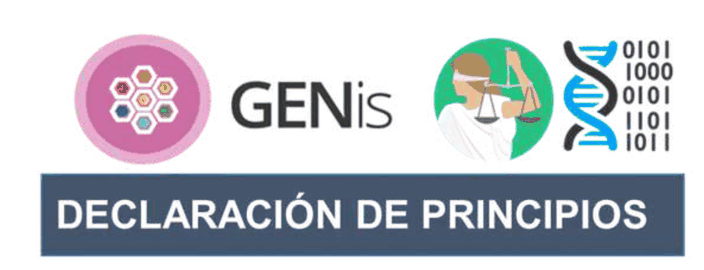

# Declaración de principios

Un conjunto de principios ha guiado el diseño del sistema **GENis**, desde su concepción y a lo largo de todo su ciclo de desarrollo. Ellos son:

- **TRANSPARENCIA**: la “transparencia algorítmica” es un atributo esencial para la validación científica de la herramienta desde su dimensión lógico-matemática. En su dimensión jurídica, es una condición necesaria para el ejercicio del derecho de debido proceso, que requiere un conocimiento público sobre el funcionamiento de los sistemas con que se producen las pericias. En todo el mundo las autoridades judiciales se valen de esos sistemas para definir sentencias que afectan la vida y la libertad de las personas. Con esos valores a proteger, es fundamental proveer la chance de que los resultados periciales puedan ser reproducidos por las partes mediante modos alternativos y en soportes independientes. Renunciar a lo anterior implicaría resignarse a una “caja negra” pericial y a confrontar el riesgo de numerosas impugnaciones. A lo largo del ciclo de desarrollo del sistema GENis se han tenido en cuenta las recomendaciones de la Comisión de ADN de la Sociedad Internacional de Genética Forense (ISFG) sobre transparencia, disponibilidad y reproducibilidad para sistemas informáticos que realizan cálculos bioestadísticos en aplicaciones forenses.

- **COLABORACIÓN**: el sistema GENis es producto del esfuerzo mancomunado de múltiples actores de distintos países, provenientes de la comunidad científica, de universidades, órganos judiciales, fuerzas de seguridad, empresas del sector privado y organizaciones de la sociedad civil. Esta comunidad promueve la contribución abierta y verificable al código, la documentación y a los estándares, asegurando trazabilidad, control de calidad y mejora continua del sistema. Por otro lado, a medida que la criminalidad trasnacional crece en magnitud y muta en sus formas, se vuelve indispensable entre los países una mayor cooperación judicial. El fomento activo a mecanismos bilaterales de intercambio de datos o incluso a la creación de registros multilaterales, se encuentra inscripto en el mapa de funcionalidades del sistema, con un módulo detallado de interconexión de instancias.

- **SEGURIDAD**: en el sistema GENis se aplica el concepto de “seguridad por diseño” que implica comprender a la misma como un proceso dinámico y, por lo tanto, revisable y mejorable en forma permanente. En las versiones vigentes del sistema el concepto queda reflejado a través de un conjunto de atributos: i) autenticación por doble factor; ii) modelo de usuarios y roles; iii) capacidades de trazabilidad y de auditoría sobre las acciones dentro del sistema; iv) utilización de criptografía y tecnologías de registro distribuido (blockchain).

[1] El ciclo de desarrollo del sistema GENis estuvo guiado por el “Estándar de bienes públicos digitales” desarrollado por la Alianza de Bienes Públicos Digitales (DPGA) y por los “Principios de desarrollo digital” propuestos por la Alianza de Impacto Digital (DIA).

- **SOFTWARE LIBRE / ABIERTO**: El sistema GENis nació como un bien público digital y se inspira en sus valores y estándares para proyectar su evolución. La publicación de su código fuente hace efectivos los principios de transparencia, colaboración y seguridad para todos los usuarios directos e indirectos de GENis. El mismo se encuentra en el repositorio público de GitHub de la Fundación Sadosky bajo Licencia GNU Affero General Public License Version 3 (AGPL v3).

Todas las herramientas utilizadas para la creación del código del sistema GENis son de licencia libre / abierta, como lo son también sus dependencias y software asociados.

Para mantener nuestros principios de transparencia, colaboración, seguridad y software libre/abierto compartiremos toda la información relacionada con los reportes de los usuarios, no esconderemos errores y seguiremos publicando GENis con licencia de software libre, sin excepciones.

**Disponible en:** *https://github.com/fundacion-sadosky/genis*
