# Solicitar una cuenta

## Previo a solicitar una cuenta

GENis utiliza un **sistema de autenticación de doble factor (2FA)** para reforzar la seguridad en el acceso de los usuarios.

Este sistema se basa en el uso de aplicaciones de autenticación instaladas en el teléfono celular del usuario, como Google Authenticator u otras compatibles.

Estas aplicaciones generan contraseñas de un solo uso (OTP: One-Time Password), que cambian automáticamente cada pocos segundos.

A diferencia de las contraseñas tradicionales (estáticas), las contraseñas dinámicas generadas por este sistema no pueden reutilizarse, lo que reduce significativamente el riesgo de accesos no autorizados incluso cuando la contraseña del usuario se haya visto comprometida.

La contraseña consta de 6 dígitos y se regenera cada 30 segundos. Para comenzar a utilizarla, primero se debe descargar el programa a un celular propio del usuario (dependiendo el caso, puede ser desde Google PlayStore, App Store, u otras). Se debe tener en cuenta que para poder aprovechar esta funcionalidad, el horario del celular debe estar sincronizado con el del servidor del sistema GENis, caso contrario la clave será rechazada. Con ese fin, se configurará el celular para que la sincronización sea automática o, en caso que se prefiera manual, se validará que el celular este con el horario que se muestra en la siguiente página:

**_https://24timezones.com_**

## Solicitar una cuenta

Antes de acceder a GENis, el usuario deberá solicitar al administrador o personal de instalacion, la creación de una cuenta con determinados roles definidos por un administrador.

Como se ha dicho, GENis provee un mecanismo de autenticación de doble factor, por lo que para su ingreso se debe introducir además del nombre de usuario y su clave, el código token provisto por la aplicación Google Authenticator (descripta en [Previo a solicitar una cuenta](#previo-a-solicitar-una-cuenta)).

Presionar en Solicitar una cuenta e ingresar los datos para poder generar la solicitud del alta.

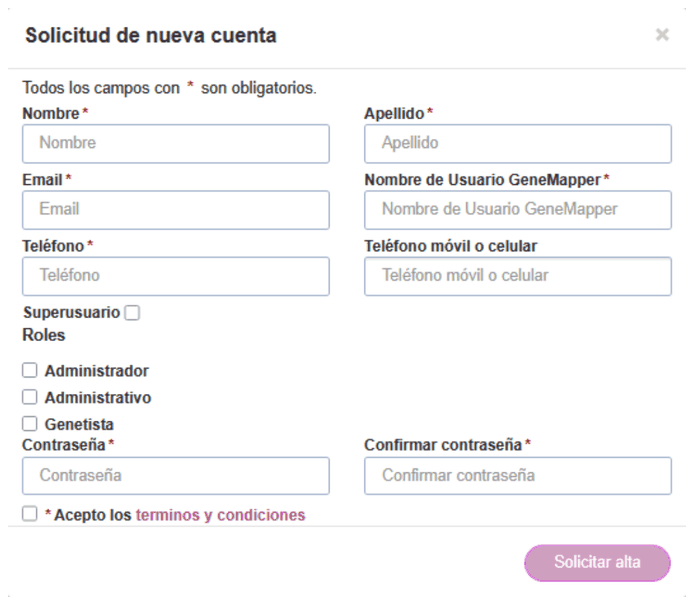

*Los campos marcados en rojo con * (asterisco) son obligatorios. Hasta que no se completen todos los campos obligatorios no se habilita el botón Solicitar alta.*

Tener en cuenta las siguientes consideraciones:

- El campo Usuario **GeneMapper**, debera coincidir con el responsable de la carga del perfil.

- El rol predefinido de **Superusuario** debe asignarse a aquellos usuarios que tengan permisos para trabajar sobre todos los perfiles genéticos de la instancia de GENis independientemente de quién sea el usuario que los haya incorporado en el sistema.

- Tener en cuenta que el rol que viene por defecto en la herramienta es solamente el rol de administrador. Se podrán crear y configurar los roles que se consideren necesarios, por ejemplo: Auditor, Técnico, Administrativo, etc.

Una vez completados todos los datos debe presionar **Solicitar alta**.

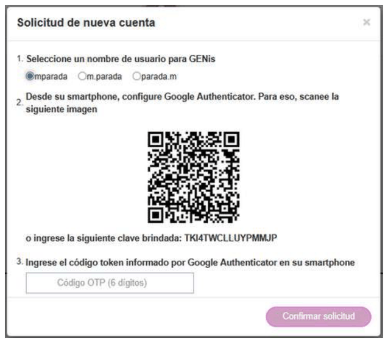

GENis le ofrecerá nombres alternativos de usuario en base al nombre y apellido ingresados. Seleccionar el de su preferencia y luego utilizando Google Authenticator escanee el código o introduzca la clave brindada. De ese modo obtendrá un código de 6 dígitos que debe ingresar en el casillero “Código OTP” para proceder a confirmar la solicitud de alta de usuario.

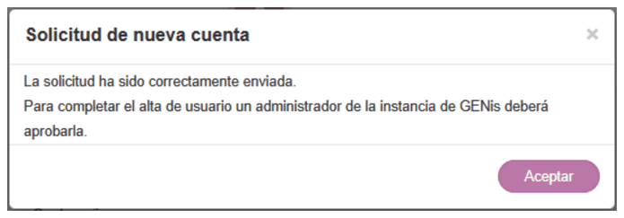

## Activación de una cuenta de usuario

El usuario administrador o quien tenga los permisos suficientes para aprobar el acceso a nuevos usuarios, recibirá en su bandeja de notificaciones una notificación nueva de que tiene una solicitud de usuario pendiente de aprobación.

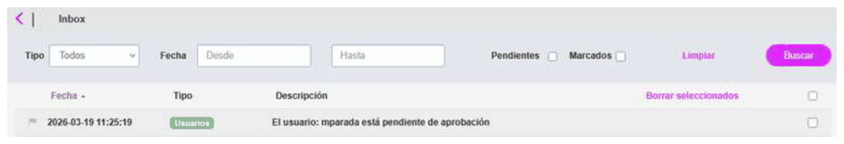

Hacer click sobre la notificación o ir al menú **Configuración/Seguridad/Usuarios**, para acceder al usuario pendiente de activación:

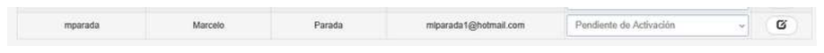

El usuario administrador deberá verificar que el usuario solicitante es el que realmente realiza la solicitud y que los permisos solicitados sean correctos.

Previo a la aprobación, el administrador podrá comprobar y modificar los roles solicitados, de ser necesario, presionando en el ícono de edición

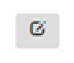

El administrador puede modificar los datos y/o roles asignados al usuario y guardar los cambios.

Para dar el alta efectiva del usuario en GENis, modificar el estado del usuario a **Activo**.

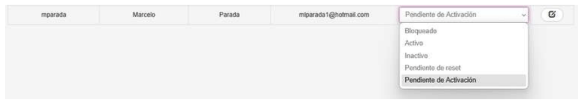

## Blanqueo de contraseña

Para que un usuario pueda realizar el blanqueo de contraseña, el usuario administrador debe cambiar el Estado del usuario solicitante a **Pendiente de reset**. Si el usuario no se encuentra en este estado, no podrá blanquear la contraseña:

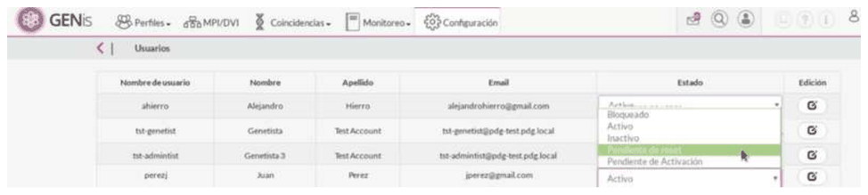

Una vez que el usuario está en el estado **Pendiente de reset**, ingresar a la opción **Olvide mi contraseña/TOTP** y podrá realizar el blanqueo:

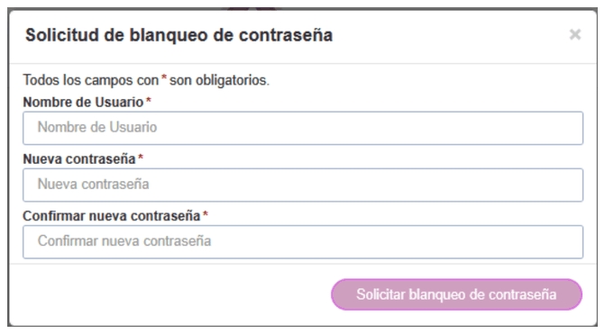

Se le genera una nueva clave brindada:

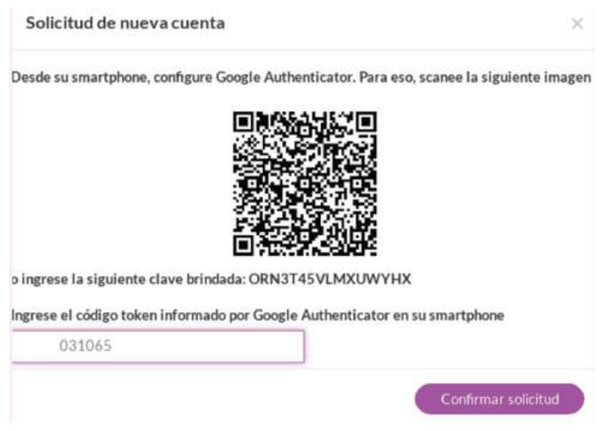

Una vez ingresado el nuevo código TOTP, aparece un mensaje de confirmación del blanquero de contraseña:

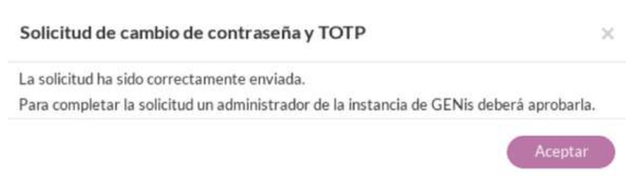

Para poder finalizar el blanqueo de contraseña, al usuario administrador le llega una notificación de que tiene un usuario pendiente de aprobación. El usuario administrador debe cambiar el estado del usuario de **Pendiente de aprobación** al estado **Activo**.

Si no se realiza este cambio de estado, el usuario solicitante no podrá acceder a GENis.

Siempre que se realice un blanqueo de contraseña, el sistema asigna un nuevo código QR para la generación del TOTP.

## Bloqueo de acceso a una cuenta de usuario

Un usuario con permisos de administrador podrá bloquear el acceso de un usuario accediendo al menú **Configuración/Usuarios** y seleccionando el estado **Bloqueado**:

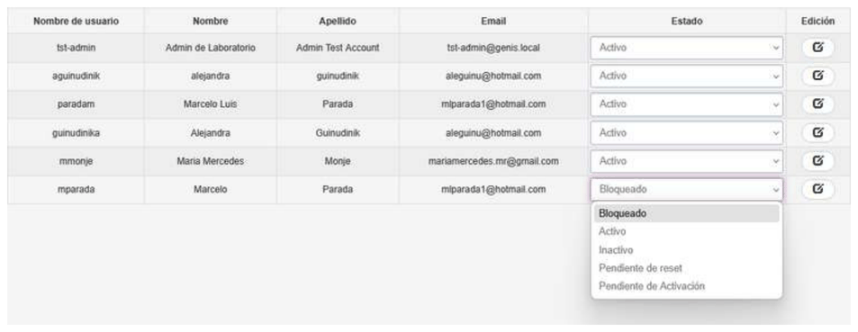

El bloqueo de un usuario se realiza cuando se detecta un mal uso de la aplicación, por ejemplo, se detectan varios intentos fallidos de acceso al sistema en menos de cinco minutos.

## Desactivar una cuenta de usuario

Para desactivar una cuenta de usuario, acceder al menú **Configuración/Seguridad/Usuarios** y seleccionar el estado **Inactivo**:

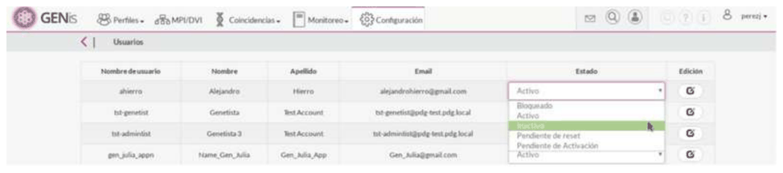

La inactivación de un usuario es una acción planificada, la cual se realiza por un periodo determinado, por ejemplo, el usuario se va de vacaciones, y entonces se lo inactiva para que en ese período queda inhabilitado el acceso al sistema.

## Inicio de sesión

Una vez que un administrador haya aceptado la solicitud, el usuario estará en condiciones de acceder al GENis completando los datos en la pantalla de inicio de sesión:

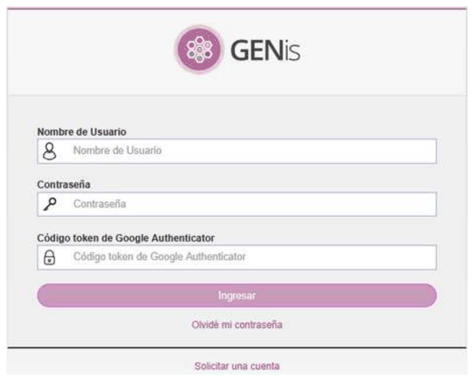

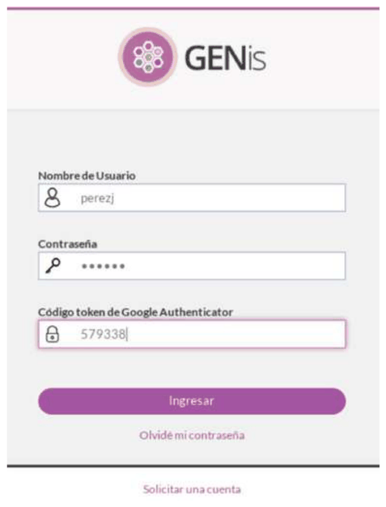

El menú del GENis se adapta a los permisos que posee el usuario que accede. Sobre la derecha se observa el panel de notificaciones:

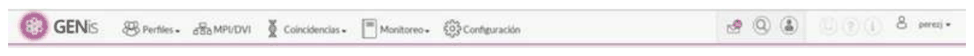

Indica las notificaciones pendientes (ver detalle en [Notificaciones](18_notificaciones.md)).

Indicador de búsquedas de coincidencias en proceso

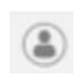
Indicador de búsqueda de personas en proceso

Permite bajarme el Manual de Usuario a la PC Presenta ayuda en pantalla

PC Presenta ayuda en pantalla

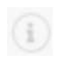
Información del sistema
