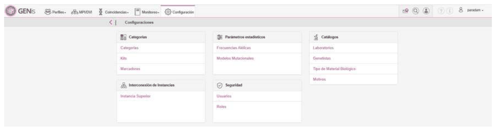
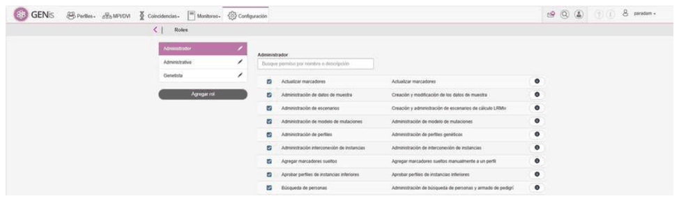
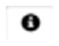
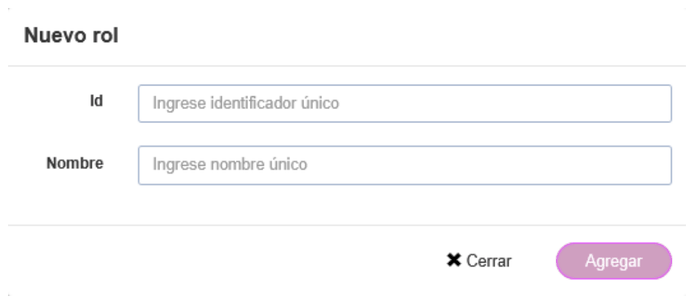
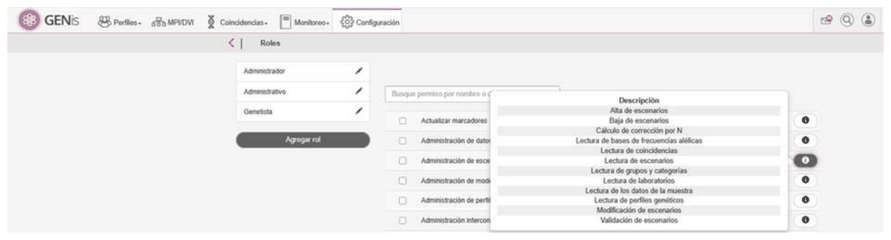
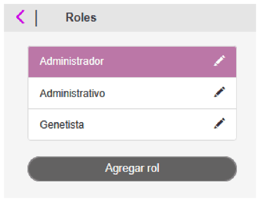
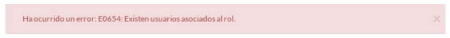

# Roles

## Roles

GENis provee la posibilidad de generar roles que son luego asignados a los usuarios y definen las operaciones que los mismos pueden realizar sobre el sistema.

Para acceder a la configuración de roles, seleccionar en el menú **Configuración /Seguridad/Roles**

A la izquierda se tienen los roles configurados en GENis y a la derecha los permisos que se pueden otorgar al rol:

Tildando la casilla del permiso, el mismo queda activo para ese rol. El ícono muestra una breve descripción del permiso.

## Agregar un rol

Para agregar un nuevo rol presionar en el botón **Agregar rol** en la parte de la izquierda y asignar al mismo un ID y un nombre.

El ID debe contener al menos 4 caracteres, no debe contener espacios ni acentos:

A cada rol se le asignan una serie de permisos que a su vez agrupan un conjunto de operaciones que estarán habilitadas para el o los usuarios a los que se les asigne ese rol (ver próxima sección: Configuración de roles).

## Configuración de roles

En el menú de la derecha se encuentran los nombres de los permisos que pueden asignarse al rol, una breve descripción de los mismos y presionando en el botón de información se accede al detalle de las operaciones que se pueden realizarse cuando se asigna ese permiso al rol:

## Modificar o eliminar un rol

Para modificar el nombre o eliminar un rol de GENis presionar en

Tener en cuenta que para poder eliminar un rol no debe tener ningún usuario asociado, sino no se va a poder eliminar y aparece el siguiente mensaje de error:

