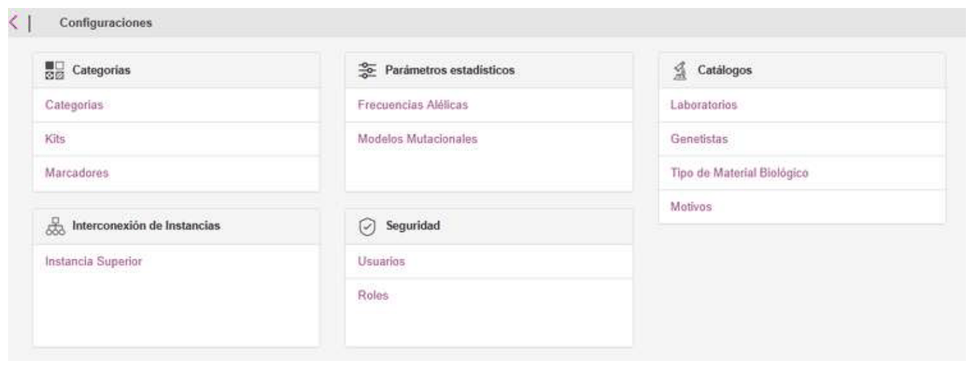
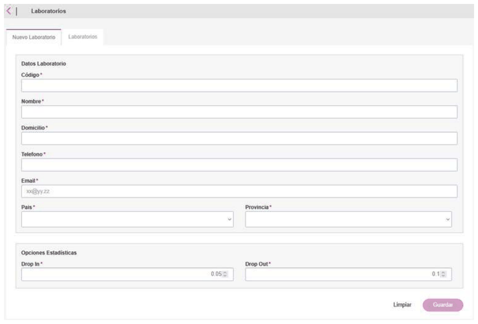
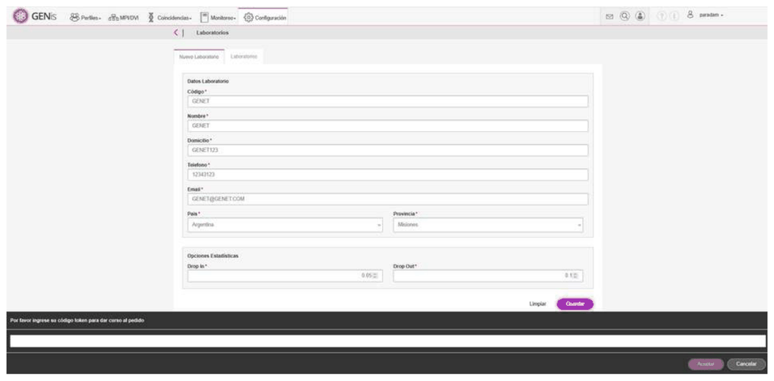
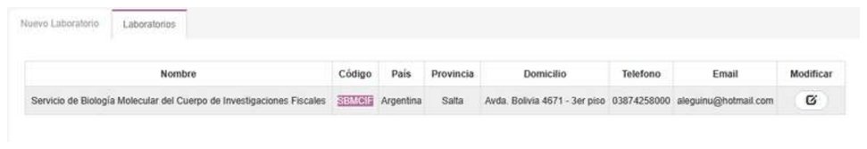
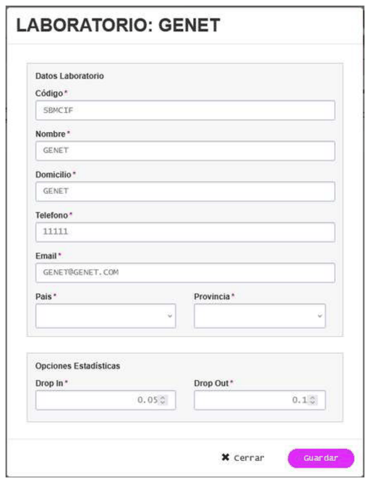

# Laboratorios

## Laboratorios

La arquitectura de GENis permite su utilización no solo en laboratorios centrales o de referencia, sino también en **instancias operativas descentralizadas**, configuradas como nodos dentro de una red .

Este diseño habilita la implementación de GENis en **laboratorios de procesamiento rápido**, tales como aquellos ubicados en **pasos fronterizos**, **aeropuertos**, **puertos**, **unidades móviles** o **centros de respuesta inmediata**, donde resulta necesario realizar comparaciones genéticas preliminares en plazos reducidos.

En estos contextos, la instancia inferior puede operar con un conjunto acotado de roles y categorías, permitiendo la carga de perfiles, la ejecución de búsquedas locales y la detección temprana de coincidencias. Los perfiles relevantes pueden ser posteriormente **replicados hacia una instancia superior**, donde se realiza la consolidación, validación y análisis integral de la información.

Este esquema descentralizado no reemplaza a las instancias centrales, sino que las complementa, permitiendo una **respuesta rápida en el terreno** sin comprometer la trazabilidad, la seguridad ni la coherencia global de la base de datos genética.

La definición de los roles de usuario, las categorías habilitadas y las reglas de búsqueda en estas instancias operativas debe ajustarse a la normativa vigente y a los protocolos institucionales de cada jurisdicción, garantizando que las decisiones finales y los análisis periciales concluyentes se realicen en los niveles correspondientes.

Para ello deben darse de alta accediendo al menú **Configuración/Laboratorios**. En la solapa **Nuevo Laboratorio** pueden incorporarse todos los datos del mismo:

El código es un identificador único para cada laboratorio que servirá para generar en GENis los códigos de los perfiles genéticos internos, garantizando su unicidad.

Para cada laboratorio deben definirse los parámetros de Drop-in y Drop-out que se utilizarán luego para los cálculos de LR por default.

En la solapa Laboratorios se accede al listado de laboratorios existentes:

Para cambiar datos de los laboratorios, presionar el botón **Modificar**  y guardar los cambios presionando en **Guardar**:

El código de identificación de perfiles en GENis se compone de un prefijo y un número correlativo.

El prefijo incluye el código del laboratorio definido por el usuario, junto con otros identificadores propios de la configuración del sistema (como país o instancia).

Por ejemplo, en un código como AR-A-SBMCIF-XXXX, "SBMCIF" corresponde al código del laboratorio (sugerido por el laboratorio), mientras que el resto del prefijo es generado automáticamente por el sistema.
El sufijo numérico (XXXX) es asignado de forma automática y secuencial por GENis para cada nuevo perfil. Esto garantiza la identificación única de cada perfil dentro del sistema.
