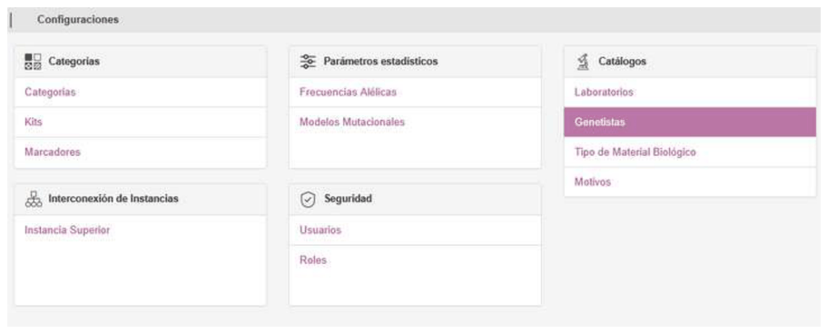
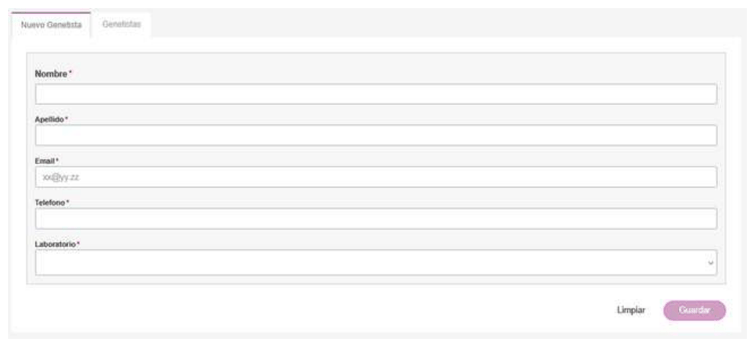
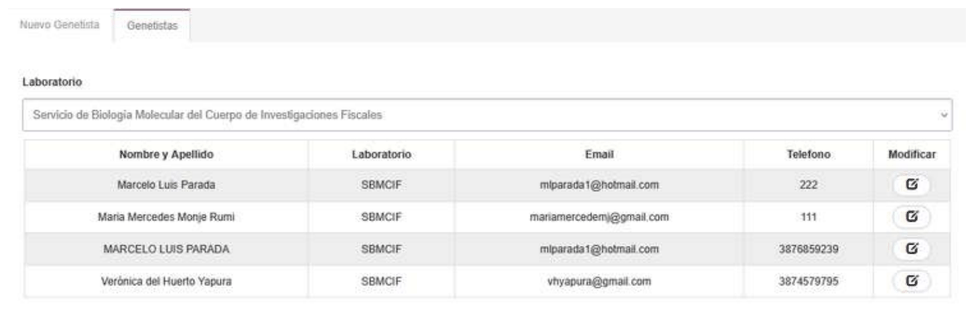

# 5. GENETISTAS

## GENETISTAS

Cuando en una instancia de GENis se pueden dar de alta perfiles provenientes de otros laboratorios, puede especificarse también quién es el genetista responsable del perfil a incorporar perteneciente a ese laboratorio. Esos genetistas no son usuarios de GENis, por lo que para, en caso de ser necesario, otro usuario pueda contactar al responsable de perfil genético ingresado, es de utilidad ingresar sus datos.

Para dar de alta los datos de genetistas que envían perfiles genéticos desde laboratorios que no cuentan con una instancia de GENis, ingresar al menú **Configuración/Genetistas** y completar los campos en la solapa **Nuevo Genetista**:

Una vez ingresados los datos, presionar en **Guardar**.

Para ver los datos de los genetistas de cada laboratorio definido en GENis, ir a la solapa **Genetistas** y seleccionar el laboratorio correspondiente:

Desde allí se pueden modificar los datos, pero no se permite su baja dado que pueden existir perfiles genéticos que fueron incorporados al GENis y por los que fueron designados responsables.

Para modificar los datos de un genetista presionar en 

Una vez modificados los datos necesarios, presionar en **Guardar**.
