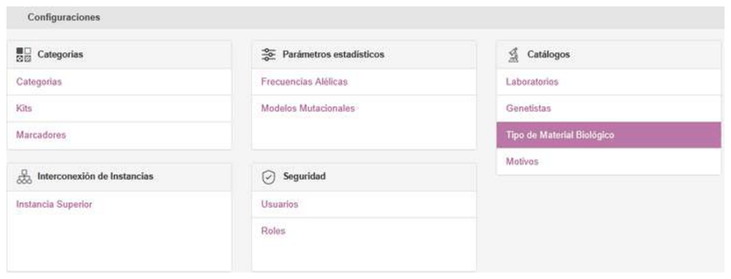
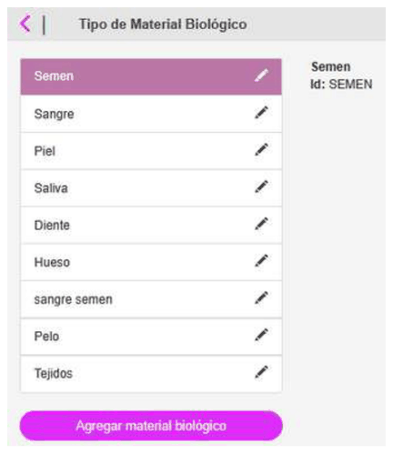
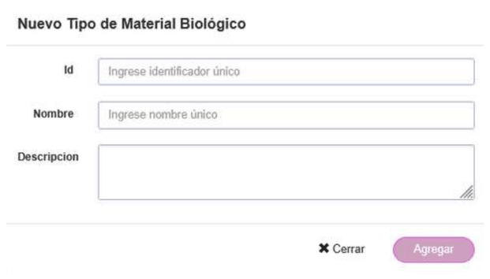
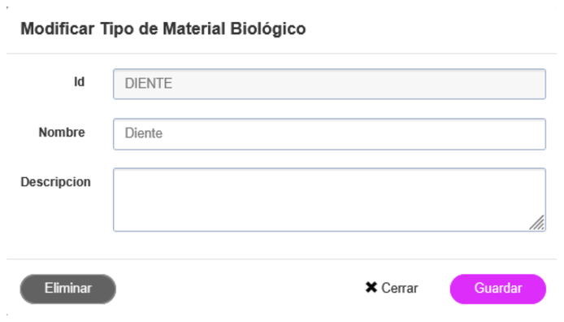

# Types of biological materials

## Types of biological materials

When a profile is created in GENis, one of the fields to fill in is the type of biological material the sample comes from. From the **Configuration/Biological Material Type** menu, an administrator can create, modify, and delete items from the list:

To add a new type of biological material that will be available for registering genetic profiles, click the **Add biological material** button:

Enter, as mandatory fields, a unique identifier and a name, which will be the one displayed in the **Biological Material Type** drop-down list in the Sample Data when registering the metadata of a new profile.

To edit an existing type of biological material, click 

You can modify the name, the description, or delete the type of biological material by clicking the **Delete** button.
