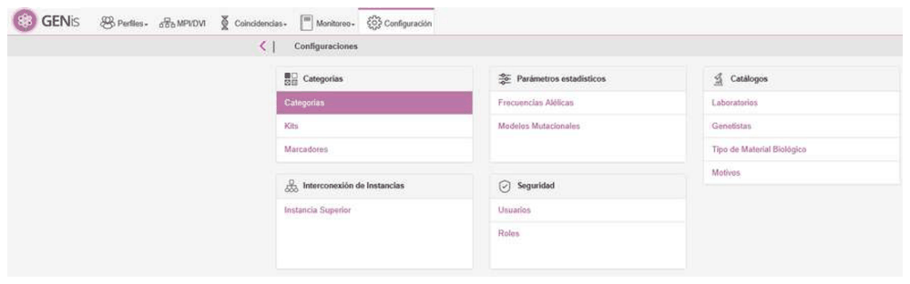
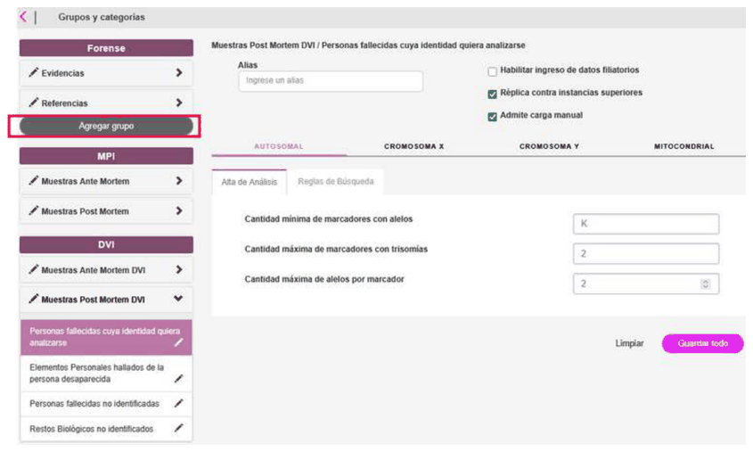
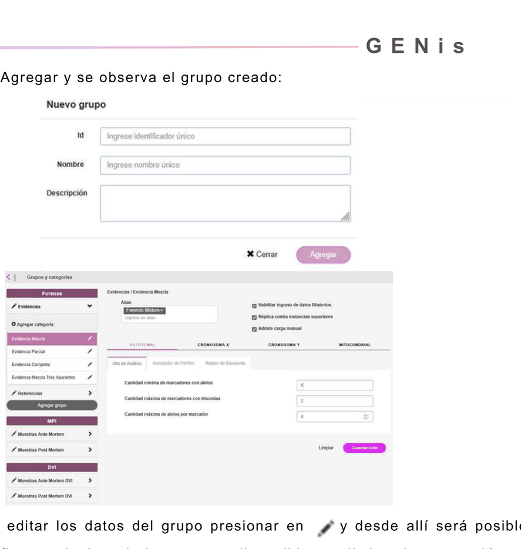
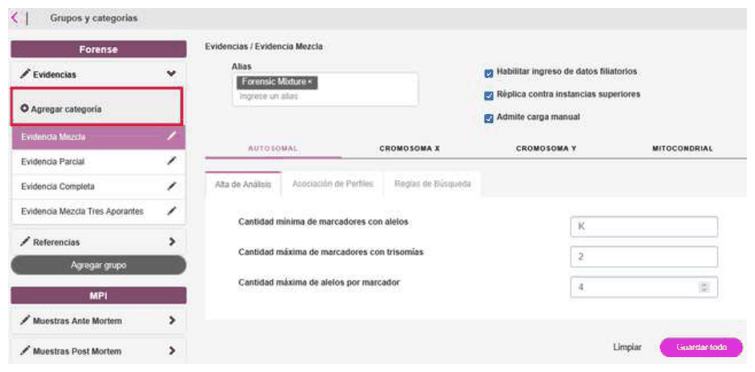
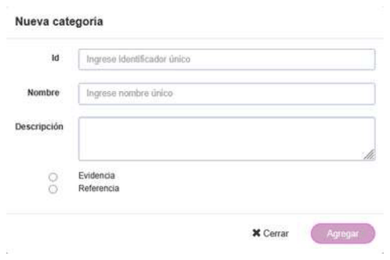
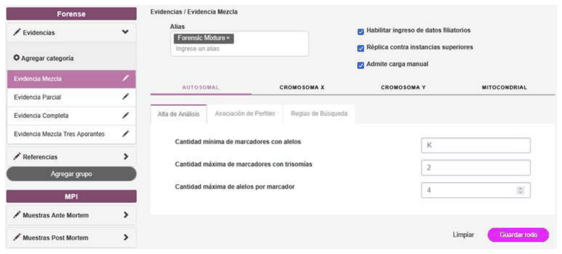
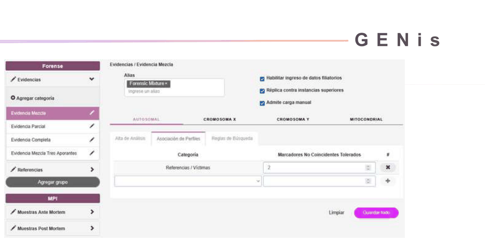
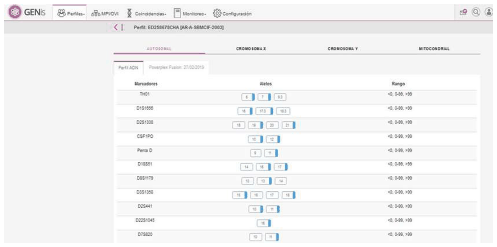
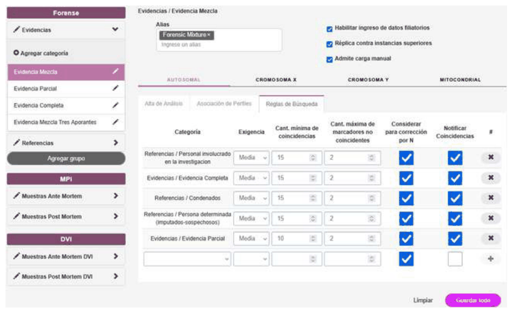

# Categories

All genetic profiles incorporated into GENis must belong to a category. The definition of categories is fundamental to the system's operation. Categories define: admissibility parameters for genetic profiles, association rules, search rules, and a list of possible aliases for batch uploads, in case the category is provided in the corresponding file in the **Specimen Category** field.

**Note: The ENFSI guide ("Guideline for DNA Database Management Review and Recommendations", 2023) states that:**

- **The first step in establishing a forensic database is to define its legal purpose, which determines which categories of individuals will be included (persons charged, convicted, detained, suspects, missing persons, human remains, relatives, etc.).**

- **Section "3. INCLUSION CRITERIA" explains that the criteria for including a profile depend on: the source of the profile, the type of sample, legal conditions, etc.**

- **It is mentioned that inclusion must be regulated by specific legislation and that categories must be clearly defined in national (or provincial, in our case) regulations; if the categories created are enabled to replicate to a higher-level instance, their characteristics must be validated by that instance, and if not, they must comply with the laboratory's and/or provincial regulations.**

**The following image illustrates categories and characteristics agreed upon between an RNDG and a province.**

| Category Name | Description | Alias |
| --- | --- | --- |
| EvidenciaCompleta | Evidence, single contributor | Forensic unknown |
| EvidenciaParcial | Evidence, partial amplification | Forensic Partial |
| EvidenciaMezcla | Evidence, at least two contributors | Forensic Mixture |
| Víctima | Victim | |

| Category ID | Minimum number of Markers | Maximum number of multiallelic markers | Max number of alleles per marker |
| --- | --- | --- | --- |
| Condenado | 15 | 2 | 2 |
| Imputado | 15 | 2 | 2 |
| Evidencia Completa | 15 | 2 | 2 |
| Evidencia Parcial | 9 | 0 | 2 |
| Evidencia Mezcla* | 15 | 2 | 4 |
| Víctima | 15 | 1 | 2 |

***Prior to using the GENis system, it is essential that the community of experts decide how the categories and search rules should be defined, since when profiles are replicated between different instances it will be advisable for the same rules to apply to all of them.***

As we will see later, due to the operating logic of the GENis system, it is always necessary to specify whether a category will store profiles from reference individuals (known-source samples) or from forensic evidence.

For greater clarity and ease in administering categories, they are created as belonging to groups. For example, a group called "Known-source reference samples" can be defined, into which the categories that will store profiles from reference samples will be incorporated; and another group called "Evidence" can be defined, into which the categories holding genetic profiles from evidence obtained at crime scenes will be incorporated.

**Note:** Keep in mind that for the MPI/DVI groupings, categories and groups cannot be added, deleted, or edited (see details in the following section). To access category administration, select the Settings/Categories menu:

## Category definition

For the person-search modules (MPI / DVI), fixed categories were defined that cannot be deleted or modified. These categories are as follows:

**MPI (Identification of missing persons)**

1. **Ante Mortem Samples (AM)**
   - a. Person seeking to learn their biological identity. (Individual INNV)
   - b. Reference Individuals (IR): Relative(s) of the missing person(s).
   - c. Personal Items of the missing person (ER).
2. **Post Mortem Samples (PM)**
   - a. Personal Items found belonging to the missing person (ENN).
   - b. Unidentified Biological Remains (RNN).
   - c. Unidentified deceased persons (INN).
   - d. Deceased persons whose identity is to be analyzed (PFNI).

**DVI (Disaster Victim Identification)**

1. **Ante Mortem Samples (AM)**
   - a. Reference Individuals (IR): Relative(s) of the missing person(s).

     Profiles that will be associated with a pedigree are entered in this category (IR_DVI).
2. **Post Mortem Samples (PM)**
   - a. Personal Items found belonging to the missing person (ENN_DVI).
   - b. Unidentified Biological Remains (RNN_DVI).
   - c. Unidentified deceased persons (INN_DVI).
   - d. Deceased persons whose identity is to be analyzed (PFNI_DVI).

Validations to keep in mind for the groupings:

**For MPI/DVI:**

- New categories cannot be added.
- Categories and groups cannot be deleted or edited.
- Only the parameters of the analysis registration rules can be modified.
- New search rules cannot be added, nor can existing ones be modified.

**For Forensic:**

- New groups can be created.
- New categories can be added
- Groups and categories can be edited (all tabs can be modified)
- On the **Search Rules** tab, it only allows me to add categories belonging to the **Forensic** group.

When a profile is entered into the database, in order to run the match, the category grouping to which the category belongs is checked first:

- If it is a profile with a category belonging to the **Forensic** grouping, the match is only run against Forensic categories.
- If it is a profile with a category belonging to the **MPI** grouping, the match only runs against MPI categories, that is, it searches against all active MPI pedigrees.
- If it is a profile with a category belonging to the **DVI** grouping, no search will be launched; that is, this search is triggered when the pedigrees within the case are activated together with the case's profiles.

## Creating and editing forensic category groups

Going to the **Settings/Categories** menu, press the **Add Group** button in the menu on the left to define a category grouping:

Keep in mind that groups can only be added for the **Forensic** category.

Press **Add** and the created group will be shown:

To edit the group's data, press ✎, from where it will be possible to modify any of the available fields or delete the grouping if no categories are associated with it.

## Creating a new category

To create a new category, select **Add Category** from the menu on the left:

In the **Id** field, enter a unique category identifier, which cannot contain spaces or special characters such as accents, quotation marks, etc.

Then enter the category name and, optionally, a description. Finally, define whether the category being created will store genetic profiles from reference samples or from forensic evidence.

Example:

By pressing **Add**, you access the configuration screen for all of the category's options.

Once the evidence category has been added, its configuration proceeds:

- **Alias**: corresponds to the GeneMapper code. The alias can contain spaces and commas. After entering it, press enter or tab. To delete it, use the keyboard or the x. Duplicate aliases are not allowed; that is, if the alias is already used by another category, it cannot be assigned as a duplicate alias.

The following checkboxes can be enabled:

- **Enable entry of personal data:** this checkbox should be checked if, for this category, the data of the person from whom the reference sample was taken can be entered.

- **Replication to higher-level instances:** this checkbox should be checked if the GENis instance is connected to a higher-level instance, in which case the profiles must be transferred in search of matches with others coming from other instances/laboratories.

- **Allows manual entry:** allow manual loading of profiles with this category.

## Analysis registration

This tab establishes the admissibility criteria for profiles that can be incorporated into the category:

- **Minimum number of markers with alleles:** by default we see the value K, which corresponds to the number of **representative** markers provided by the kit used to process the sample. A formula can be defined using K as a reference, for example: K/2. This indicates that at least half (or the value rounded up) of the markers provided by the kit used to process the sample must contain allele values.

- **Maximum number of markers with trisomies:** for reference samples, this specifies the number of markers that can contain more than two alleles. For evidence, it is used to infer the number of contributors to the sample.

- **Maximum number of alleles per marker:** in the case of Evidence-type categories, this indicates the maximum number of alleles I can have in each marker.

## Profile association

This tab is only available for categories defined as evidence and allows selecting the other category to which the profiles of multiple contributors must be associated. Its usefulness lies in allowing the reference profiles of victims to be associated with evidence, thereby optimizing match searches:

The corresponding category must be selected, along with the maximum number of non-matching markers allowed between the evidence and the reference profile, to tolerate possible drop-ins, drop-outs, or null alleles.

To complete the registration, press the button  and then **Save**.

## Search rules

In this tab, the rules for searching for matches between profiles incorporated into the category must be configured.

In **Category**, select the category against which a match search will be launched every time a new profile is incorporated into the category being configured.

In **Stringency**, if **Mixture-Mixture** is selected, no stringency level is set, since it is designed to run between profiles derived from forensic evidence with two contributors. The other stringency options available are: high, medium, or low. **Correction for N** allows the system to avoid treating as incompatible those markers where one of the profiles shows an absence of information (N). In this way, missing data at a marker does not automatically result in exclusion in the comparison.

Search rules are bidirectional; that is, when a rule is created from one category against another, that rule will subsequently also be seen in the second category against the first, with the same parameters.
