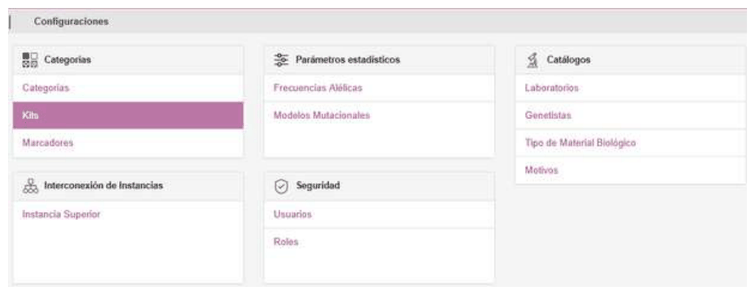
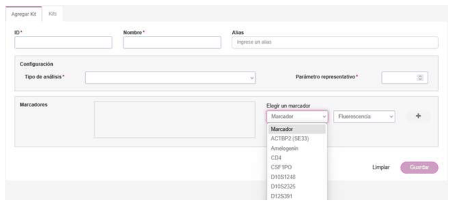
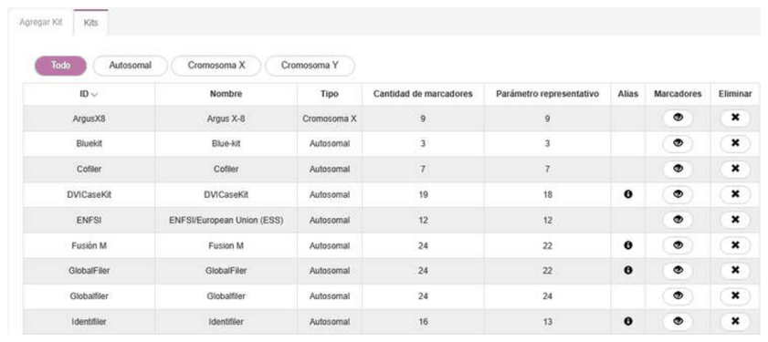
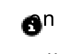
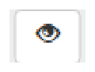

# Kits

Each genetic profile is obtained using one or more kits.

Each kit has a set of markers or systems.

To add a new kit, go to the **Configuration/Kits** menu.
The first tab lets you add kits, and the second tab shows the
existing kits. Fields marked with an asterisk (*) are mandatory.

Add the markers belonging to the kit. The **Representative
Parameter** field represents K in the category configuration.

Once finished, click the **Save** button.

On the **Kits** tab, you can see the list of available kits:

If an alias has been added, the  icon appears in the
**Alias** column, and clicking it shows the associated alias
or aliases.

When performing a bulk profile upload, the upload file must include the
**UD2** field, which must match the **kit's name or alias**. This
ensures that the genetic profile being imported is correctly
associated with a kit that has already been defined and is available
in the GENis tool. Once the alias has been loaded, it is
visible in the *Alias* column of the list of available kits.

In the **Markers** column, clicking the  icon shows
the markers associated with that kit.
