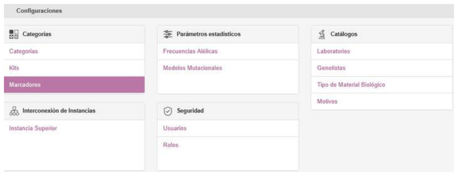
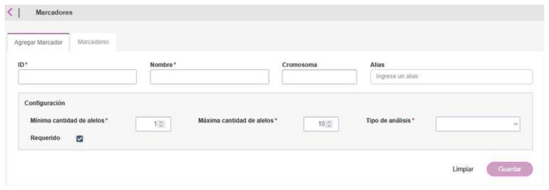
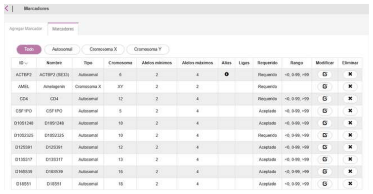
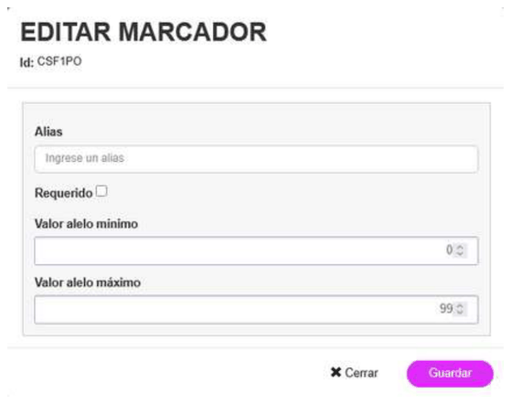
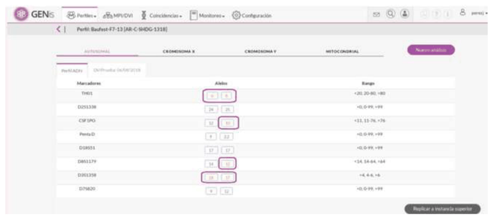
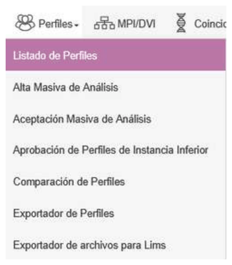
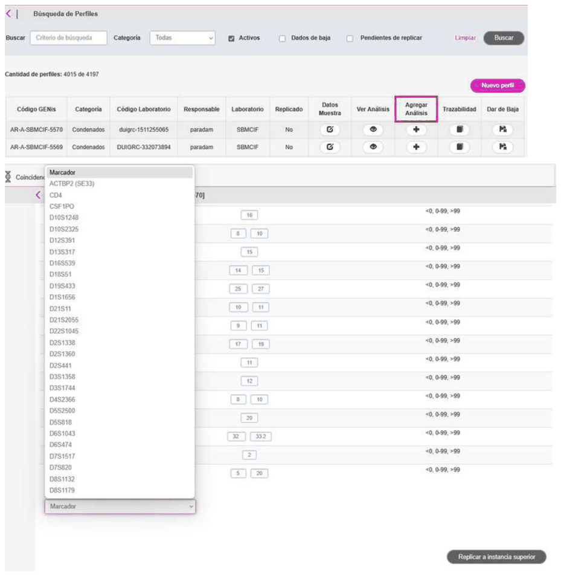

# Markers

## Markers

To access markers, go to the **Settings/Markers** menu:

There are two tabs: **Add Marker**, for adding new markers, and the **Markers** tab, with the full list of existing markers.

## Adding markers

To add a new marker, go to the first tab, **Add Marker**.

Fields with an asterisk (*) are mandatory

- **Chromosome:** the chromosome on which the marker is located (1-22, X, Y, XY, MT). Depending on the value entered in **Chromosome**, minimum and maximum allele values are available. If the chromosome has a value from 1 to 22, X, or Y, the minimum and maximum allele values will appear. If the marker's chromosome is XY or MT, no validation is entered.

By default, the **minimum allele value** is 0 and the **maximum allele value** is 99.

Null or empty values will not be allowed. Range validation checks that the maximum value is greater than or equal to the minimum value. It will be validated that the value is an integer between 0 and 99.

In the case of the **Autosomal analysis type**, there is the option to link markers:

- **Minimum number of alleles:** the minimum number of alleles to enter in a reference analysis.

- **Maximum number of alleles:** the maximum number of alleles to enter in a reference analysis.

- **Required:** this checkbox must be checked if the marker is to be required. Otherwise, the marker will remain as accepted. Both **Required** and **Accepted** type markers will take part in the Matching process. The minimum number of markers must be validated only against the total number of **Required** markers.

## Modifying/deleting markers

The **Markers** tab shows all existing markers sorted alphabetically:

It is possible to modify an existing marker by clicking the icon

Only the following fields can be modified: alias, the Required checkbox, and the minimum and maximum allele values:

To delete a marker, click the delete button

## Allelic values out of range

If the allelic value entered for the marker falls outside the defined allelic ladders, the analysis will be accepted and the out-of-range alleles will be marked in a different color:

## Adding standalone markers

Standalone markers can be added to an existing profile. Note that to be able to add standalone markers, the role must have this option configured (see section **3.2 Role Configuration**).

To add a standalone marker, go to the profile where the marker is to be added and select **Add Analysis**. In the menu at the bottom left, **Add a marker**, select the marker you want to add:

## Microvariants

For autosomal and Y-chromosome markers, if an allele is recorded with a microvariant in the form ".x", for example 12.x, it must match against any microvariant of 12, that is, values between 12 and 13, not inclusive. The "x" functions as a wildcard value.

If two alleles are entered in the .X form, for example 10.X and 10.X, they are considered two distinct alleles, not a homozygote.

If an allele is recorded with values outside the ladder, the limit value of the marker's allelic ladder will be used for comparison. For example, if the allele was entered as "10" but the allelic ladder defined for the marker was <11, 11-20,20>, the entered allele will be compared as "<11" and will only match other allelic values of the form "<11".

In the match result, both the originally entered allele value and the one used for the comparison must be shown. Following the previous example, it should display the value "10/<11" for that marker (with "10" being the originally entered value and "<11" the value used for the comparison).
