# Bases de datos de frecuencias

GENis debe contar con una Base de Datos de Frecuencias Alélicas (Base de Datos Poblacional) porque esta información es **esencial e indispensable para la valoración estadística de las coincidencias** de perfiles genéticos.

Esta base de datos poblacional se utiliza para:

1. **Estimar la Rareza y Probabilidad de Coincidencia:** Se usa para estimar las **Probabilidades de *Match* Aleatorio (RMP)** y, de manera crucial, para calcular el **Cociente de Verosimilitudes (LR)**. El objetivo es determinar la frecuencia con la que se espera que ocurra un perfil de ADN dado en una población. Tener información de alta calidad en esta base es importante para hacer una **estimación fiable de la frecuencia** para una coincidencia aleatoria.
2. **Cálculo de LR por *Default* en GENis:** El sistema realiza cálculos automáticos del LR por default para que el analista pueda "evaluar rápidamente el valor que puede poseer el hallazgo de una coincidencia".
3. **Análisis de Escenarios:** La base de frecuencias alélicas es un parámetro que se puede modificar y seleccionar al **generar escenarios de cálculo**, junto con el **Coeficiente de co-ancestralidad (Theta)**.
4. **Cálculos de Frecuencias Mínimas:** GENis permite configurar las Bases de Datos de Frecuencias para calcular frecuencias mínimas (si estas no están incluidas) utilizando modelos como **NRC II**, que requiere ingresar el valor **N** (número de individuos analizados en la población de interés).
5. **Perfiles y Haplotypes:** La base de datos contiene colecciones de perfiles de ADN de individuos anónimos y es importante para estimar la frecuencia esperada de haplotipos de ADN mitocondrial (mtDNA) que se observan en los casos forenses.

Para dar de alta las bases de frecuencias, ir al menú Configuración/Parámetros Estadísticos/Frecuencias alélicas.

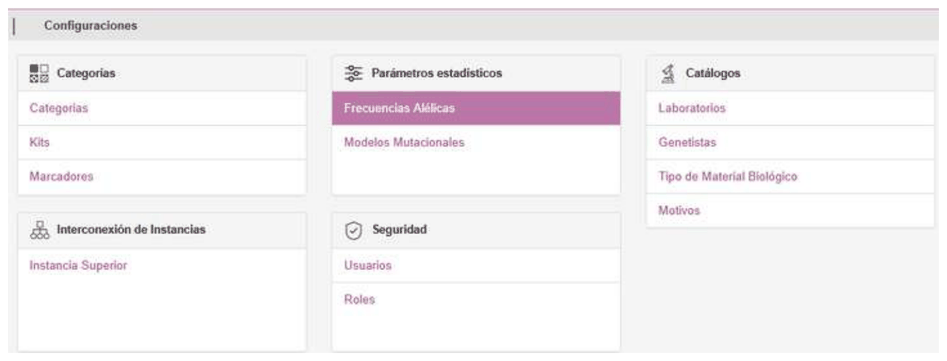

Debe seleccionar el archivo de texto delimitado por comas (CSV). El formato de estos archivos debe contener en la primera columna del encabezado la palabra "**alelo**". Luego, en la primera fila, los nombres de los marcadores y en la primera columna los valores de los alelos.

Si el archivo contiene las frecuencias mínimas, las mismas deben incorporarse en la última fila del archivo y como valor de alelo la palabra "**fmin**".

A continuación se muestra un ejemplo de este tipo de archivo:

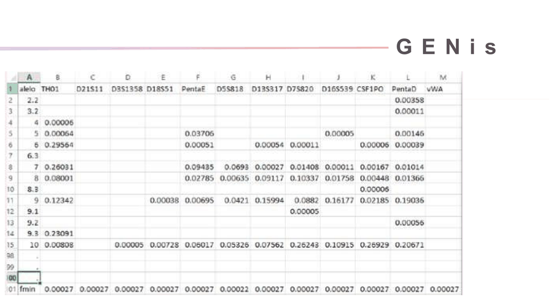

Para ingresar una nueva base de frecuencias, seleccionar el archivo, el nombre que se le dará a la base de datos, y el valor de theta.

El valor de Theta corresponde con el coeficiente de Inbreeding de la población. Solo se aceptan valores mayores o iguales a cero.

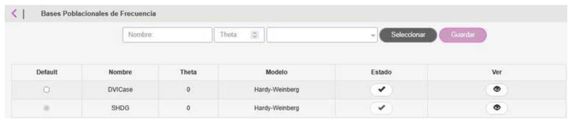

Presionar en **Guardar**.

Si la frecuencia mínima no viene dada, se presentará la siguiente pantalla para que el usuario seleccione el modo de cálculo:

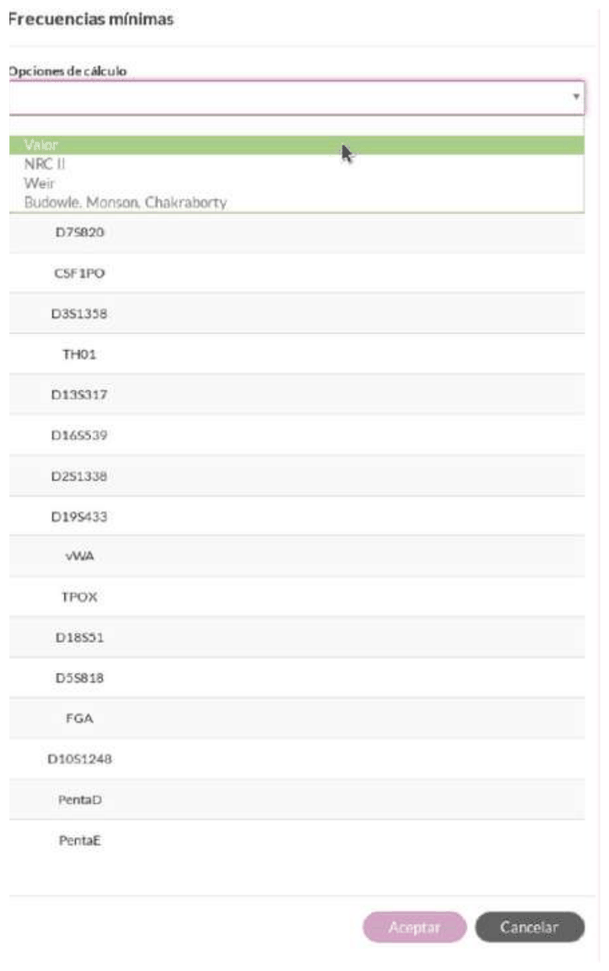

**1) Valor:** el usuario podrá ingresar un valor de frecuencia mínima para cada uno de los marcadores genéticos.

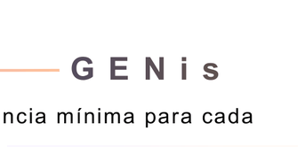

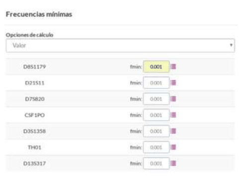

Presionando en el botón a la derecha del valor ingresado 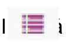, autocompletará el resto de los casilleros con el mismo valor.

Los valores ingresados deben contener puntos, no debe ingresarse comas.

**2) NRC II (National Research Council II):** Este método, que se basa en las recomendaciones del Consejo Nacional de Investigación, requiere que el usuario ingrese el **Número de individuos (N)** analizados sobre los cuales se elaboró la tabla de frecuencias. Este enfoque se utiliza para asegurar que un alelo haya sido muestreado lo suficiente (históricamente, al menos cinco veces) para ser utilizado de manera fiable en los cálculos estadísticos

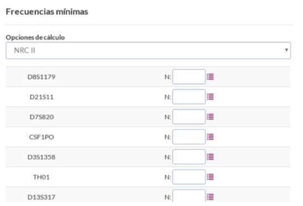

**3) Weir:** Método del estimador bayesiano Beta-binomial, este método incorpora heterogeneidad poblacional y usa un parámetro αlfa (parámetro que representa variación entre subpoblaciones, valores típicos entre 1 y 2 o algo mayor según la estructura poblacional) que modela subestructuras poblacionales.

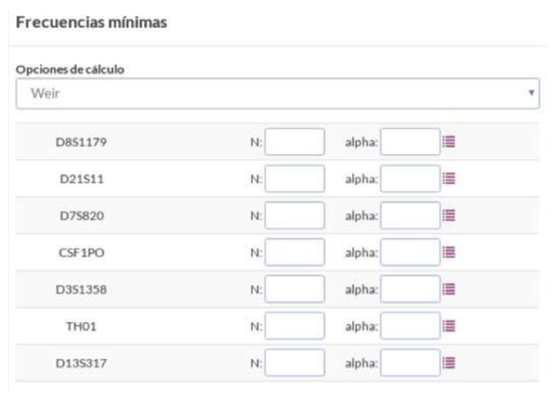

**4) Budowle, Monson, Chakraborty:** Método theta-corregido + constante C, Este método es el más conservador y matemáticamente más completo. Donde N es el numero de la muestra, alfa es el parámetro bayesiano y C es la constante para compensar la ausencia total del alelo en el muestreo (puede tomar valores 5, 10, etc. dependiendo del conservadurismo).

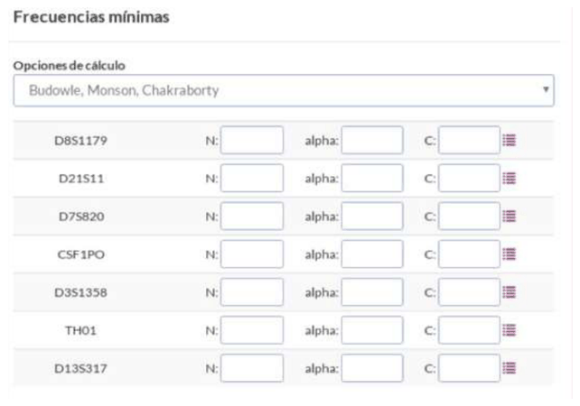

Siempre se tiene una Base de Frecuencia seteada como Dafault:

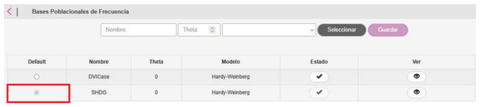

| Método | fmin cuando el alelo NO aparece | Dependencias | Conservadurismo |
| --- | --- | --- | --- |
| Manual | fmin = valor fijo | ninguno | Depende del usuario |
| NRC II | 5 / (2N) | N | Medio-alto |
| Weir | α / (N + α) | N, α | Medio (depende de α) |
| Budowle–Monson–Chakraborty | (C + α) / (2N + α + C) | N, α, C | alto (el más conservador) |
