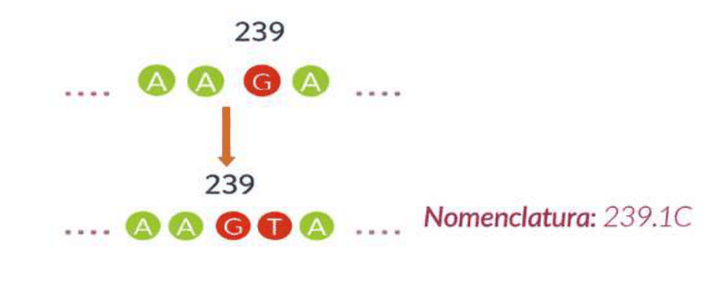
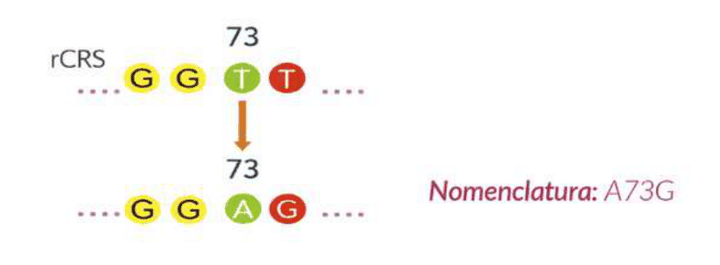
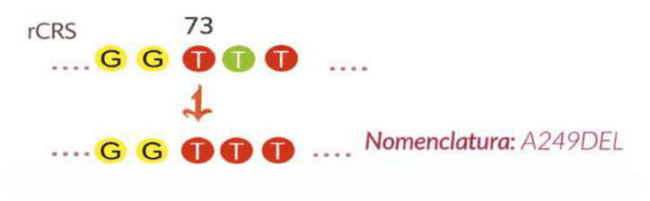
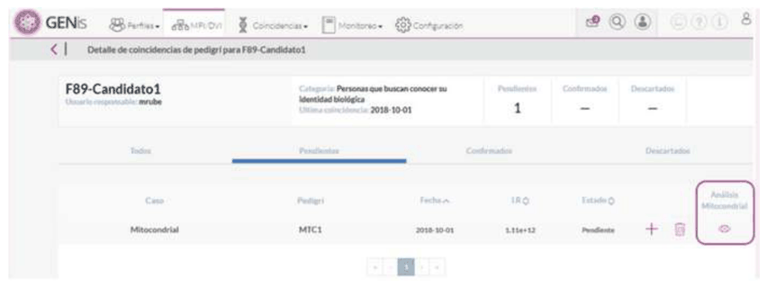
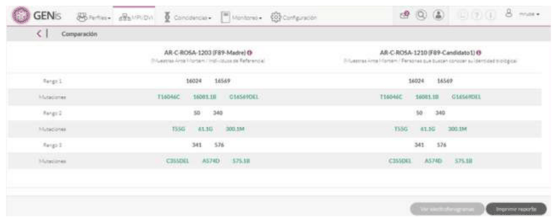

# Mitochondrial

Mitochondrial DNA (mtDNA) is a genetic marker of special use in forensic genetics due to its **high copy number per cell**, its **strictly maternal inheritance**, and its **greater resistance to degradation** compared to nuclear DNA. These characteristics make it a valuable resource for analyzing highly **degraded** samples, such as ancient bones, rootless hairs, long-buried human remains, or biological evidence with little nuclear DNA.

In the context of a forensic database, mtDNA expands the possibilities for comparison when:

- autosomal STR profiles cannot be obtained,
- the available genetic material is scarce or fragmented,
- the aim is to identify remains where the maternal line is relevant (for example, in MPI/DVI contexts).

Representation of the mitochondrial haplotype
In forensic genetics, mtDNA profiles are expressed as a **list of differences relative to the rCRS reference sequence** (revised Cambridge Reference Sequence). Each haplotype is recorded by means of:

- the position within the control region (HVS-I, HVS-II, or other analyzed regions), and
- the alternate base observed in the sample.

Haplotype example (IUPAC):
**16093C 16223T 263G 309.1C 315.1C**

The GENis system does not perform alignments or interpret chromatograms; therefore, **the differences must be determined beforehand by the analyst** in their sequencing software. The final haplotype is then loaded into the system exactly as reported in the expert report.

The system analyzes up to 4 ranges with their corresponding mutations.

Comparisons are performed within the defined range of 16024 to 16569 and of 1 to 576, and IUPAC codes are used (positional heteroplasmies).
The inconclusive points 16193, 309, 455, 463, 573 are not taken into account in GENis because:

- **they mutate very frequently**,
- they are subject to **expansions or contractions of repeats** (309, 455, 463, 573),
- they often exhibit **length heteroplasmy**,
- they are not stable across tissues of the same person,
they provide no real discriminating value.

## Upload format

The accepted formats for loading mutations are as follows:

- **Insertions:** a letter is added

- **Substitution or nucleotide change:** consists of changing one letter for another

- **Deletions:** absence of a letter

## Match

The GENis system compares mitochondrial haplotypes using a model based on differences between positions (mismatches). The mitochondrial match is always performed in **high-stringency mode**, that is, considering all informative positions of the haplotype, except those corresponding to highly variable regions (309, 455, 463, 573, and 16193), which are not used to exclude profiles.

Each haplotype can contain up to **four ranges** or analyzed segments. During comparison, GENis adds up all the differences between the two profiles across all ranges. The final result is the **total number of mismatches**, which is compared against the **maximum allowed threshold** configured in the profile's category.

Two profiles are considered a match when:

total mismatches ≤ threshold allowed for the category

If an individual has more than one mitochondrial analysis loaded, GENis performs cross-comparisons among all of them; it is enough for **a single pair of haplotypes** to meet the matching condition to declare an overall match between the profiles. In the Match Manager, the system groups the matches by profile, showing which haplotypes were responsible for the match.

If a match has occurred, in the match manager, the cards group the matches by profile.

Clicking the eye icon shows the detail of the matches by profile.

