# Profile registration

The **profile registration** process refers to the set of actions through which a genetic profile is formally incorporated into the GENis system database, becoming available for storage, comparison, and eventual replication to higher-level instances. This stage is a critical point in terms of traceability, technical responsibility, and validity of the record, since it defines the link between the biological sample, the generated genetic profile, and its digital representation within the system.

To register a new profile:

1. Go to the **"Profiles"** menu.
2. Select the **"New Profile"** option.
3. Fill in the fields required according to the profile category.
4. Complete the process by pressing **"Save"**, at which point the system registers the profile in the database.

## Considerations regarding personal data, laboratory code, and profile responsible party

### a) Personal data and profile category

During profile registration, it is essential to distinguish between profiles that represent identified persons and those corresponding to evidence or samples of unknown origin, since this determines whether entering personal data is necessary and appropriate.

Fields marked with an asterisk (*) are mandatory fields.

Entering complete personal data (first name, last name, ID document, or other identifying information) is optional depending on the category, but it is important in those categories where the profile corresponds to a known person, such as:

- persons charged or convicted,
- voluntary references,
- donors for identification in MPI/DVI contexts,
- persons identified post mortem.

In these categories, personal data help ensure the legal traceability of the profile and its correct linkage to the individual's legal identity.

In contrast, for categories corresponding to biological evidence, unidentified remains, or profiles of unknown origin, personal data must not be entered; only the laboratory code should be used as the profile's primary identifier.

### b) Laboratory code as the unique profile identifier

The **"Laboratory code"** field is the primary identifier of the genetic profile within the GENis system and plays a central role in database traceability and management.

International recommendations for the administration of criminal genetic databases (ENFSI, ISFG, best practices derived from the Prüm model) suggest that each profile be identified by a **unique, stable, and non-reusable code**, independent of the person's personal data, which makes it possible to:

- ensure the genetic traceability of the record over time,
- avoid duplication or ambiguity,
- facilitate interoperability between nodes,
- preserve the confidentiality of personal data.

It is recommended that this code function as a **unique genetic identifier**, assigned by the laboratory and kept constant throughout all processes of loading, analysis, validation, and replication of the profile across the network.

It is also suggested that the code not contain explicit personal information and that its format be standardized within each institution or database network.

### c) The "Responsible" field and its functional scope

The drop-down **"Responsible"** field identifies the person who assumes technical responsibility for the genetic profile within the GENis system. This role is not limited solely to the physical act of loading the profile, but represents the person who endorses its incorporation into the database and guarantees its technical validity.

The meaning of the **"Responsible"** field should be interpreted in relation to the roles assigned to the user within the system, and may cover different functions depending on the laboratory's organizational structure:

- responsible for manually registering the profile,
- responsible for the technical validation of the profile prior to its incorporation,
- responsible for authorizing batch profile uploads,
- supervisor or node coordinator who approves the integration of the batch into the database.

In this way, the **"Responsible"** party can represent:

- the person who directly loaded the profile,
- the person who technically supervised its content,
- or the person who formally authorized its incorporation.

In batch upload processes, this field becomes particularly relevant, since all profiles included in the batch will inherit the same responsible party, making it possible to:

- later audit the origin of the set of records,
- identify the person who validated the registration of the batch,
- establish the institutional traceability of the process.

On the other hand, it is important to note the difference between:

- **User who enters the data, or "Profile registration"**
- **User who loads the profile** (technical operator)
- **Technical party responsible for the profile** (who endorses its incorporation),

After entering all the requested data, a unique GENis code is generated for the sample. This code is used to identify that profile within the profile database and is unique across the different interconnected databases:

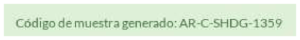

A notification is also sent indicating that a new profile has been created, to show that it is pending the addition of an analysis.

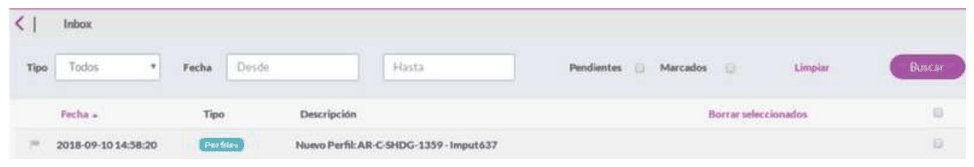

To enter the result of a genetic analysis, go to the **Profiles** menu / Profile list and press Add Analysis:

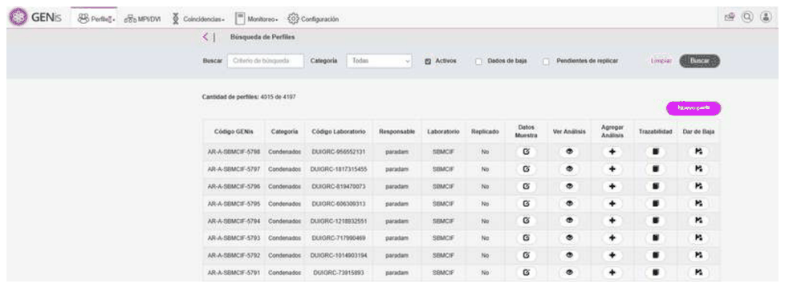

## Loading mitochondrial analysis

Mitochondrial DNA (mtDNA) analysis in GENis allows the haplotypes obtained for a given profile to be incorporated into the system. Loading must follow a standardized structure that ensures the correct interpretation of the ranges and mutations entered, as well as the reliable execution of the mitochondrial matching process.

Before loading a mitochondrial analysis, make sure that:

- The profile's category has its search rules correctly configured, including the maximum number of mismatches allowed.
- The user is familiar with the range- and mutation-based loading structure, since mtDNA works by differences relative to the rCRS.

To check this, go to Settings → Categories and review:

- Category name
- "Maximum number of non-matching markers"
- Whether the category "Notifies matches"

## Accessing analysis loading

1. Go to **Profiles** → **Profile list**.
2. In the row of the desired profile, click **+** in the *Add analysis* column.
3. Within the profile, select the **Mitochondrial** tab.

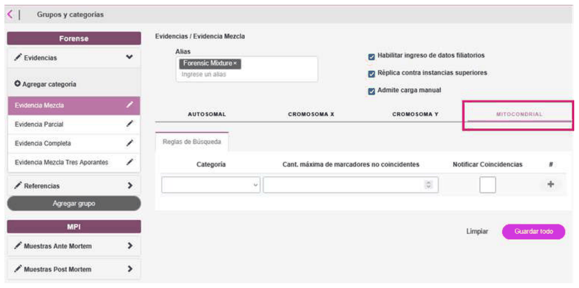

## Loading ranges and mutations

1. Click **Add Range**.
2. Fill in the requested fields:

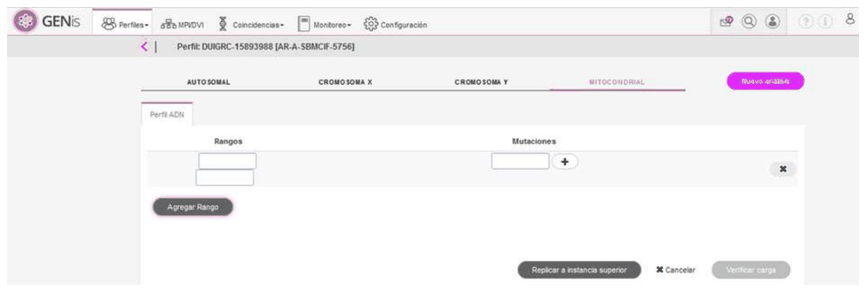

**Important considerations:**

- Up to **4 ranges per analysis** can be entered.
- Each range entered must be **valid** with respect to the recorded mutations.
- It is mandatory to **enter at least one mutation** within the range.
- The system will not allow saving inconsistent or empty ranges.

## Double-blind entry

GENis requires double-blind entry to minimize errors:

1. The user enters the ranges and their mutations for the first time.
2. Presses **Verify entry**.
3. The system again shows the fields empty so the user can re-enter them.
4. Both entries must match exactly.

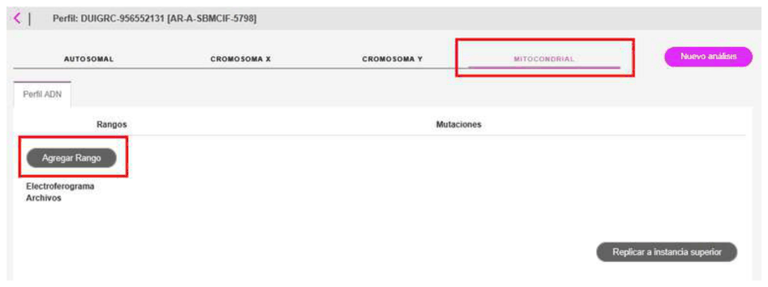

## Effective registration

The **Save** button will remain disabled until:

- The double entry matches, and
- All ranges and mutations have been correctly validated.

When **Save** is pressed:

- The **effective registration** of the mitochondrial analysis on the profile is carried out.
- The **matching rules** configured for the category are automatically executed.

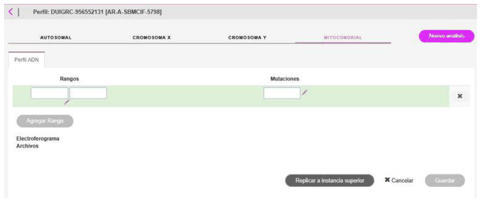

## Loading autosomal analysis

Loading an autosomal analysis in GENis consists of entering the alleles obtained in the laboratory for each marker included in an STR kit. The system requires a fixed structure per kit and a **double-blind entry** to prevent errors in allele transcription.

Before loading an autosomal analysis, verify that:

- The category has its **search rules** configured.
- The kit to be used is **already loaded into the system** with its corresponding marker list.

### Accessing analysis loading

1. Go to **Profiles** → **Profile list**.
2. In the profile's row, click **+** in the *Add analysis* column.
3. Within the profile, select the **Autosomal** tab.

### Kit selection and allele entry

1. Select the **Kit** to be used (the same name that appears in GeneMapper).
2. The form will automatically display the list of markers.
3. Enter the corresponding alleles for each one.

### Considerations:

- Using the **+** button, the user can add additional alleles if the marker requires it (e.g., systems with ≥3 alleles, tri-allelic).
- Alleles that fall outside the range allowed by the kit will automatically be highlighted in color to alert the user.

## Double-blind entry

1. Complete the first entry and press **Verify entry**.
2. The system will request that all alleles be entered again.
3. Both entries must match exactly to enable the **Save** button.

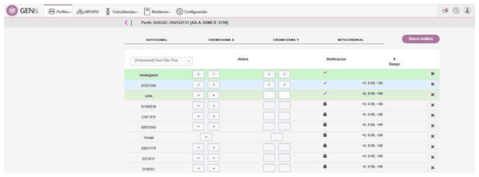

## Uploading attachments and electropherograms

GENis allows documentary evidence associated with the analysis to be attached:

1. Go to **View profile analysis**.
2. In the kit tab, after the markers, there are buttons to upload:

- Attachments (PDF, reports, spreadsheets)
- Electropherograms (fsa, png, jpg, etc.)

Once loaded, they can be viewed from the same tab:

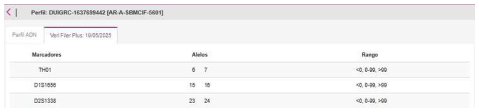

Once the files are loaded, the electropherograms can be viewed:

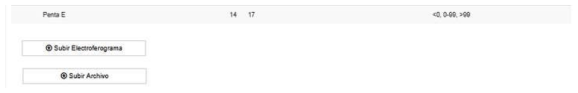
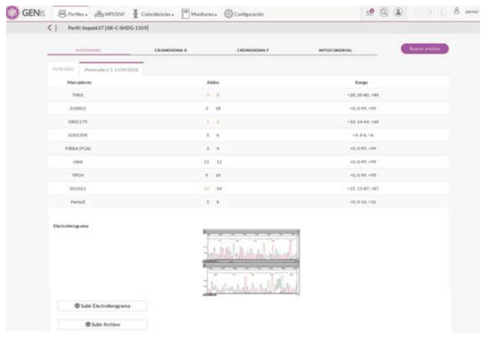

## Batch upload

Batch upload makes it possible to take the GeneMapper output in a text file to register genetic profiles.

The system performs 2 validations:

1. **Format validation:** checks that the file contains all the necessary information in the correct format.
2. **Qualitative validation:** checks that the profile meets the restrictions configured for the category to which it is being associated.

An administrative user can enter the sample data and, in the case of a reference sample, the personal data, so that once the sample has been processed it can be loaded into GENis using the batch upload procedure described below.

To do this, the sample's internal code must match the **Sample Name** in the batch upload file.

## Generating the batch upload file from GeneMapper / GeneMapper ID-X

Batch profile upload in GENis requires a **tab-delimited `.txt` file** with a specific structure. To do this, it is necessary to configure a **Table Setting dedicated to the batch upload file** in GeneMapper / GeneMapper ID-X and correctly fill in the fields that GENis validates at the time of import.

The recommended steps for correctly generating the file are described below.

### 1. Configuring the Table Setting in GeneMapper / ID-X

1. Open GeneMapper ID-X and go to:

**Tools → GeneMapper ID-X Manager → Table Settings**

2. Create a new Table Setting intended exclusively for exporting to GENis, or duplicate an existing one by selecting it and clicking "save as" — this will duplicate the selected one.

3. Open the new Table Setting and, on the **Samples** tab, select only the following columns:

- **Sample Name**
- **Specimen Category**
- **UD1**
- **UD2**

4. On the Genotypes tab, enable only:

- **Marker**
- **Allele 1 through Allele 8**

(GENis requires a minimum of 8 allele columns in the header, even if some markers do not use all of those fields).

5. Save the Table Setting.

**Note:**
Although additional columns useful for reviewing the file may be included — Size, Height, Peak Area, Dye, Panel, Mutation, or others — GENis does not interpret these parameters during batch upload.

### 2. Completing the UD1 and UD2 fields in the project

Before exporting the file:

- On the project's **Samples** tab, fill in:
  - **UD1** → Name of the user or party responsible for the profile (mandatory field for GENis).
  - **UD2** → Alias of the kit used, written exactly as it appears in GENis.

If the UD1 or UD2 values do not match those configured in GENis, the batch upload will be rejected.

### 3. Configuring Specimen Category (via CODIS Export Manager)

For a category to be selectable in the project's **Specimen Category** column, it must first be created in GeneMapper ID-X.

1. Go to:

**Tools → CODIS Export Manager**

2. In the Specimen Types section, type the exact name of the desired category, for example:

- "Condenado" (Convicted)
- "Víctima" (Victim)
- "Referencia" (Reference)
- "Caso" (Case)
- "No exportar" (Do not export)

3. Click Add.

4. Confirm with **OK**.

From this point on, the category will appear in the drop-down list of the **Specimen Category** column within the project.

**Warning:**
The category name must match exactly the category name configured in GENis (including uppercase, lowercase, and accents).
If it does not match, GENis will not be able to interpret the category and the batch upload will fail.

### 4. Exporting the file from GeneMapper / ID-X

To generate the file:

1. Select the samples to export within the project.

2. Verify that the Table Setting created for GENis is selected.

3. Go to:

**File → Export Combined Table**

4. Choose the following options:

- **One line per marker**
- **Include all marker information** (mandatory option; ensures the format is compatible with GENis)

5. Save the file in **tab-delimited `.txt`** format.

The generated header must have, at minimum, the following structure:

```text
Sample Name  Specimen Category  UD1  UD2  Marker  Allele 1  Allele 2  ...  Allele 8
```

If the header contains fewer than 8 allele columns, the following message will appear even if the genetic profile does not have 8 alleles:

**`E0305` – Missing parameters in the file header.**

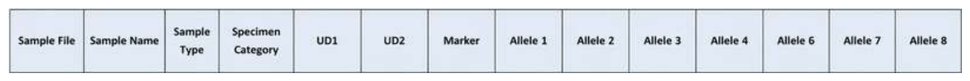

### 5. Pre-upload check before batch loading in GENis

It is recommended to review the `.txt` file before uploading it, checking:

- The presence and correct order of the columns.
- That all categories in **Specimen Category** match GENis.
- That **UD1** and **UD2** were filled in correctly.
- That there are no empty rows or improperly formatted values.

If all parameters match the GENis configuration, the file will be accepted without errors.

For mitochondrial

- Range from
- Range to
- Mutation 1… Mutation 50

Fields must be separated by tabs.

The order of the columns can vary; it does not affect the file.

Example upload file for autosomal:

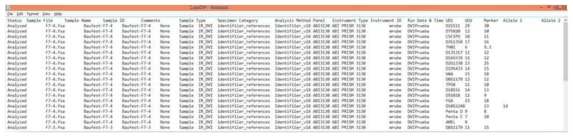

Example upload file for mitochondrial:

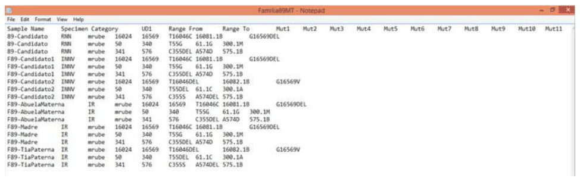

If the sample data was previously entered, the association will be made based on a match of the sample's internal code. Otherwise, the user will need to enter the data (sample data and, if applicable according to the selected category, personal data).

## First level of approval

To start the batch upload process, go to the **Profiles/Batch Analysis Registration** menu:

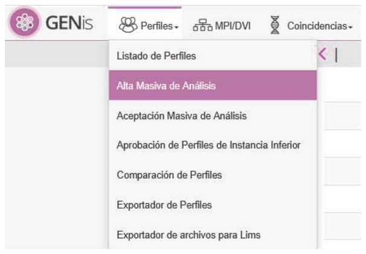

By clicking on the icon

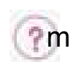

I can download a sample upload file for an autosomal analysis or a mitochondrial analysis, and it shows the naming convention to be used for loading mitochondrial analyses:

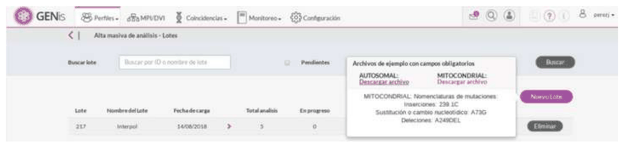

When clicking **New Batch**, the following screen appears, in which the following fields must be filled in:

- Analysis type: select whether the analysis is Autosomal or Mitochondrial.
- File: clicking the Choose file button allows me to select the desired file.
- Batch name: an optional field that lets me identify a batch by name when it needs to be associated with an MPI/DVI case (see [Associating a batch](20_busqueda_de_personas.md#associating-a-batch))

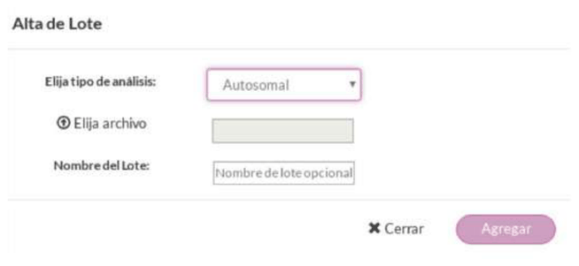

By clicking the **Add** button, the profiles contained in the batch are added.

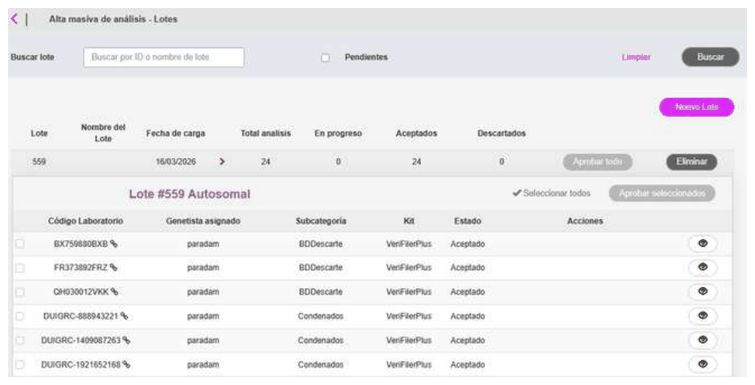

Once the data has been entered, the following actions can be performed:

- Reject the analysis by clicking on the cross (x).

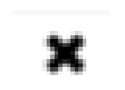

- Edit the analysis before approving it, adding more information about the case and the sample data, showing the same screen seen when adding a new profile (laboratory code,

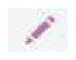

responsible party, category). This option does not appear if the "sample name" in the file for this sample matches the laboratory code already loaded for this profile, in which case it will be associated with the previously loaded information, and the symbol will be shown to the right of the laboratory code

- Approve the analysis

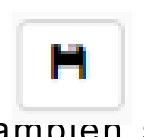

It is also possible to approve all, delete all, and approve the selected ones.

**Note:**

- The symbol may appear 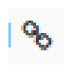 to the right of the sample's internal code, indicating that the metadata of the profile to be incorporated was previously loaded and has been automatically associated.
- If the subcategory is not included, the profile will remain in Incomplete status until a subcategory is entered.

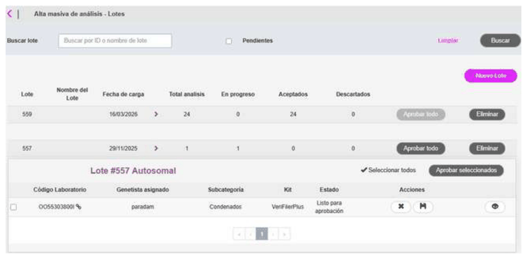

## Second level of approval

Once the first instance has been approved, the user responsible for the profiles or a superuser (a user who has permissions to operate on all profiles in the instance) may proceed to carry out the effective registration. To do this, go to the **Profiles/Batch Analysis Acceptance** menu.

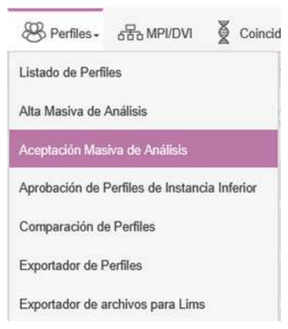

The responsible user can modify the category, prior to its effective registration, using the pencil icon

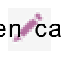

in case they detect that the category was entered incorrectly.

To proceed with the effective registration, press the thumbs-up button on each analysis, or select them individually or as a group and press **Accept Selected**, or directly press the **Accept All** button.

There is a **Replicate to higher-level instance** checkbox so that the profile is replicated if it is checked (see details in [Instance interconnection](21_interconexion_de_instancias.md))

The icon

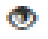

lets me see the detail of the profile's alleles.
From the effective registration onward, the Match process runs automatically, which means that from that moment the profile will take part in future comparisons, according to what has been configured in the search rules.

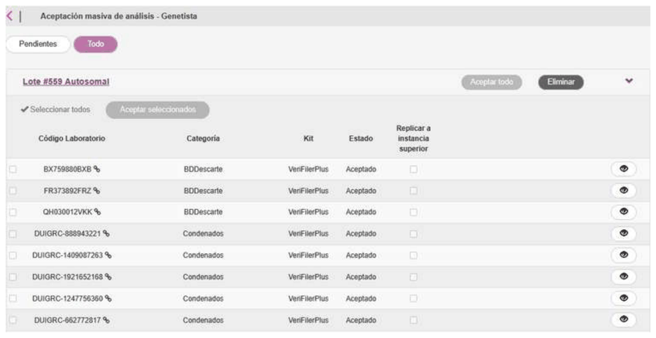

## Rejecting a profile

If you want to reject the analysis, the reason for rejection must be filled in to proceed:

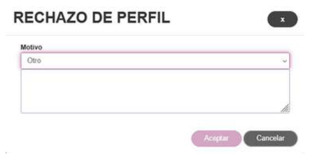

Only once the reason has been filled in will the **Accept** button be enabled.

The reason for rejection is recorded together with the analysis:

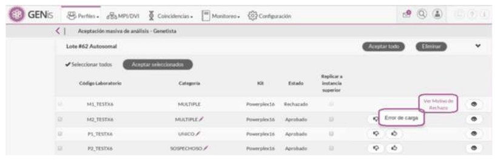

## Errors that can prevent acceptance of an analysis

In some cases, an analysis loaded through batch upload can be imported correctly but **not be accepted** at the "Profile Acceptance" stage. This is due to additional validations that GENis performs before allowing the profile to enter the database and be considered in match searches.

The most common errors that prevent acceptance are:

1. Incompatibility between the declared kit and the kit registered in GENis

If the kit alias (UD2 field) does not match exactly the kit configured in GENis, the system does not accept the markers and reports errors such as:

**`E0686`: Invalid marker**

**`E0400`: Allele values cannot be changed**

2. Non-matching marker names

Marker names must be identical to those defined in GENis. Minor differences (spaces, capitalization, decimal points) cause the analysis to be rejected.

3. Incorrect structure of the batch upload file

GENis requires the header to include, at minimum:

**Sample Name, Specimen Category, UD1, UD2, Marker, Allele1 … Allele8**

If the header has fewer allele columns or contains additional unrecognized columns, the system will not allow the analysis to be accepted.

4. Conflict between a previous analysis and the loaded analysis

If the profile already had an analysis loaded manually or in another import, and the values do not match, GENis does not allow the existing alleles to be modified.

5. Alleles outside the kit's valid range

Invalid alleles or improperly formatted hybrids result in automatic rejection.

If GENis does not allow acceptance, the user must:

1. **Review the errors using the "View Errors" button,**
2. **Correct the source file or the kit configuration,**
3. **Reject the analysis from this same screen,**
4. **Repeat the manual or batch upload with the corrected data.**

This ensures that only validated, complete profiles compatible with the system's rules enter the database.

## Evidence associated with victims

GENis allows evidence from multiple contributors to be associated with the victim's profile. For this reason, a category can be configured to allow this association.

When a profile is registered in a category that must be associated with a victim, the effective registration that triggers the searches will occur once the association is made. The user will receive a notification of **profile pending association:**

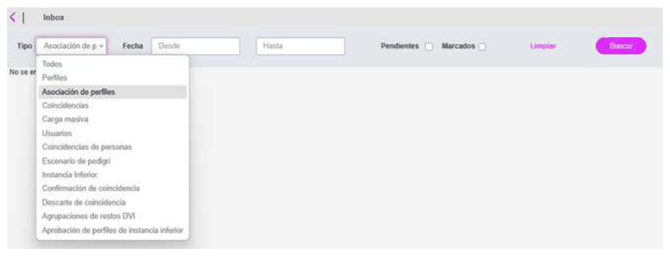

To do this, access the profile details from the notifications, or proceed from the **Profiles/Profile List** screen by pressing View Analysis.

Press the **Associate Profiles** button:

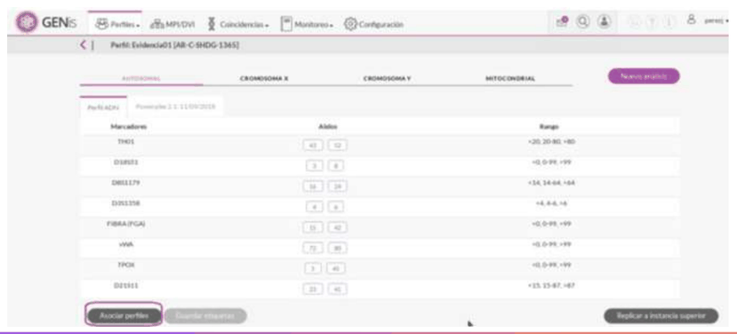

Select the profile corresponding to the victim:

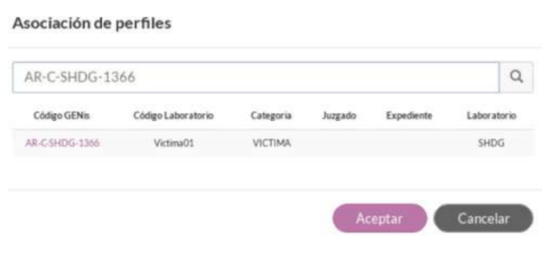

By pressing **Accept**, the tags of the alleles corresponding to the victim's profile can be viewed. To save the association, press **Save Tags**:

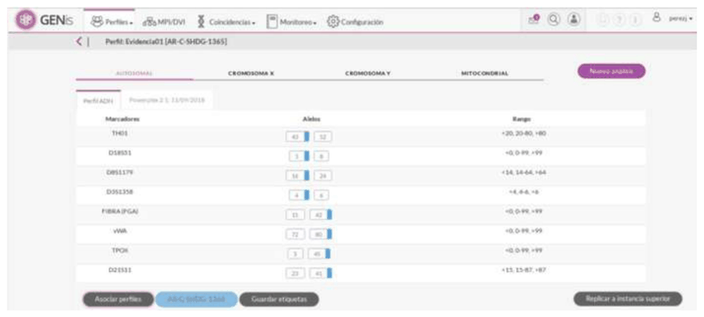

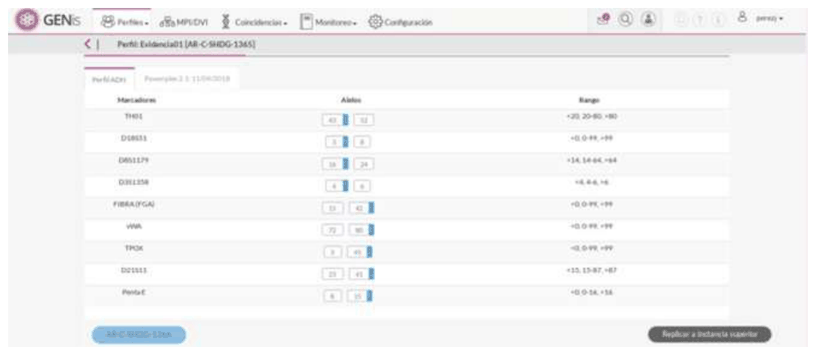

## Tagging evidence

When a geneticist analyzes forensic evidence from multiple contributors, they may sometimes proceed to deconvolve the mixture, a task that makes it possible to identify which alleles correspond to the victim and which to the suspect.

GENis allows the user to tag the alleles. This tagging does not affect the searches or the calculation of the likelihood ratios. It is simply a visual aid so that possible matches with other profiles can later be assessed.

To tag an evidence profile, go to Profiles, select the corresponding one, and press (View Analysis).

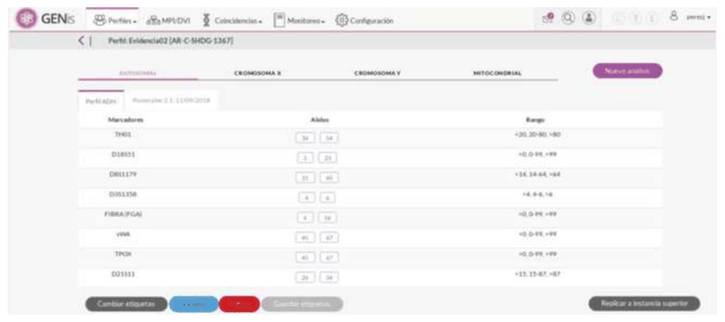

Next, select the type of tag to be assigned to the alleles by pressing

**Change tags**, the options are shown:

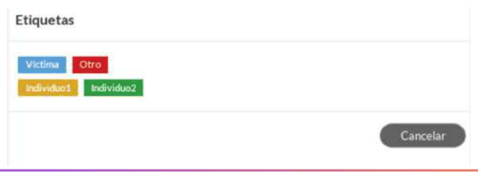

Once the tag names have been selected (Individual1-Individual2 or Victim-Other). Then select the alleles to be tagged by pressing "Ctrl + click":

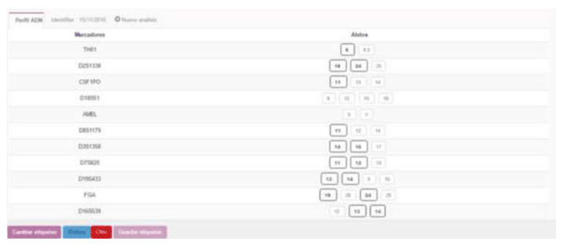

Once the alleles to be tagged are highlighted, select the corresponding tag. In this case, Victim or Other:

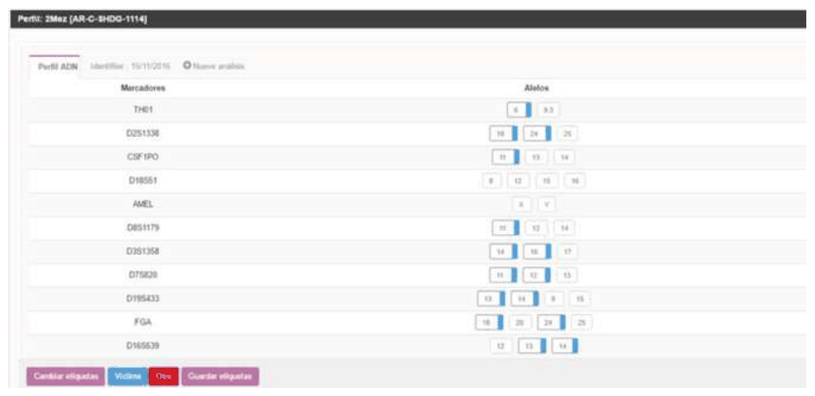

To save the changes, press **Save tags.**

## Notes on evidence tagging

Evidence tagging in GENis is a tool intended for classifying and marking alleles when working with mixtures or complex profiles. For this reason, the tagging option is not always available.

The function is only enabled when the following conditions are met:

1. **The profile's category must be configured as an evidentiary category.**

Only profiles assigned to categories such as Case, Evidence, or others designated by the node can be tagged. Reference or convicted-offender profiles do not support tagging.

2. **The autosomal analysis must be accepted.**

The function is not enabled if the analysis has only been loaded but not accepted in the Profile Acceptance module.

3. **There must be at least one marker with more than two alleles.**

Tagging is only necessary for mixed profiles or those with markers showing more than two peaks. If all markers present one or two alleles, GENis considers that no classification is required and does not enable tagging.

If any of these conditions is not met, the tagging option will not be available, and the user will need to adjust the category, accept the analysis, or review the quality of the profile.
