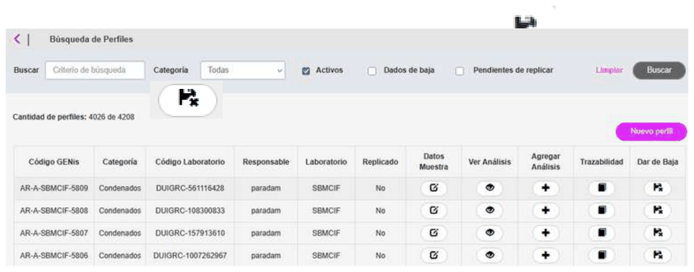
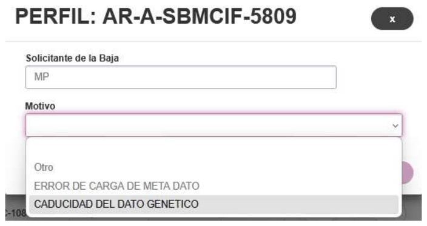
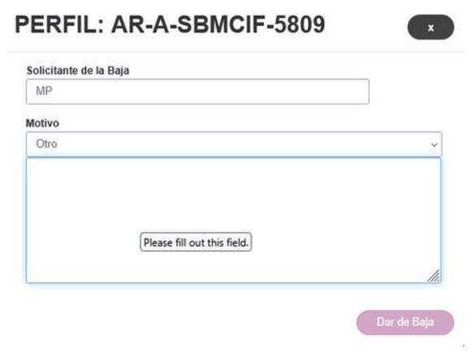
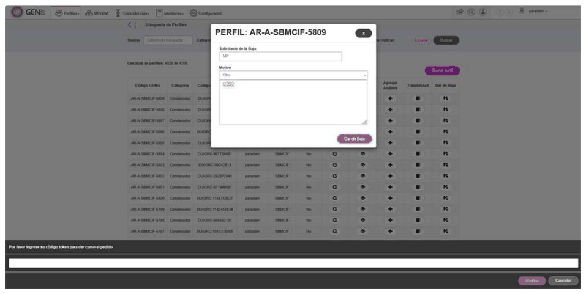

# Baja de perfiles

Toda baja en GENis es lógica, nunca física. Esto significa que el registro no se elimina físicamente de la base de datos, sino que se marca como inactivo. Un perfil dado de baja deja de participar en búsquedas, coincidencias, réplicas y procesos automáticos, pero permanece almacenado internamente para garantizar la trazabilidad, auditoría y el historial del sistema. Este procedimiento es consistente con las buenas prácticas internacionales en bases de datos genéticos criminales, donde la eliminación física de información no está permitida por razones legales, técnicas y de control de calidad. El resultado de dar de baja un perfil es que el mismo no participe más de los procesos de búsqueda.

Para proceder a la baja de un perfil, desde el menú se accede a Perfiles/Listado de Perfiles y presionar en el botón

Se presenta un cuadro de diálogo en el que deben completarse los siguientes datos:

Se debe completar el solicitante de la baja y el motivo.

El motivo es una lista configurable que puede variar según el laboratorio.

La opción **Otro** me habilita un cuadro de texto para poder ingresar más detalle de la baja:

Al presionar el botón para efectivizar la baja del perfil, el usuario deberá introducir nuevamente su código TOPT y aceptar:

## Consideraciones sobre la fecha de caducidad

La "Fecha de Caducidad" es un **dato informativo** destinado a la gestión administrativa del perfil. GENis **no realiza bajas automáticas**, no genera alertas ni ejecuta ninguna acción cuando el perfil alcanza dicha fecha.

 El control de este campo depende exclusivamente del usuario o del nodo responsable, y la baja del perfil debe ser ejecutada manualmente a través de este módulo cuando corresponda. La fecha de caducidad no tiene vinculación funcional con el proceso de baja ni con otros procesos internos del sistema.

## Consideraciones a tener en cuenta al dar de baja un perfil:

Para Forense:

- Si existen matchs pendientes asociado al perfil dado de baja, se resuelven de modo habitual, aunque el perfil este dado de baja.
- Si existe escenarios generados pendientes asociados al perfil dado de baja, se resuelven normalmente.
- No se puede dar de baja un perfil con un escenario pendiente de validar.
- La baja de un perfil no se replica entre las instancias.
- El objetivo de dar de baja un perfil, es que no participe más en las búsquedas. Un perfil dado de baja no es editable, pero si se puede acceder al mismo para ver el detalle.

Para MPI/DVI:

- No se puede dar de baja un perfil si se dan las siguientes condiciones:
  - *El perfil está asociado a un escenario.*
  - *El perfil está asociado dentro de un caso.*
  - *El perfil está asociado a un pedigrí en estado Activo.*
  - *El perfil tiene algún match pendiente.*
