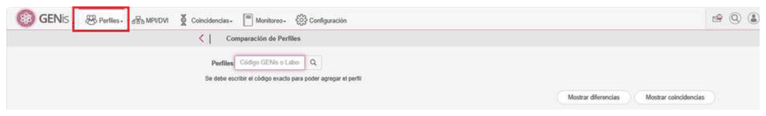
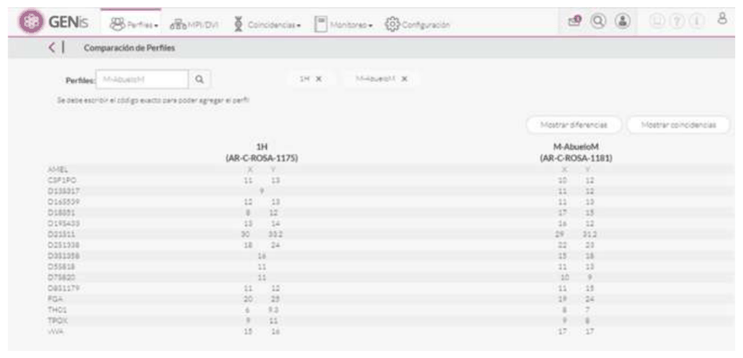
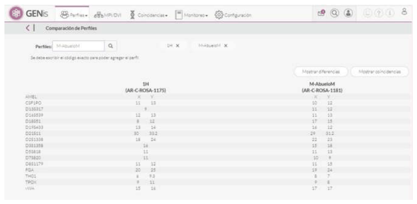
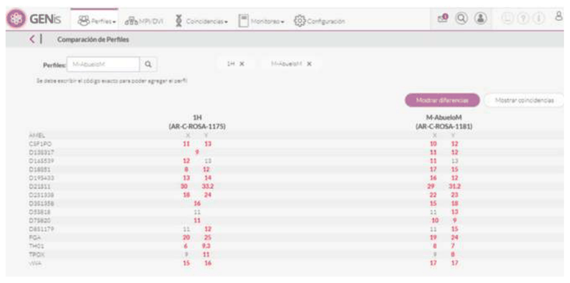
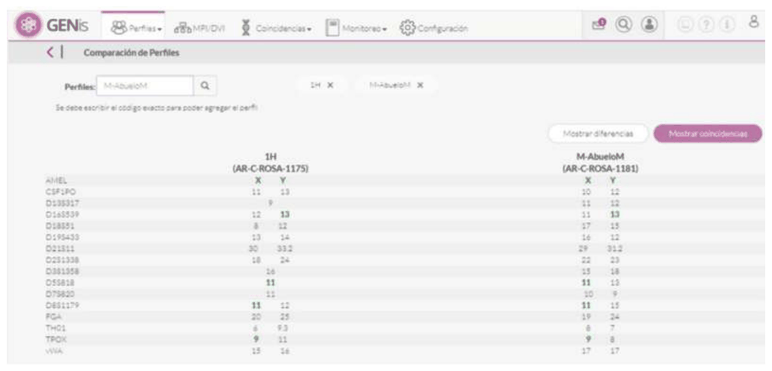

# Comparador de perfiles

## Comparador de perfiles

El comparador de perfiles es una funcionalidad que permite comparar dos perfiles de cualquier categoría y ver las diferencias y coincidencias entre sus alelos.

Solo se puede comparar dos perfiles como máximo y el resultado de la comparación se muestra por pantalla, pero no queda guardado.

Para utilizar el comparador de perfiles ir al menú Perfiles/Comparación de Perfiles:

Ingresar el **Código GENis o Código de Laboratorio** de los dos perfiles que se quieren comparar y presionar la lupa. Una vez ingresados los dos perfiles, se muestran los alelos que contiene cada uno:

Presionando los botones **Mostrar diferencias** y **Mostrar coincidencias** muestra los alelos que tienen diferencia en rojo y los alelos que tienen en común en verde:

## Mostrar diferencias

## Mostrar coincidencias

