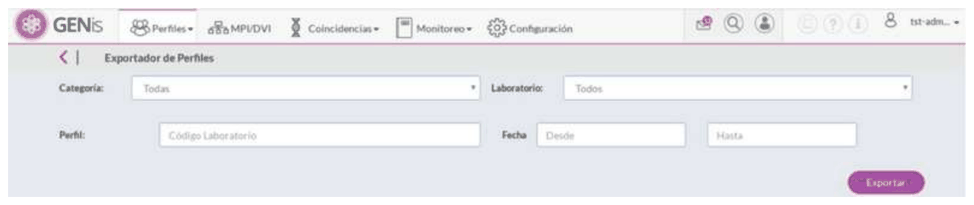

# 15. Profile exporter

## Profile exporter

The profile exporter is a feature that allows exporting profiles in GENis's import format.

To use the profile exporter, go to the Profiles/Profile Exporter menu:

The profile exporter is a feature that can filter by category, laboratory (you can select among the laboratories registered in the application), profile (via its laboratory code), and profile creation date (specified as a from date and a to date)

The filters are not mandatory; if no filter is selected, the entire database will be exported.

Once the desired filters have been set, click the Export button, which will produce the export of the profiles.

All analysis types will be exported. A .zip file will be generated containing a .csv file for each analysis type, paginated every 1000 profiles.

If a profile has more than one analysis of the same type, they will be exported in separate files.

Allows exporting profiles in GENis's import format.
