# 16. Match manager and forensic calculations

The **Match Manager** is divided into cards that group matches by profile.

On a first screen, the match with the profile that produced the highest LR is shown, and on a second screen, the profiles are grouped according to their category (evidence, reference, and inferred number of contributors). The groupings shown also depend on the category of the grouping profile, which are described in the following sections.

## Grouping profile

When a genetic profile is registered under a category, the search processes defined for that category are launched. The profile entered may find one or more matching profiles. At the time of accessing the match manager, this profile that found other matching profiles is called the **grouping profile**.

## Shared systems

When the same profile has more than one accepted autosomal analysis (for example, analyses obtained with different kits), GENis uses all the markers available across all loaded analyses in the search, which is known as: *composite profile, cumulative profile, consolidated profile, consensus profile*.

This allows a profile to add information from different genetic systems, increasing the discrimination power of the comparison.

The combination is only applied within the same profile and never between different profiles.

The analyses must be accepted, belong to categories enabled for search, and present no marker conflicts.

## Percentage of shared alleles

The "percentage of shared alleles" is a measure used by GENis to quantify the degree of match between two genetic profiles, comparing marker by marker the proportion of alleles that both share.

The evaluation is performed by taking one profile as the **grouping profile (Q)** and another as the **compared profile (P)**, and calculating, for each marker, the fraction of alleles of the grouping profile that are present in the other profile. The final result corresponds to the **average** of these fractions across all compared markers.

### 1. Case: Q = Evidence and P = Evidence

When both profiles are evidence, GENis evaluates what proportion of the alleles present in Q (grouping evidence) are also found in P (compared evidence).

The formula is:

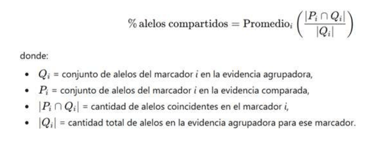

Illustrative example (Evidence–Evidence)

Marker D8S1179:

- Q: {12, 13}
- P: {12, 14, 15}

Matching = {12}

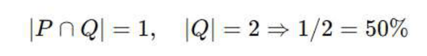

This percentage is calculated for each marker, and the average is then obtained.

### 2. Case: Q = Evidence and P = Reference

When P is a reference (diploid profile), GENis evaluates what proportion of the alleles of the **reference** are contained within the evidence.

The formula applied is:

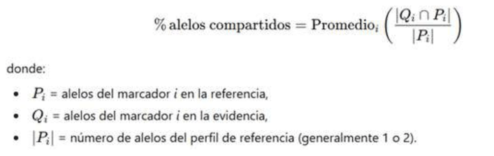

Illustrative example (Evidence–Reference)

Marker D8S1179:

- P (Reference): {12, 14}
- Q (Evidence): {12, 14, 15, 19}

Matching = {12, 14}

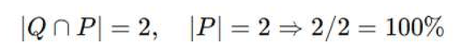

The percentage indicates to what extent the evidence contains the reference's genetic information.

## States

When GENis finds a match between two profiles, it must be confirmed or dismissed. Since the profiles involved may belong to different users responsible for them, confirmation or dismissal of a match is established based on a voting system. For confirmation or dismissal to become final, both responsible users must have performed the same action on the match, i.e., both confirmed it or both dismissed it.

That is why the status of a match depends on the status set by the grouping profile and by the matching profile. The possible statuses for each are:

**Pending**: initial status when the match has not yet been assessed for confirmation or dismissal.

**Dismissed**: the match between both profiles has been dismissed by those responsible for each profile involved.

**Confirmed**: the match between both profiles has been confirmed by those responsible for each profile involved.

**Conflict**: the match has been confirmed by one of the responsible parties and dismissed by the other.

### Comparison Window

When assessing a match between two profiles, a default LR calculation is performed that depends on the type of profiles involved in it. In this window both profiles can be observed, along with the total LR and the LR for each individual marker. The frequency database and the drop-in and drop-out probabilities can be modified to obtain a new result.

Within the Notifications menu, accessing the match, the following profile comparison screen is presented:

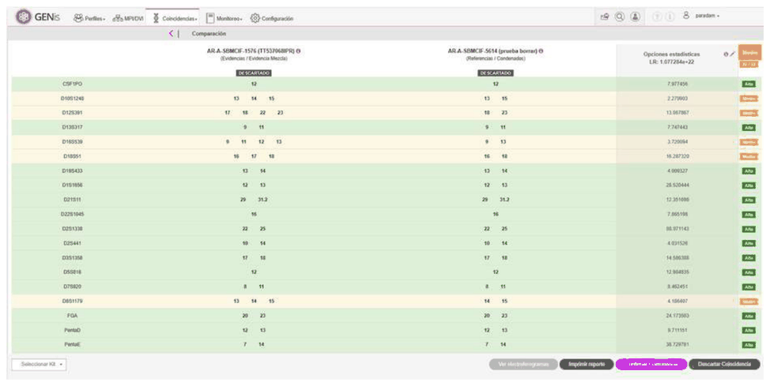

Using the **Print Report** button, a PDF is generated with the information shown on screen:

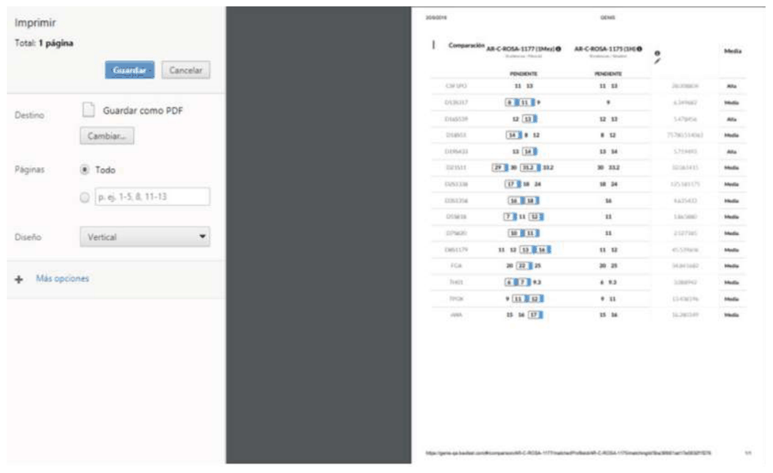

## Scenario

When a match involves evidence, scenarios can be generated in which the user can modify the calculation parameters. They can determine the profile(s) participating in each hypothesis, the number of unknowns, the frequency database, the theta value, the drop-in probability, and the drop-out probability.

Click **Add scenario**:

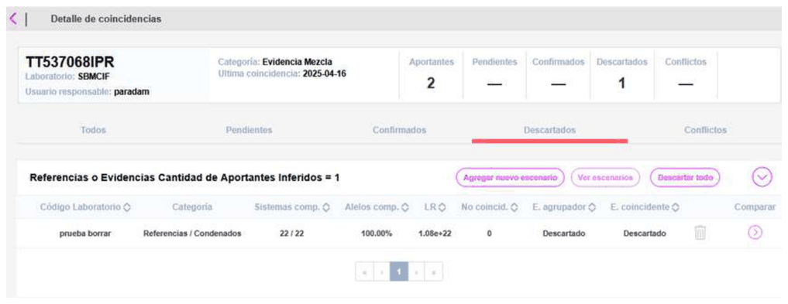

Calculation scenarios have two tabs:

**Calculation Scenario**: from where the user generates and parameterizes the hypotheses. Although GENis can generate an LR calculation, this does not replace the use of calculation software for the assessment of contributors and drop-out probability.

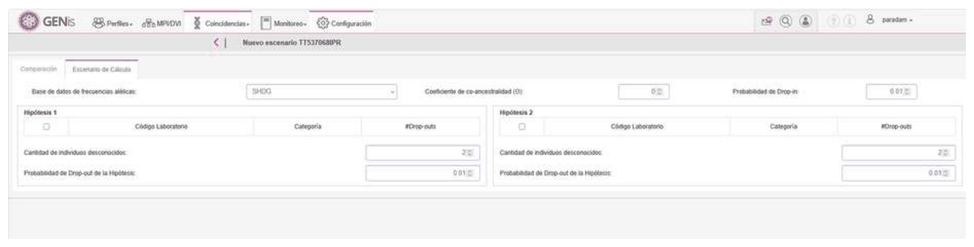

**Comparison**: a tool for easily and visually detecting differences and matches between profiles.

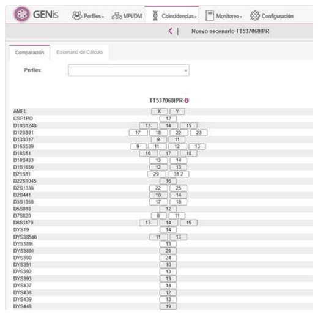

**Result**: presents the total LR and the LR per marker, plus the parameters used to obtain the result.

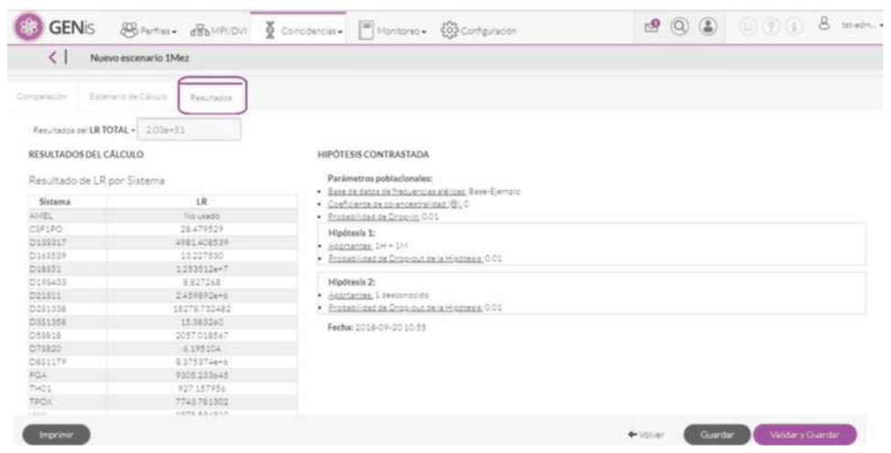

On this screen it is possible to Validate and Save the calculation, or simply Save it to verify later.

## Default parameters

For the default LR calculation, the drop-in and drop-out probability parameters corresponding to the laboratory responsible for the grouping profile are used.

Technical note – International recommendations on drop-out and drop-in parameters.

- According to the recommendations of the **ISFG DNA Commission (2012, 2016)**, of **SWGDAM**, and the **ENFSI** guidelines, the drop-out and drop-in probabilities used in the calculation of likelihood ratios (LR) must be **backed by validation studies specific to the laboratory** that uses them.

These studies must be representative of:

- the STR kit used,
- the analytical and amplification conditions,
- the instrument platform,
- the DNA quantity ranges,
- and the laboratory's operational detection threshold.

In this regard, each laboratory is responsible for **documenting and justifying** the values or models used for drop-out and drop-in, whether as fixed values, usage ranges, or derived models (for example, Pr(D)–RFU regressions).

## Viewing the parameters used in GENis

Within the matches module, GENis allows viewing the drop-out and drop-in values applied to the LR calculation directly from:

- the comparison window, and
- the scenarios screen.

This ensures transparency regarding the parameters involved in the calculation and allows the analyst to verify that they correspond to the values defined and validated by their laboratory.

## Access to the Match Manager

According to the search rules defined for each category, when a genetic profile match is found, the user receives a notification of new matches:

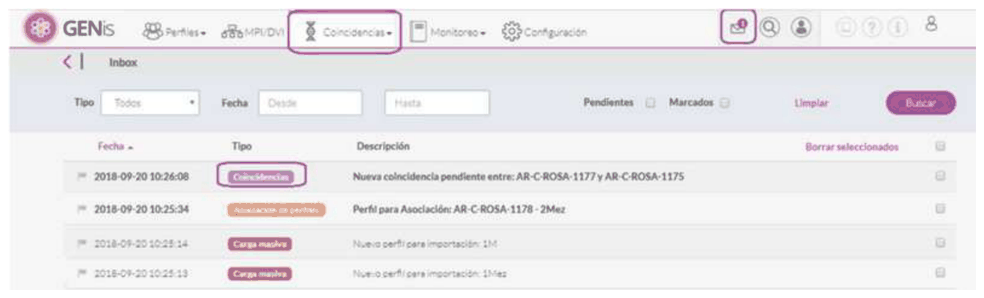

The statistical analysis and assessment of matches can be accessed from the notifications, or from the menu by selecting **Matches/Forensic**.

Accessing from the **Matches** menu, on the first screen a profile search tool is shown. A profile search can be performed either by **GENis Code** or by **Laboratory Code**, and the search is done by the complete code.

Note:

- Keep in mind that if a profile with pending matches is deactivated, the matches it had before being deactivated can still be confirmed or dismissed, but the profile no longer takes part in new searches, i.e., no new matches are generated for it.
- Within the **Match Manager**, if you want to search for a profile that has been deactivated, you must search only by **GENis Code**, since the **Laboratory Code** of a deactivated profile may coincide with that of an active profile.

The list of matches is obtained as a result of the search according to the filters applied. By default, the list is displayed sorted from the most recent match to the oldest:

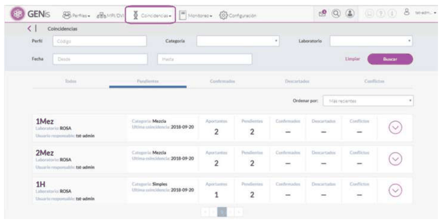

The list is presented as a series of cards showing the following data: Laboratory Code, user responsible for the profile, category the profile belongs to, date of the last match, inferred number of contributors.

The profile against which matches are assessed is called the **grouping** profile.

On the right, the number of matches per global status can be observed. These statuses are formed from the statuses set by each of the responsible parties of the profiles, and can be: Pending, Confirmed, Dismissed, or Conflict, as explained above.

Pressing the arrow on the right expands the match with the best LR and a summary of the matching profile's data, such as shared alleles, shared systems, and the maximum number of non-matching markers:

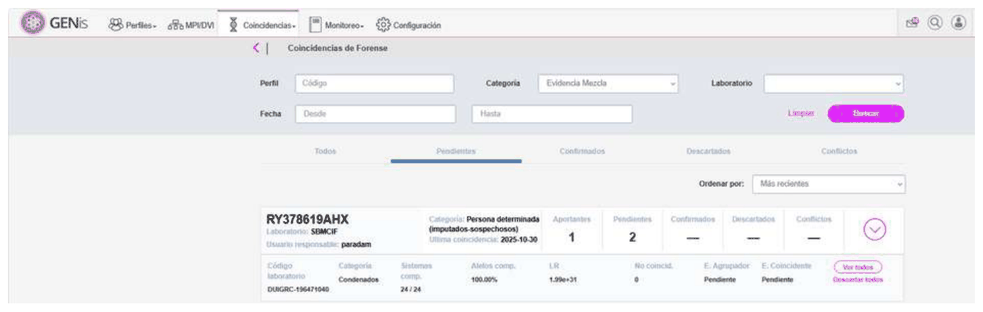

**Note:** the best LR is considered to be the one with the largest number.

To view the detail of the matches and be able to confirm or dismiss them, press the **View all** button, which opens a new screen whose layout depends on whether the grouping profile corresponds to forensic evidence or to a reference sample:

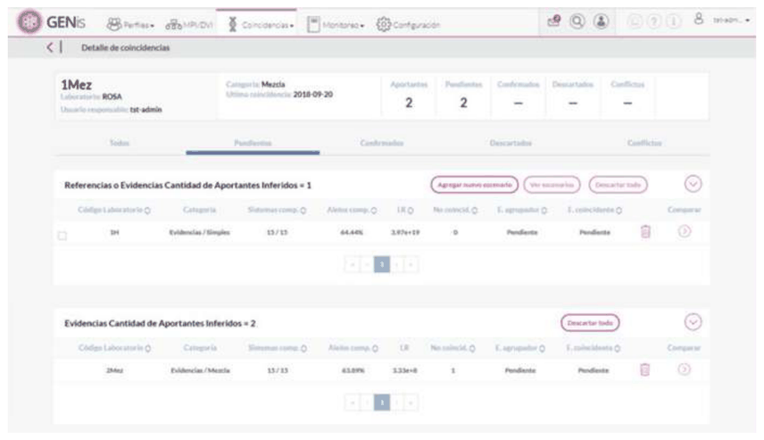

## Grouping profile: reference

When the grouping profile corresponds to a reference sample, the profiles against which matches were found are grouped into References and Evidence.

Matches should not normally be found between reference profiles, except when an undisputed sample is entered because a person presented under a different identity, or was loaded under two different categories (defendants–convicted), or in the case of identical twins.

Expanding the Evidence group shows the profiles against which the reference obtained matches, according to the search algorithms established between categories.

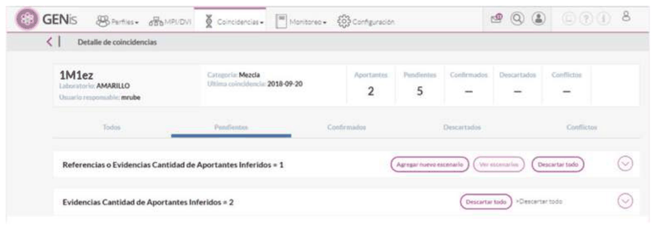

In the evidence grouping, for each profile we can see:
1. Laboratory Code.
2. Category.
3. Shared systems.
4. Percentage of shared alleles.

## Grouping profile: reference

When the grouping profile corresponds to a reference sample, the profiles against which matches were found are grouped into References and Evidence.

Matches should not normally be found between reference profiles, except when an undisputed sample is entered because a person presented under a different identity, or was loaded under two different categories (defendants–convicted), or in the case of identical twins.

Expanding the Evidence group shows the profiles against which the reference obtained matches, according to the search algorithms established between categories.

In the evidence grouping, for each profile we can see:
1. Laboratory Code.
2. Category.
3. Shared systems.
4. Percentage of shared alleles.
5. LR
6. Maximum number of non-matching markers
7. Assessment of the grouping profile's status
8. Assessment of the matching profile's status
9.

View scenarios
10.
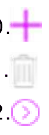
Add a new scenario
11.
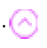
Dismiss
12. Access the comparison window.
13. Replicate match status to a higher-level instance.

## Grouping profile: evidence

We must distinguish between an inferred number of contributors in the evidence acting as the grouping profile equal to two, or different from two.

When the number of inferred contributors of the evidence is different from two (1 or greater than 2), the grouping is:

1. References or Evidence with Inferred Number of Contributors = 1
2. Evidence with Inferred Number of Contributors > 1

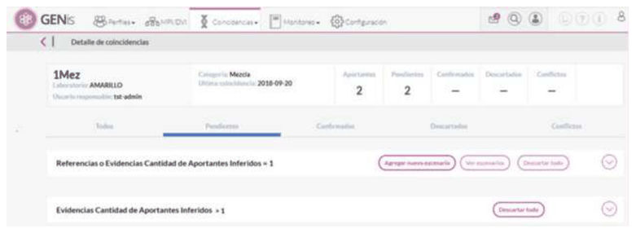

When the number of inferred contributors is two in a grouping profile belonging to a category of evidence type, the profiles with which matches were found are presented grouped as follows:

1. References or Evidence with Inferred Number of Contributors = 1
2. Evidence with Inferred Number of Contributors = 2
3. Evidence with Inferred Number of Contributors > 2

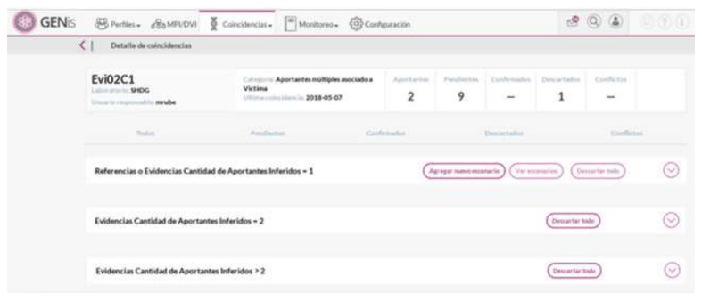

In this example, the profile Evi02C1 is the grouping profile, and we can observe who its responsible user is, its laboratory, the category it belongs to, and the inferred number of contributors.

**Grouping profile with inferred contributors <> 2 and its matches with References or Evidence with Inferred Number of Contributors = 1**

The grouping profile is an evidence with an inferred number of contributors equal to one that produced a match with evidence profiles that also have a single inferred contributor, or with a reference profile:

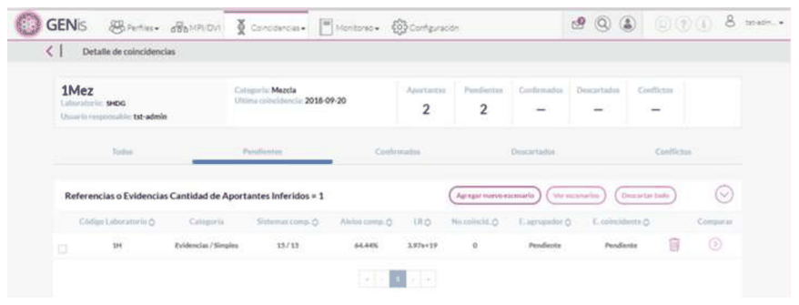

From here, scenarios can be created, or the comparison window can be accessed.

**Grouping profile with inferred contributors <> 2 and its matches with Evidence with Inferred Number of Contributors > 1**

This case occurs when the grouping profile has an inferred number of contributors different from two (1 or greater than 2), and matches are found with evidence with an inferred number of contributors greater than one.

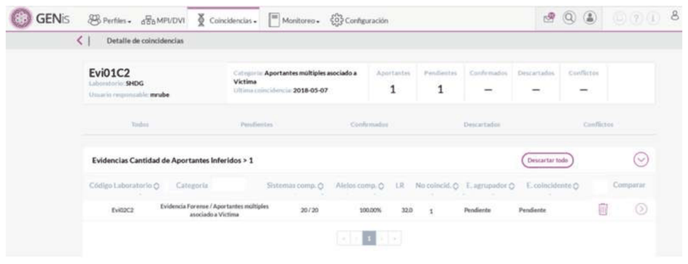

As in the previous point, scenarios can be created, or the comparison screen can be accessed.

**Grouping profile with inferred contributors = 2 and its matches with References or Evidence with Inferred Number of Contributors = 1**

Selecting **References or Evidence with Inferred Number of Contributors = 1** displays a list of profiles against which the grouping profile, in this case Caso3-Mezcla, had matches according to the Search Rules parameters defined for the grouping profile's category.

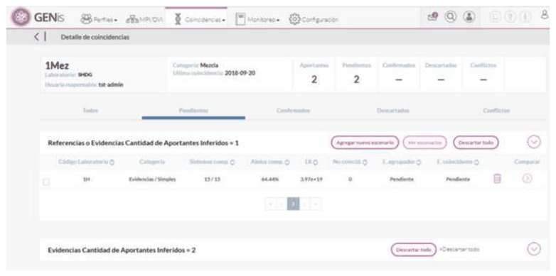

In the evidence grouping, for each profile we can see:

1. Laboratory Code
2. Category.
3. Shared systems.
4. Percentage of shared alleles.
5. LR
6. Number of non-matches
7. Validation of the grouping profile's status
8. Validation of the matching profile's status
9.

Access the comparison window.

In this case, there are two options for statistically assessing the matches:

1. **Pressing**

**to the right of the matching profile**: with this option, the user accesses the comparison only between the grouping profile and the matching one. We call this screen the **comparison window**:

Pressing the pencil icon located to the right of the LR, the calculation options can be modified regarding the frequency database to be used and the drop-in and drop-out parameters.

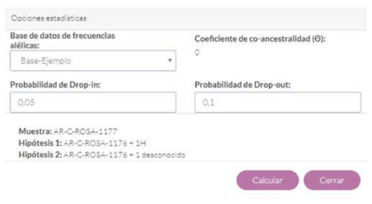

2. **Add calculation scenarios**: in this case, a new calculation scenario is created by pressing the **Add scenario** button.

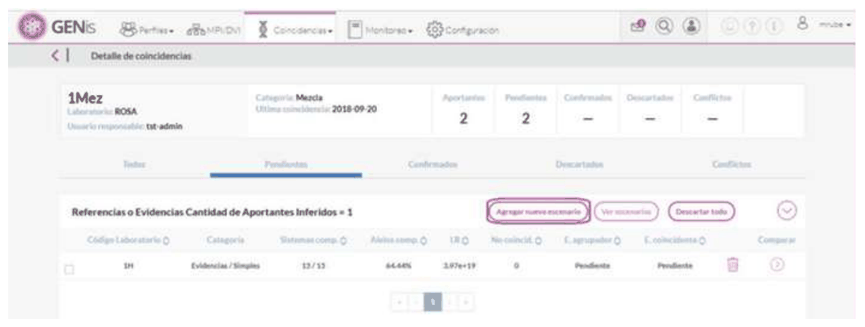

The **View scenarios** button allows access to previously saved calculation scenarios.

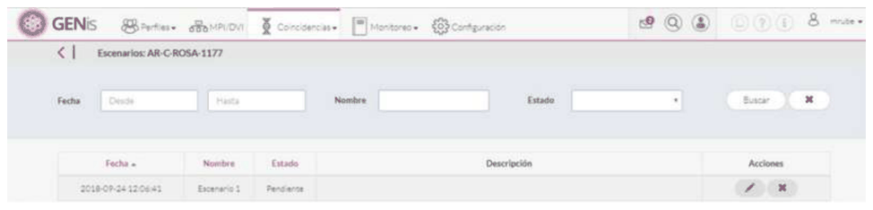

Pressing the button
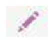
allows the scenario to be edited.

**Grouping profile with inferred contributors = 2 and its matches with Evidence with Inferred Number of Contributors = 2**

Expanding this grouping of profiles matching the grouping profile, we can observe the matches resulting from the **Mixture-Mixture** search algorithm and the resulting LR calculation for these cases:

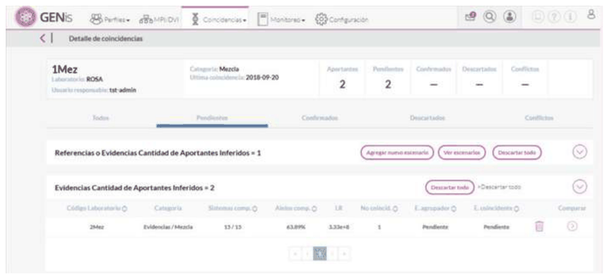

Pressing the button

opens the comparison window:

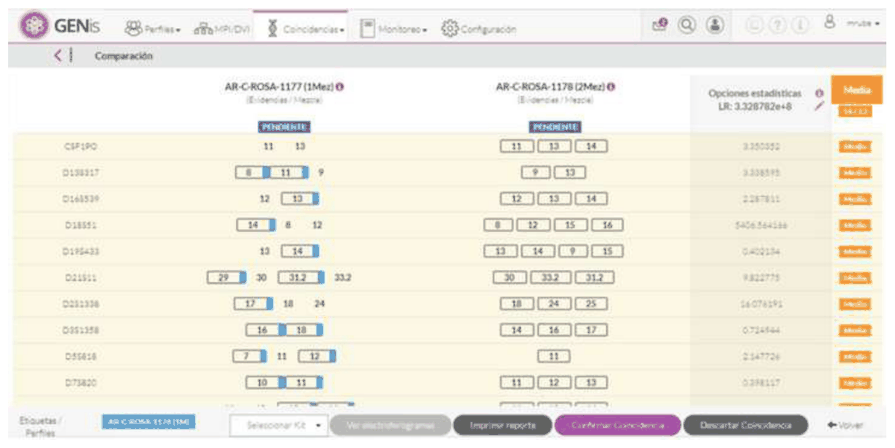

The statistical options can be modified by pressing
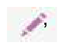
, to the right of the LR.

In the case of matches between two evidence profiles with two contributors each, the only thing that can be modified is the frequency database used for the calculation.

**Grouping profile with inferred contributors = 2 and its matches with Evidence with Inferred Number of Contributors > 2**

In these cases, the match window can be accessed, but it is not possible to perform statistical calculations or confirm the match:

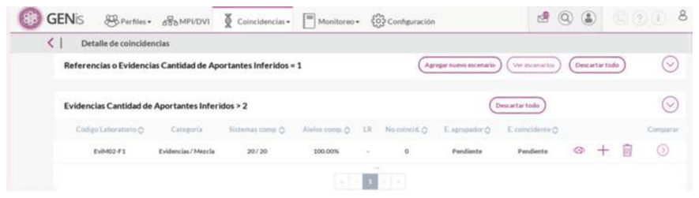

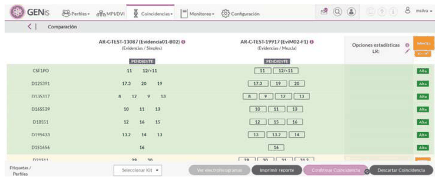

## Organization of the Match Manager

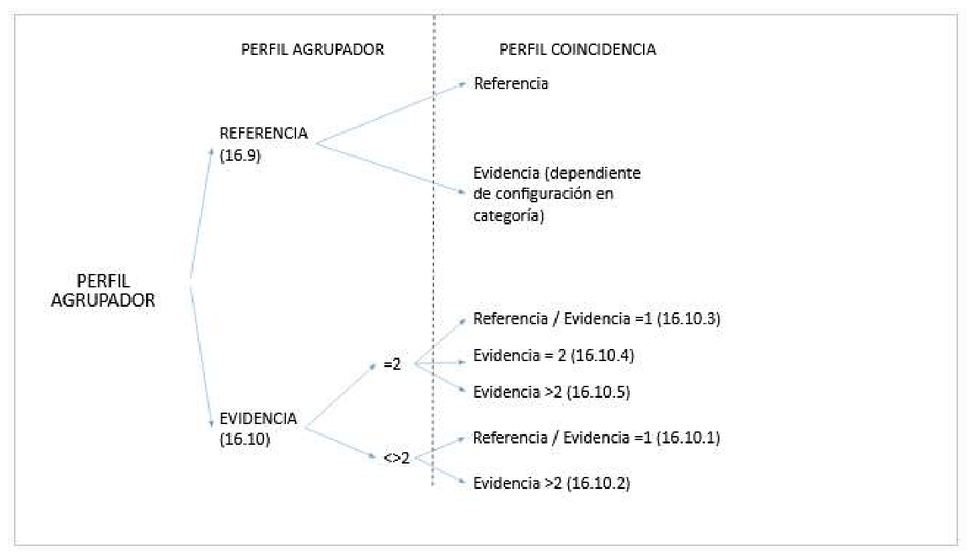

## Interpretation of the LR in GENis according to comparison type

### 1. Nature of the LR calculation in GENis

GENis's forensic module uses a matching engine that **assesses the probabilistic compatibility between two genetic profiles**, modeling the presence, absence, and unexpected appearance of alleles through **drop-out** and **drop-in** parameters defined by the laboratory.

However, the LR produced by GENis **is not the same LR** obtained from expert software such as **LRmix**, **EuroForMix**, or **STRmix**, which implement *semicontinuous* or *continuous* models based on formal hypotheses of the type:

- Hp: Defendant X (reference profile) is a contributor to the evidence
- Hd: An unknown individual from the population is a contributor to the evidence

This approach necessarily requires a reference profile in order to define Hp.

For that reason, tools such as LRmix **do not calculate an LR between pieces of evidence**, because in the absence of a reference there is no biologically interpretable Hp.

GENis, on the other hand:

- does not require a hypothesis based on a specific individual,
- does not distinguish between Hp and Hd the way an expert model does,
- estimates the mutual compatibility of profiles **without needing a known individual**,
- produces an **operative LR**, whose purpose is to **order and prioritize matches within the system**, not to express probative weight in the judicial sense.

In simple terms:
**GENis's LR is a likelihood index for automated searching, not a judicial LR.**

### 2. How GENis's operative LR works according to comparison type

The following explains how to interpret the LR value in the different scenarios presented in Section 16.

**A. Grouping Profile = Reference**
Match = Evidence
This is the only case that **structurally resembles** the LRmix model, because:

- a real reference exists,
- the evidence contains one or more unknown contributors,
- it is assessed whether the evidence is compatible with including the reference profile as a possible contributor.

However, even in this scenario:

The LR calculated by GENis is NOT a forensic semicontinuous LR, because:

- it does not model RFU peaks,
- it does not estimate drop-out specific to each marker or contributor,
- it does not incorporate analytical error associated with peak heights,
- it uses global parameters defined by the laboratory.

Interpretation of the LR in this scenario:

- **High LR:** the evidence is compatible with including the individual as a possible contributor, given a mixture proportion and global drop-out parameters.
- **Low LR:** the evidence is poorly compatible with including the individual.

This LR only guides the operator regarding the **priority of the match** within the database.

**B. Grouping Profile = Evidence**
Match = Reference
This scenario reverses the perspective: the evidence is the base profile, and it is assessed whether the reference could explain its observed alleles.

The engine works the same way as in A, but with one conceptual difference:

- The software does not assess "Hp: the reference is a contributor,"
- but rather "can the reference's alleles explain the alleles observed in the evidence, considering drop-out/drop-in?"

Practical interpretation:

- High LR: the reference is compatible with the evidence from a technical matching standpoint.
- Low LR: the reference does not explain the evidence well.

Important:
The value remains an **operative LR**, not a probative one, because formal Hp/Hd hypotheses are not being assessed.

**C. Grouping Profile = Evidence**
Match = Evidence

This is the most complex case, because there is no reference to define Hp. What GENis does is:

1. Assess whether the alleles of Evidence A can be explained using hypothetical contributors from Evidence B (and vice versa).
2. Model the absence of alleles as drop-out.
3. Model unexpected alleles as drop-in.
4. Combine these assessments into a compatibility index.

This produces an LR, but it is NOT an expert LR.

Practical interpretation:

- **High LR:** The two pieces of evidence are structurally compatible and could share one or more contributors.
- **Medium LR:** There is some compatibility, but also differences explained by drop-out or multiple contribution.
- **Low LR:** The pieces of evidence do not share a compatible genetic structure.

### 3. Regulatory recommendation for interpreting the LR in GENis

According to:

- ISFG DNA Commission (2016, 2020)
- SWGDAM (2018, 2024)
- ENFSI DNA WG Best Practices (2015–2022)

**Any formal probabilistic assessment (judicial LR)
MUST be performed using software validated for expert use,
such as:**

- LRmix Studio (semicontinuous)
- EuroForMix (continuous)
- STRmix (continuous)

GENis does **not** replace these tools, because it does not incorporate:

- RFU information,
- marker-specific drop-out variation,
- continuous mixture quantification,
- modeling of stutter, degradation, or inhibition.

Technical references on GENis's matching engine and operative LR

The matching model used by GENis is described in:
**Chernomoretz et al. (2020), "GENis, an open-source multi-tier forensic DNA information system", Forensic Science International: Reports, 2, 100132.**

This work details the probabilistic approach used to assess compatibility between profiles, including the use of drop-out and drop-in parameters, and weighting by allelic frequencies.

Additionally, the exact operation of the matching engine can be consulted in the project's open source code (Fundación Sadosky, GENis – GitHub repository), where the comparison algorithms, allele weighting, and likelihood index ("operative LR") calculation are implemented.

The LR reported by GENis is a **functional index for the search and prioritization of matches**, and does not correspond to the semicontinuous or continuous LR used by expert software such as LRmix, EuroForMix, or STRmix, in accordance with international recommendations (ISFG 2016; SWGDAM 2018/2024; ENFSI DNA WG).

## Bulk match dismissal

Pressing the arrow on the left, in the **Matches** menu, expands the match with the highest LR.

Clicking **Dismiss all** automatically dismisses all matches found with that profile:

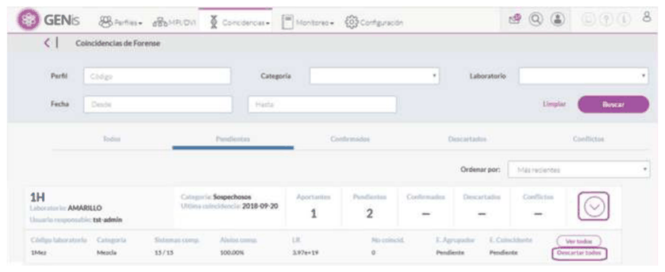

A confirmation message for the bulk dismissal of all matches appears:

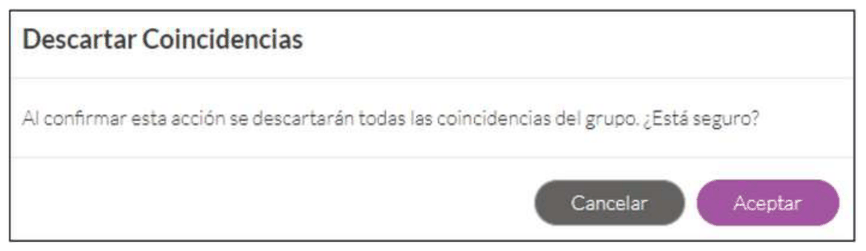

By accessing the detail of all matches, you can also **Dismiss all**:

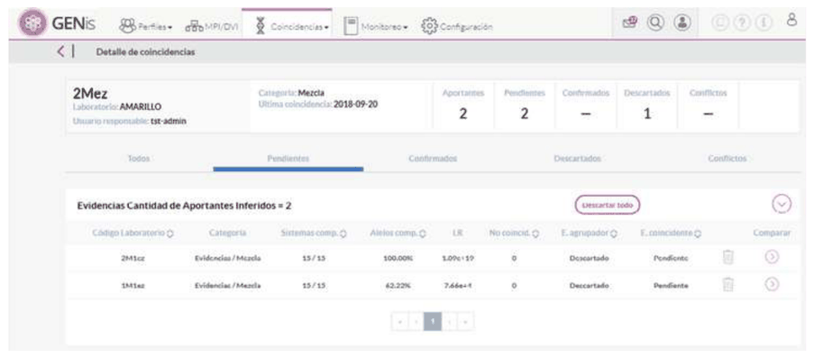

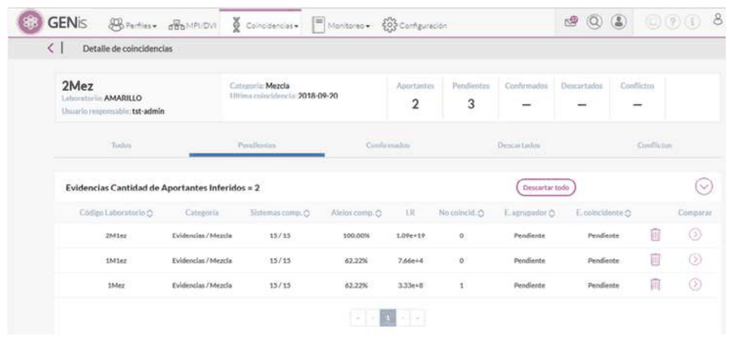
