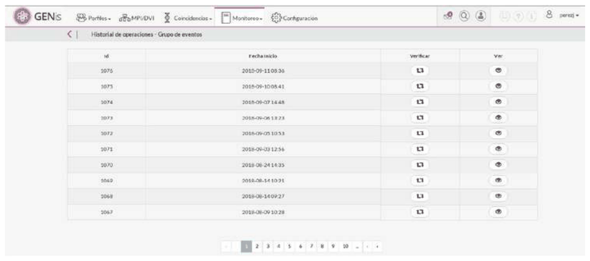
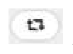
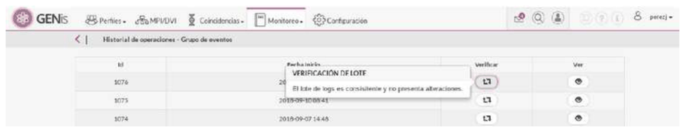
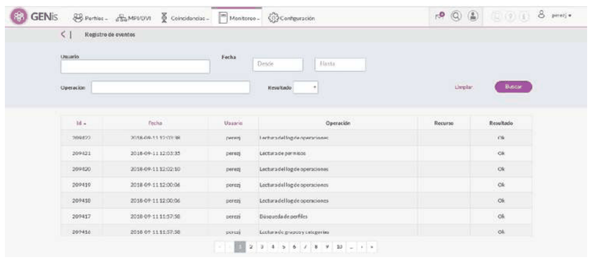
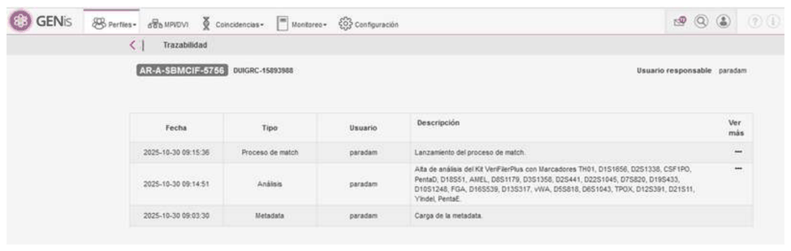

# 17. Audit

## Audit and traceability in GENis

GENis incorporates a comprehensive audit system designed to guarantee the traceability of operations performed on the genetic database and its associated elements. These features are aligned with the current recommendations of international bodies (ISFG, ENFSI, SWGDAM) and with the requirements of quality management systems used in forensic laboratories (for example, ISO/IEC 17025 and ISO/IEC 27001).

The main features of the audit module and their relationship to these recommendations are summarized below:

### Detailed record of operations (audit trail)

GENis maintains a **centralized event log** that stores, at a minimum, the following information for each relevant action:

- The user who performed the action (based on their personal credentials).
- The exact date and time of the operation.
- The type of action performed (creation, modification, logical deletion, acceptance/rejection of analyses, configuration changes, searches, exports, etc.).
- The object affected (profile, analysis, category, user, configuration parameter, etc.).
- For critical operations, the previous and new values.

This level of detail makes it possible to reconstruct the history of a genetic profile or a system configuration, in line with the requirement of **complete traceability** of records set out in international standards for DNA databases.

### User traceability and non-repudiation

Access to the system is done through individual credentials and clearly differentiated **user roles** (administrator, operator, person in charge, auditor, among others). GENis links each operation recorded in the audit to a specific user, which ensures:

- **Individual accountability** for the actions performed.
- The impossibility of "diluting" the authorship of changes into generic accounts.
- Conditions of **non-repudiation**: a user cannot reasonably deny having performed an action that appears in the audit log.

This philosophy is consistent with the principles of **information security and access control** established in standards such as ISO/IEC 27001, as well as with good-practice guidelines for genetic databases used in criminal investigations.

### Record integrity and logical deletion

GENis implements the concept of **logical deletion** of profiles, which means that:

- Profiles and associated records are not physically deleted from the database.
- They are marked as inactive or deregistered, keeping their history in the audit log.

This approach favors the **preservation of the change history**, allows past decisions to be reviewed, and is consistent with the principle of **not erasing activity traces**, which is recommended for sensitive database systems. The management of **expiration dates** and deregistrations relies on this scheme, keeping a record of who decided the deregistration and when, without any loss of historical information.

### Security, access, and support for external audits

In addition to the event log, GENis incorporates security mechanisms that reinforce the reliability of the audit:

- A configurable **role and permission model**, which limits which operations each type of user can perform.
- A log of changes to the system configuration and to user administration.

These features facilitate the performance of **internal and external audits** (for example, in the context of accreditation under ISO/IEC 17025 or regulatory evaluations), since they:

- Allow documentary evidence to be presented of who performed each action and under which permission profile.
- Make it possible to verify the application of access policies, data update policies, and profile deregistration policies.

### Alignment with international recommendations

Taken together, GENis's audit features respond to the principles that consistently appear in international recommendations for genetic databases used in criminal investigations, among them:

- **Complete traceability** of operations on profiles and configurations.
- **Unambiguous identification of users** and recording of the date/time of each action.
- **Preservation of the change history** (logical deletion instead of physical deletion).
- **Separation of duties and roles**, avoiding the concentration of privileges in a single account.
- The ability to **review and audit** the system's operation transparently.

It is important to note that GENis **provides the technical tools** necessary to comply with these principles, but the **effective compliance with current standards and regulations** depends on the policies, procedures, and controls established by each user institution (for example, quality manuals, access protocols, data retention periods, and periodic audit programs).

GENis allows auditing of all activities carried out on the system by accessing the menu
Monitoring/Operations History:

The log of all operations performed by users is immutable and is divided into batches. To verify that a batch is correct, click  and confirmation is obtained through the following on-screen message:

To analyze or review the operations performed by users on the system, click the  button to access the following screen:

Searches can be performed on the batch of operations by user, date, operation, and result (Ok or Error).
The batch can also be browsed using the controls located at the bottom of the screen.

### Genetic profile traceability

In addition to the system's overall audit log, GENis implements a specific traceability mechanism at the level of each individual genetic profile.
From the profile list, authorized users can access the traceability option associated with an individual profile, which allows the complete history of actions performed on that record to be viewed.

The history of a genetic profile may include, among other events:

- creation of the profile (initial registration),
- identification of the user responsible for the upload,
- addition of genetic analyses (autosomal, mitochondrial, or others),
- verification and acceptance processes for analyses
- subsequent modifications to the profile or its associated data,
- changes of category or status,
- replications to higher-level instances of the database,
- logical deletions and eventual reactivations, when applicable.

Each of these events is explicitly associated with:

- an identified user,
- a date and time of execution,
- and the type of action performed.

This level of traceability makes it possible to reconstruct the complete life cycle of the genetic profile within the system, from its creation to its logical deletion, constituting a core element for internal and external audits, quality reviews, and compliance with the traceability requirements established by international standards and recommendations applicable to genetic databases used in criminal investigations.

