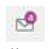
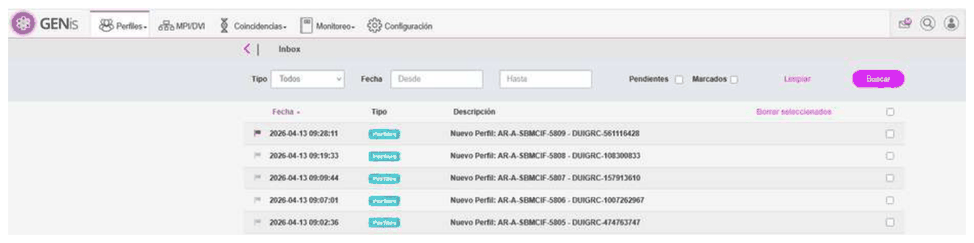
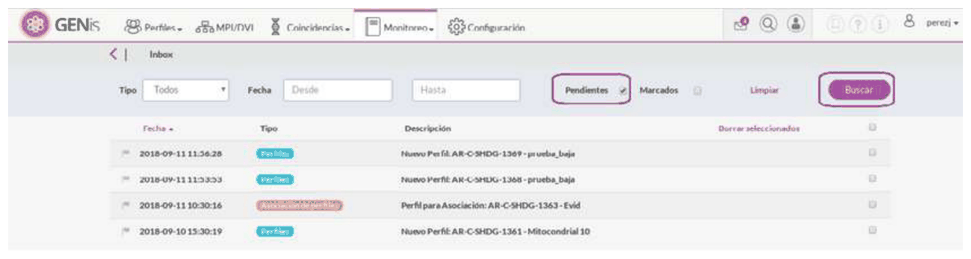
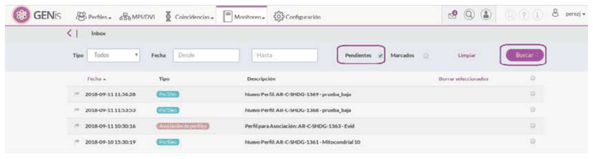

# 18. NOTIFICACIONES

## NOTIFICACIONES

GENis cuenta con un inbox de notificaciones. Es un sobre ubicado en la parte derecha que indica la cantidad de notificaciones pendientes.

Para acceder al detalle de las notificaciones, al hacer click sobre el ícono del sobre:

A medida que van llegando notificaciones, se va actualizando el número del sobre.

En GENis la mayoría de las notificaciones indican que se tiene una acción pendiente del usuario. Hasta que no se realice la acción pendiente, la notificación quedará en negrita.

Se tiene la posibilidad de marcar con un flag las notificaciones que son importantes:

Para eliminar las notificaciones, seleccionar las notificaciones que se desa eliminar y hacer click en el botón **Borrar seleccionados**.

## BÚSQUEDA AVANZADA Y FILTROS

Se pueden aplicar varios filtros sobre las notificaciones.

Se tienen los siguientes casilleros para tildar y realizar un filtro:

- **Pendiente**: muestra todas las notificaciones pendientes de realizar alguna acción.
- **Marcado**: muestras aquellas notificaciones que fueron marcadas como notificaciones de importancia.

Ejemplo de notificaciones pendientes:

Se puede filtrar por un rango de fecha (fecha desde/hasta) y por el tipo de notificación. Ejemplo tipo de notificación **Asociación de perfiles**:

### Tipo de notificaciones

Existen distintos tipos de notificaciones y según de que tipo se trate, se identifican con un color diferente.

A continuación se muestran los tipos de notificaciones, acciones requeridas y cuando se resuelve la notificación (en el caso de que tenga una acción asociada) :

**Generales**

- **Usuarios:** se genera cuando un nuevo usuario solicita acceso a GENis o realizó su blanqueo de contraseña. Se resuelve cuando se le otorga el acceso. Se identifica con un color verde.
- **Carga masiva:** Se genera cuando ingresa un perfil en el paso 1 de la carga masiva, y se resuelve cuando se aprueba en el paso 2. Se identifican con un color morado.
- **Perfiles:** Se genera cuando ingresa un perfil a la base y aún no tiene datos genéticos. Se resuelve al incorporarle algún análisis. Se identifican con un color azul.

**Forense**

- **Asociación de perfiles:** Se genera cuando ingresa un perfil candidato para asociación. Se resuelve cuando se asocia el perfil. Se identifican con un color naranja
- **Coincidencias:** Se genera cuando se encuentra un nuevo match, y se resuelve cuando se le hace un hit o descarte al mismo. Se identifican con un color violeta.

**Búsqueda de personas**

- **Coincidencias de personas:** Se genera cuando se encuentra un nuevo match en el proceso de búsqueda de personas. Se resuelve cuando se valida el escenario asociado a este match. Se identifica con un color morado.
- **Escenario de pedigrí:** Se genera cuando se finaliza el cálculo de LR en un escenario de pedigrí. Se identifica con un color azul.

**Agrupación de restos DVI:**

- **Finalización de búsqueda de agrupaciones:** Se genera cuando se realiza una agrupación automática para un caso de DVI y se encontraron agrupaciones. Se identifica con un color verde.
- **No se encontraron agrupaciones:** Se genera cuando se realiza una agrupación automática para un caso de DVI y no se encontraron agrupaciones. Se identifica con un color verde.

**Interconexión de Instancias**

- **Instancia Inferior:** Se genera cuando una instancia inferior está pendiente de aprobación de una instancia superior. Se identifica con un color gris.
- **Notificaciones de Match/Descarte/Hit:** es la misma notificación de Coincidencia. Se notifica a los owners de los perfiles que dieron match/descarte/hit y al administrador de la Instancia Superior.
- **Confirmación de Coincidencia:** Se genera cuando se confirma una coincidencia. Se notifica al owner del perfil de la instancia con la que hubo match y al administrador de la Instancia superior. Se identifica con un color violeta.
- **Descarte de Coincidencia:** Se genera cuando se descarta una coincidencia. Se notifica al owner del perfil de la instancia con la que hubo match y al administrador de la Instancia superior. Se identifica con un color violeta.
