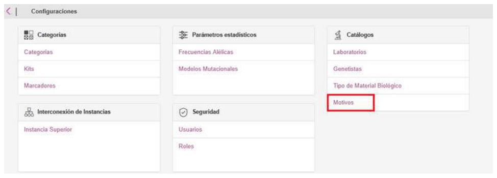
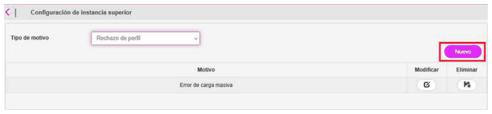
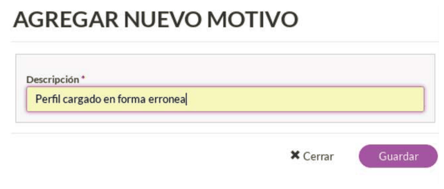
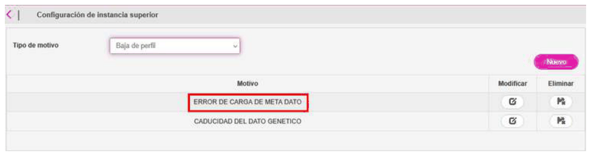

# 19. Reason coding

## Reason coding

Reason coding allows you to configure the reasons that will appear when the following actions are performed:

- Rejection of a profile
- Deactivation of a profile.

To configure reason coding, go to the **Configuration/Catalogs/Reasons** menu.

Select the type of reason you want to code and click the **New** button:

Add the corresponding reason and click Save:

Note that the reason has been saved. It is possible to modify and/or delete it:

