# 20. BÚSQUEDA DE PERSONAS

## BÚSQUEDA DE PERSONAS

Este capítulo abarca dos módulos:

- Búsqueda de personas desaparecidas (MPI)
- Búsqueda de personas victimas de desastres (DVI)

Las investigaciones de personas, son situaciones donde los perfiles genéticos de determinados restos humanos son comparados con perfiles obtenidos de muchas y diferentes muestras biológicas, lo que introduce un nivel de complejidad que va mas allá de los desafíos del análisis de parentesco convencional en ciencias forenses.

## CREACIÓN DE UN CASO

El primer paso para trabajar con pedigrís, es dar de alta un caso.

Para generar un nuevo caso, dentro del menú MPI/DVI, hacer click en el botón **Nuevo Caso**:

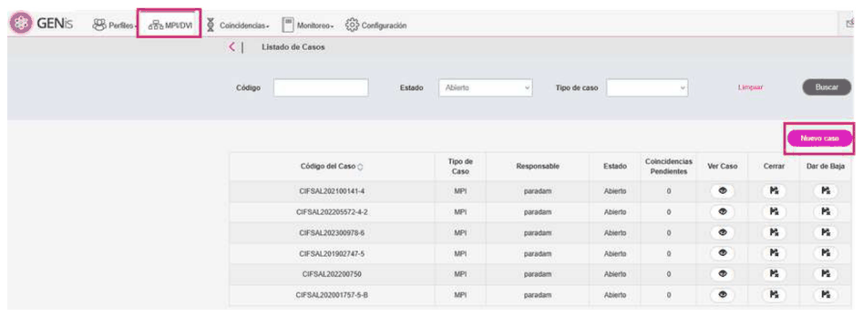

Al crear un nuevo caso, me abre una pantalla en la solapa Datos de la causa, en donde se deben completar dos campos mandatorios:

- **Código del caso:** nombre que identifica el caso. Debe ser único, es decir, no puede haber dos casos con el mismo nombre (incluso si el caso está en el estado Borrado).
- **Tipo de caso:** MPI o DVI. Según lo que se complete en este campo, cambian las solapas del Caso:

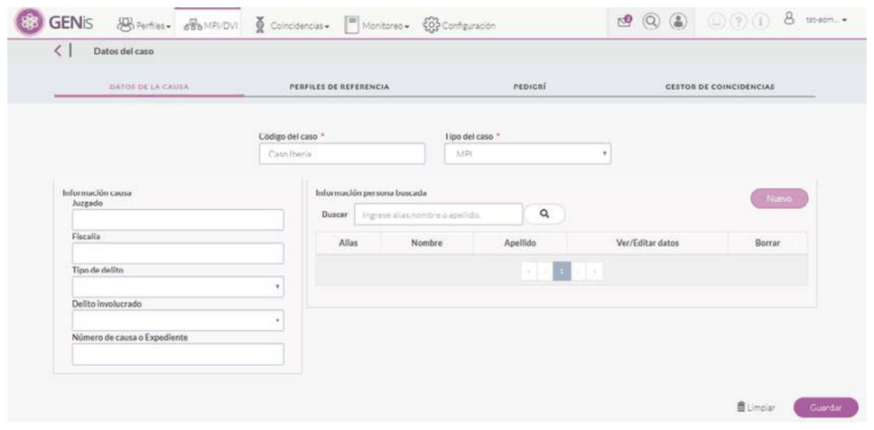

Para MPI se tienen las siguientes solapas:

- Datos de la causa
- Perfiles de Referencia
- Pedigrí
- Gestor de Coincidencias

Para DVI se tienen las siguientes solapas:

- Datos de la causa
- Perfiles de Referencia
- Perfiles NN post mortem
- Agrupador de restos
- Gestor de Coincidencias
- Pedigrí

El detalle de cada solpa se ve en los siguientes capítulos.

Una vez creado el caso, el mismo aparece en el listado de casos, dentro de la pantalla principal del menú MPI/DVI:

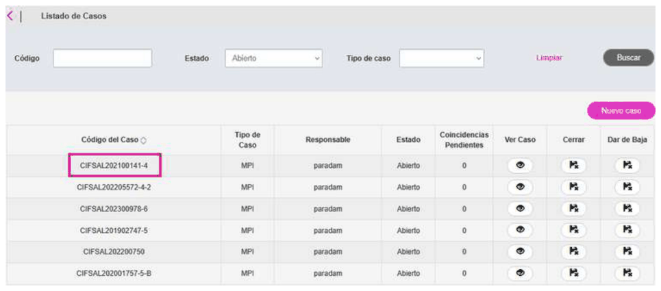

Por defecto se muestran los casos en el estado Abierto. Se puede filtrar por estado, tipo de caso y por el código del caso (no hace falta escribir el código completo, con poner parte del mismo, realiza la búsqueda).

Para ingresar al caso, hacer click en el ícono 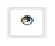 de ojo que permite ingresar al caso.

Una vez guardado el caso se pueden completar las solapas e ingresar la metadata. El Código del caso y el Tipo de caso quedan en un estado de solo lectura sin poder modificarse:

## ESTADOS DE UN CASO

Se tienen tres estados posibles por los que puede pasar un caso:

- **Abierto:** estado inicial en el que se encuentra el caso al crearlo y durante el cual permanece mientras se lo esté trabajando. Del estado Abierto se puede ir al estado Borrado o Cerrado.
- **Cerrado:** Para poder cerrar un caso, hacer click sobre el botón Cerrar en el listado de casos. Todos los pedigrís pertenecientes al caso, no deben tener matchs pendientes, caso contrario, no me permitirá cerrar el caso y aparecerá un mensaje de advertencia de que se tiene coincidencias pendientes. Si no se tiene coincidencias pendientes, aparecerá el siguiente mensaje de advertencia, antes de proceder a cerrar el caso:

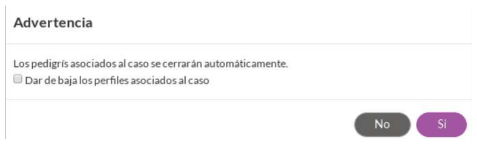

Tener en cuenta que si se marca la opción Dar de baja los perfiles asociados al caso, solo se darán de baja de la base si no se encuentran asociados a otros casos y no tienen matchs pendientes.

Cuando un caso está en estado **Cerrado** no se puede hacer ninguna acción sobre él, queda en estado solo lectura. Si se puede ver toda la información que contiene.

**Dar de Baja:** Se tiene la opción **Dar de baja** que elimina el caso. Para poder dar de baja un caso, de deben cumplir las siguientes condiciones:

- No se podrá tener matchs pendientes
- No se podrá tener pedigrís en el estado **Confirmado**.

Antes de darlo de baja me aparece un cartel de advertencia (mismo cartel de para cerrar un caso) y si se marca la opción **Dar de baja los perfiles asociados al caso**, solo de darán de baja de la base si no se encuentran asociados a otros casos y no tienen matchs pendientes.

Al borrar el caso, el mismo aparece en el listado grisado sin posibilidad de poder accederlo.

## METADATA DE UN CASO

Dentro de un caso, en la solapa **Datos de la causa**, me permite agregar la metadata.

Para agregar la metadata, hacer click sobre el botón **Nuevo** y me aparece la siguiente pantalla:

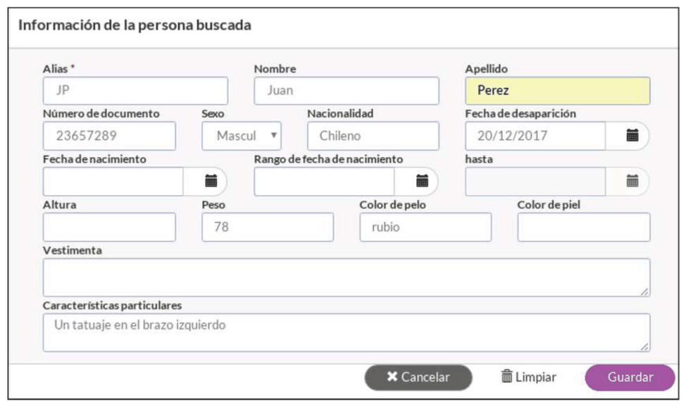

El campo **Alias** que es un campo mandatorio y no editable. El alias es único, no se puede tener dos alias iguales dentro del caso.
Al hacer click sobre **Ver/Editar datos**, me permite agregar más información.

Dentro del recuadro de **Información persona buscada**, me aparece el listado de toda la metadata que se hayan cargado para el caso. Los registros estan ordenados por el campo alias.

## INFORMACIÓN DE LA PERSONA BUSCADA / GRUPO FAMILIAR

La sección "Información persona buscada / grupo familiar" permite registrar metadata descriptiva del caso MPI, vinculada a la persona de interés y a su contexto familiar.
Esta información cumple una **función administrativa, documental y de trazabilidad**, y está destinada a facilitar la organización, comprensión y seguimiento del caso por parte de los usuarios del sistema.
Los datos consignados en esta sección **no intervienen en los procesos automáticos de búsqueda**, ni en la construcción del pedigrí, ni en el cálculo de LR, ni en la generación o validación de coincidencias.
 Su utilización es exclusivamente informativa y no genética.
No obstante, esta metadata resulta relevante como **soporte contextual** para la interpretación humana de los resultados y para auditorías internas o externas, permitiendo comprender el objetivo y alcance del caso.

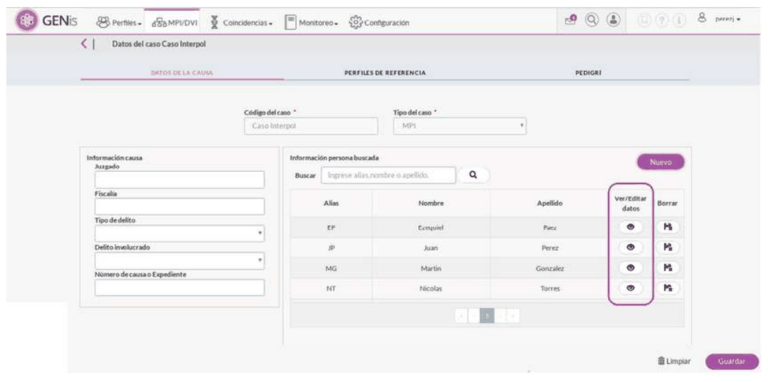

## ASOCIAR PERFILES A UN CASO

El siguiente paso, luego se haber creado el caso, es asociar los perfiles que se van a utilizar cuando se generen los nodos del pedigrís.
Según el tipo de caso (MPI o DVI) se tienen las siguientes solapas para asociar perfiles:

**MPI**

- Perfiles de Referencia
- DVI
- Perfiles de Referencia
- Perfiles NN Post Mortem

Estas solapa permite asociar los perfiles que se van a poder asociar a los nodos del pedigrí.

## SOLAPA PERFILES DE REFERENCIA

Esta solapa solo me permite asociar perfiles pertenecientes a las categorías:

**Para MPI**

- Persona que busca conocer su identidad biológica. (Individuo INNV)
- Individuos de Referencia (IR)

**Para DVI**

- Individuos de Referencia (IR_DVI)

Se puede asociar un perfil en particular o un lote completo.

## SOLAPA PERFILES NN POST MORTEM

Para el tipo de caso DVI, aparte de la solapa Perfiles de Referencia, se tiene la solapa Perfiles NN Post Mortem.

Esta solapa permite asociar perfiles pertenecientes a las categorías Post Mortem de DVI:

- Elementos Personales hallados de la persona desaparecida (ENN)
- Restos Biológicos no identificados (RNN)
- Personas fallecidas no identificadas (INN)
- Personas fallecidas cuya identidad quiere analizarse (PFNI)

## ASOCIAR LOTE

Para asociar un lote, hacer click en el botón **Asociar Lote** y aparece una pantalla que me permite buscar el lote por ID o por nombre:

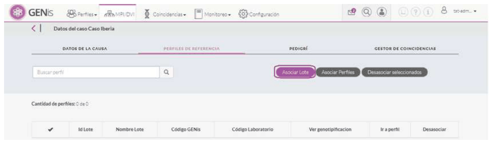

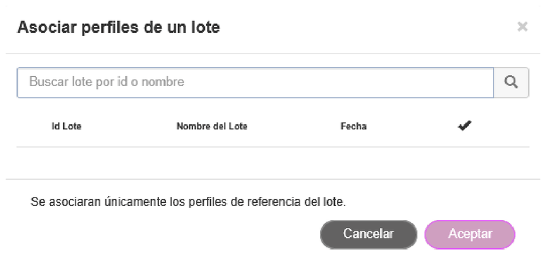

Tener en cuenta las siguientes consideraciones:

- Se puede asociar mas de un lote a la vez, siempre y cuando tengan nombres similares, ejemplo: FAM1, FAM2, dado que la asociacion es según lo buscado en pantalla.
- Para poder hacer efectiva la asociación del lote, se debe marcar el casillero:
- Se asociarán **solamente** (como indica la leyenda) perfiles de Referencia (IR e INNV para MPI y IR_DVI para DVI), es decir, si un lote contiene perfiles correspondientes a otras categorías, solo asociará los perfiles de las categorías permitidas.
- Para los casos de DVI que tienen ambas solapas (Perfiles de referencia y Perfiles NN post mortem), según la categoría perteneciente al perfil se asociarán en una solapa u otra. Ejemplo: si en la solapa **Perfiles de Referencia** cargo un perfil con categoría ER, este perfil se cargará automáticamente en la solapa **Perfiles NN Post Mortem**.
-  Tener en cuenta que para el caso de DVI, si se tiene un pedigrí activo y se asocia un nuevo lote, **solo** se asociarán los perfiles correspondientes a la solapa de **Perfiles de referencia**. Para que se pueden exportar tambien los perfiles pertenecientes a la solapa **Perfiles NN Post Mortem**, cambiar el estado de los pedigrís a **En Construcción**, importar el lote y volver a activarlos.

## ASOCIAR PERFILES

Para asociar perfiles se cumplen las mismas reglas que para asociar un lote. Para buscar el perfil a asociar se puede buscar por los siguientes campos:

- Código GENis
- Código Laboratorio
- ID de Categoría
- Responsable

La columna Asociado, indica si este perfil ya esta asociado en el caso, lo cual no me permitirá volver a asociarlo. Se pueden tener asociado el mismo perfil a varios casos pero no se puede volver a asociar al caso un perfil que ya esta asociado:
Para poder hacer efectiva la asociación del perfil, se debe marcar el casillero: 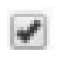

Tener en cuenta que los perfiles ya asociados no se van a poder tildar.

## DESASOCIAR PERFILES DEL CASO

Se puede desasociar un perfil especifico, haciendo click sobre el ícono de la papelera o seleccionar los perfiles que se desean desasociar y hacer click en el botón **Desasociar seleccionados**:

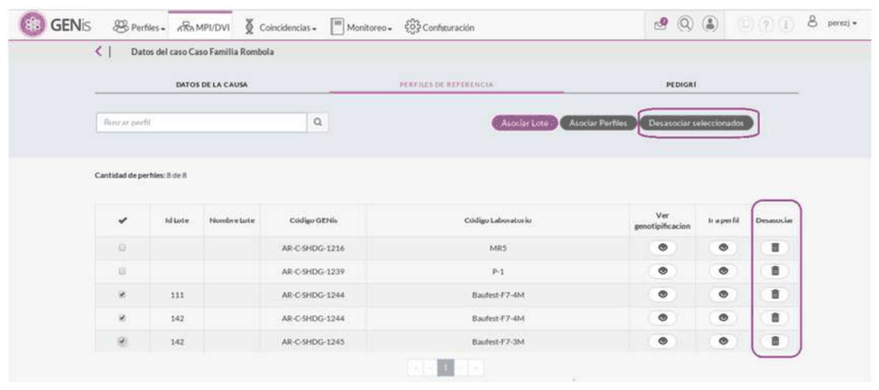

Validaciones

- No se puede desasociar un perfil que este asociado a un pedigrí
- Tener en cuenta que si se quiere desasociar un perfil que es padre (Ver sección **20.22 Agrupaciones de Restos**), los hijos asociados al perfil agrupador pasarán al estado **Activo**.

## CREACIÓN DEL GENOGRAMA O PEDIGRI

El próximo paso es construir el pedigrí.

Para crear un nuevo Pedigrí, ir a la solapa **Pedigrí**, dentro de un caso, y hacer click en el botón **Nuevo Pedigrí**:

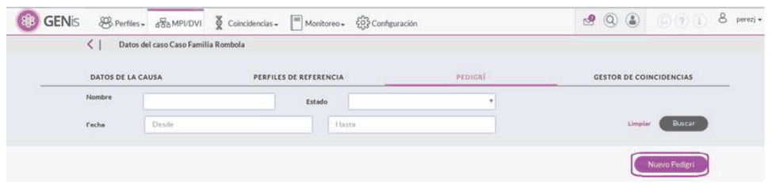

Al entrar al genograma del pedigrí, se generan por defecto Madre y Padre ya que esos nodos son necesarios para el algoritmo de familias:
Los nodos candidatos para los combos de madre/padre se filtran según el sexo de los nodos ya ingresados

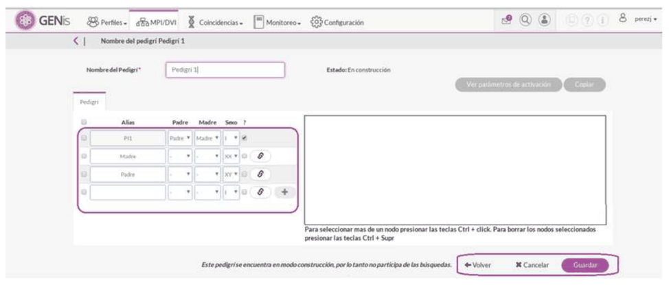

Se deberá completar el campo mandatorio **Nombre del Pedigrí**. Si no se tiene este campo completo, el botón **Guardar** permanecerá grisado.

Mientras el pedigrí esté en modo construcción, aparece la leyenda: *"Este pedigrí se encuentra en modo construcción, por lo tanto, no participa de las búsquedas"*

## ASIGNAR NODOS A UN PEDIGRÍ

La asociación de nodos dentro del pedigrí permite asignar perfiles que estén asociados dentro del caso. Según el tipo de caso se comporta de la siguiente manera:

**Para DVI:**

- Se pueden asociar perfiles tanto de la solapa **Perfiles de Referencia** (IR_DVI), como de la solapa Perfiles NN Post Mortem (PFNI_DVI, ENN_DVI, RNN_DVI, INN_DVI) que estén dentro del caso. Tener en cuenta que solo se podrán asociar perfiles en el estado Activo (Ver sección **20.22 Agrupaciones de Restos**)

**Para MPI:**

- Se pueden asociar los perfiles de la solapa **Perfiles de Referencia**.

Para asociar perfiles a los nodos, hacer click en el ícono   y me aparece el listado de los perfiles asociados al caso:

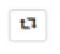

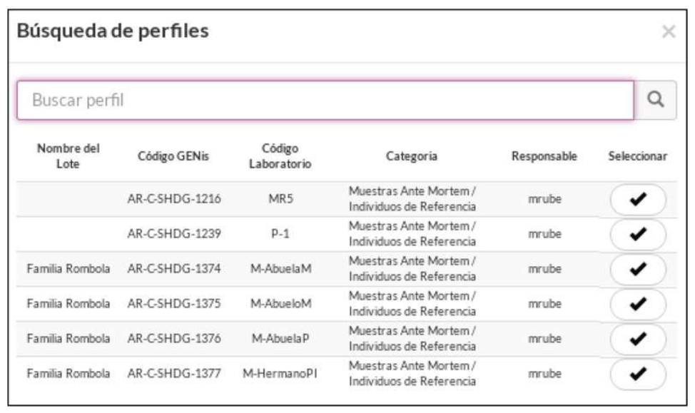

Este ícono también permite desasociar el perfil del nodo.

Tener en cuenta que una vez que voy asociando los perfiles a los nodos, ese perfil deja de aparecer en la pantalla de **Búsqueda de perfiles** para que no lo pueda volver a asociar.
El ícono   me indica que el nodo tiene un perfil asociado:

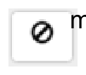

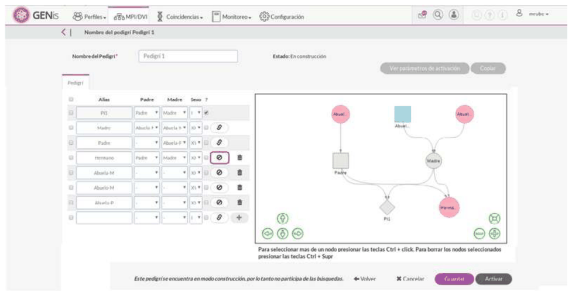

Para agregar más nodos se usa la última fila. Hasta que no se toca el "+", no se impacta el gráfico.

El pedigrí será luego construido con herramientas gráficas, respetando el estándar para los nodos (ej: cuadrados para masculinos, círculos para femeninos, , etc).

Para los perfiles asociados a los nodos, se utilizan los siguientes colores:

- Color rosa para representar perfiles de referencia de sexo femenino.
- Color azul para representar perfiles de referencia de sexo masculino
- Color naranja para representar perfiles de DVI Post Mortem:
    - Personas fallecidas cuya identidad quiere analizarse
    - Elementos personales hallados de la persona desaparecida
    - Restos biológicos no identificados
    - Personas fallecidas no identificadas

## CAMBIOS DE ESTADO DE UN PEDIGRÍ

Un pedigrí puede pasar por los siguientes estados:

| Acción | Estado Inicial | Estado Destino | ¿Pedigrí editable? | ¿Pedigrí activo en búsquedas? | ¿Acción manual? | Descripción |
| --- | --- | --- | --- | --- | --- | --- |
| Crear pedigrí | - | En construcción | SI | NO | SI | Primer estado en que se crea el pedigrí |
| Botón Dar de baja | En construcción | Borrado | NO | NO | SI | Solo se puede realizar si el pedigrí no paso por el estado Activado. Si ya se activó una vez, no se podrá realizar esta acción y saldrá el siguiente mensaje: "El pedigrí no se puede borrar dado fue activado al menos una vez." |
| Botón Activar | En construcción | Activo | NO | SI | SI | Activo en búsquedas. Antes de activar el pedigrí me aparece una pantalla con determinada información que se debe completar (Ver sección 20.15 Búsqueda: Activación del Pedigrí) |
| Botón Editar | Activo | En construcción | SI | NO | SI | Se puede realizar esta acción si no hay HIT. Solo se puede volver a este estado si tengo matchs descartados. Si tengo matchs pendientes aparecerá el siguiente mensaje: "El pedigrí no se puede editar dado que tiene matches sin descartar" |
| Botón Cerrar | Activo | Cerrar | NO | NO | NO | Se pasa al estado cerrado si se cumplen las siguientes condiciones: No hay match pendientes No tiene Hits |
| Crear pedigrí | Activo | Confirmado | NO | NO | SI | Se pasa al estado confirmado cuando se valida un escenario de un match. Al validar el escenario me sale un mensaje de advertencia con la siguiente confirmación: Pedigrí sigue activo en búsquedas? Si: el pedigrí pasa al estado Confirmado y se crea una copia del pedigrí actual en el estado Activo poniendo como nombre "Copia nombre pedigrí original". No: pasa al estado Confirmado. El pedi-grí pasa automáticamente al estado Confirmado y el match también. Un pedigrí solo puede tener un solo escenario validado. No se pueden validar los escenarios que se generan desde el pedigrí. |

Los estados **Cerrados y Confirmados** son estados finales. Se puede ver el pedigrí y sus escenarios y me permite realizar una copia, pero no se puede realizar ninguna modificación ni activar el pedigrí (estado solo lectura).

Existen dos maneras de visualizar el estado en un pedigrí:

- Desde la solapa **Pedigrí**, me aparece el listado de todos los pedigrís asociados al caso, y una columna que me indica el estado en que se encuentra cada uno:

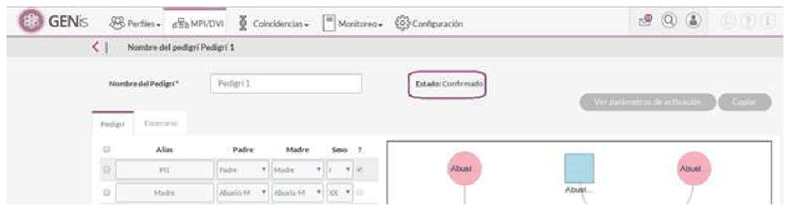

Dentro del Pedigrí, se tiene la información del estado en que se encuentra el mismo:

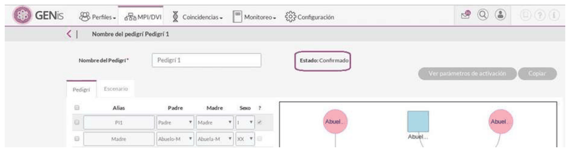

Para borrar un pedigrí, hacer click sobre el ícono de Borrar, dentro de la solapa de Pedigrí:

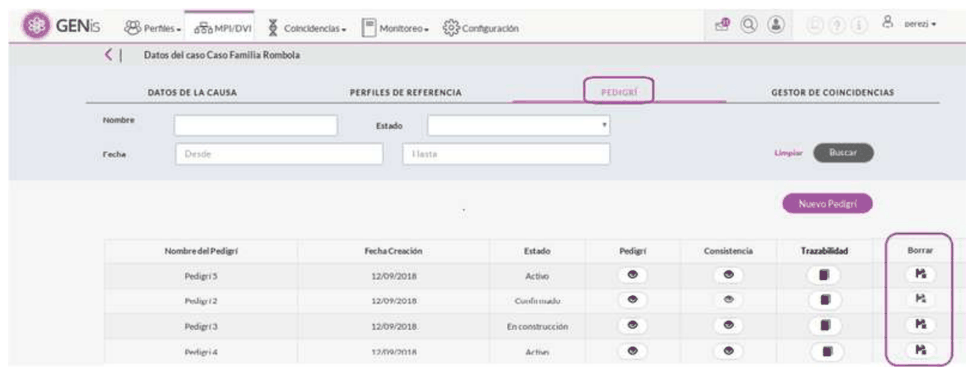

Al borrar el pedigrí se elimina automáticamente de la lista de pedigrís del caso sin posibilidad de acceder nuevamente al mismo.

## FILTROS

Se tienen varios filtros para la búsqueda de pedigrís dentro de un caso:

- Nombre: me trae todos los pedigrís que contengan la palabra ingresada. No hace falta escribir el nombre exacto del pedigrí, ya que me trae todos los pedigrís que contengan esa palabra. Ejemplo:

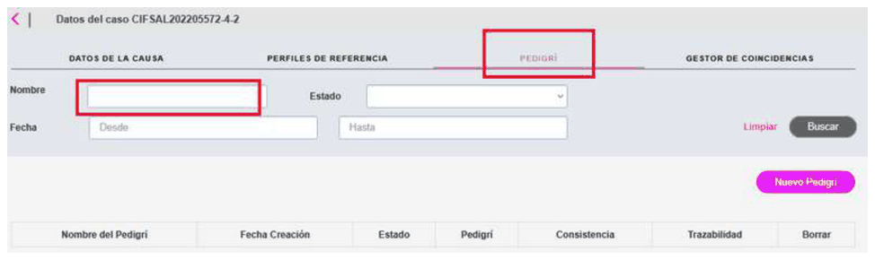

- Estado: este filtro me permite realizar el filtro por el estado que se encuentran los pedigrís. Las opciones pueden ser: En construcción, Activo, Confirmado, Cerrado. Ejemplo:

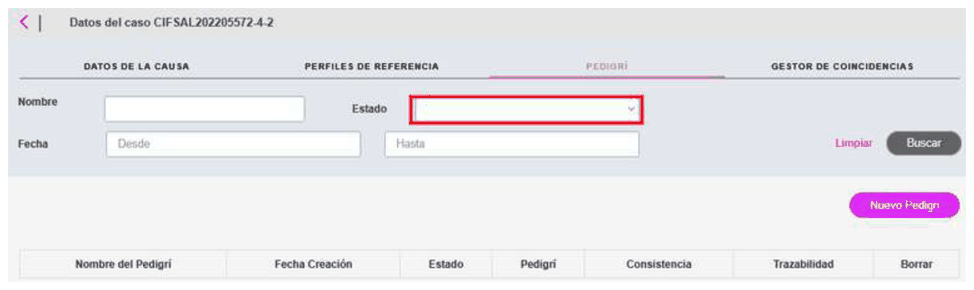

- Fecha Desde/Hasta: permite filtrar por la Fecha de creación. Ejemplo:
Se puede realizar una combinación de los filtros que permita buscar la información deseada.

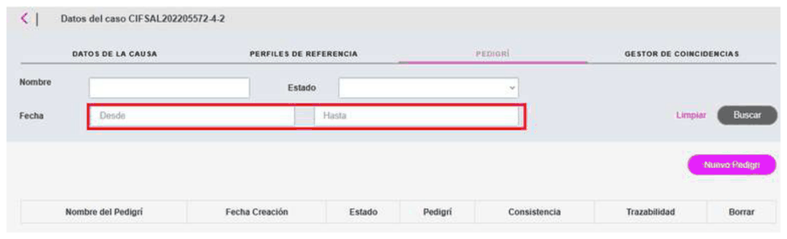

## CHEQUEO DE CONSISTENCIA

El chequeo de consistencias permite analizar si el pedigrí es consistente, ya sea porque el pedigrí está incompleto o los perfiles asociados a los nodos no tienen relación entre sí.

El chequeo de consistencia se puede realizar para ambos tipos de casos (MPI y DVI) y para poder realizarlo el pedigrí debe estar en cualquier estado diferente a **Confirmado** y **Cerrado**.

Para realizar el chequeo de consistencia, dentro del caso ir a la solapa **Pedigrí**, y hacer click en el ícono del ojo ubicado en la columna **Consistencia**:

EEjemplo ilustrativo – Chequeo de consistencia del pedigrí

Considérese un caso MPI en el cual se construye un pedigrí simple compuesto por un padre, una madre y un hijo (persona de interés), todos con perfiles autosomales cargados.

Durante el chequeo de consistencia, GENis verifica que la estructura del pedigrí sea válida (por ejemplo, asignación correcta de sexos y relaciones parentales) y evalúa, para cada marcador genético, si los alelos observados en el hijo pueden explicarse a partir de los genotipos parentales según las reglas de herencia mendeliana.

Por ejemplo, si para un marcador determinado el padre presenta los alelos 12 y 14, la madre los alelos 9 y 11, y el hijo los alelos 11 y 14, el marcador resulta compatible y contribuye a la consistencia del pedigrí.

En cambio, si el hijo presenta alelos que no pueden derivarse de ninguno de los progenitores, el sistema detectará una inconsistencia.

Cuando el pedigrí no tiene asociado un modelo mutacional, incompatibilidades genéticas directas conducen a un resultado de pedigrí inconsistente. En cambio, si se encuentra configurado un modelo mutacional, determinadas incompatibilidades pueden ser consideradas dentro del modelo probabilístico, afectando las probabilidades calculadas pero sin invalidar necesariamente el pedigrí.

El chequeo de consistencia no confirma relaciones de parentesco ni identidades, sino que permite verificar que el pedigrí sea genéticamente viable para su utilización en los procesos de inferencia probabilística y búsqueda de coincidencias del módulo MPI.

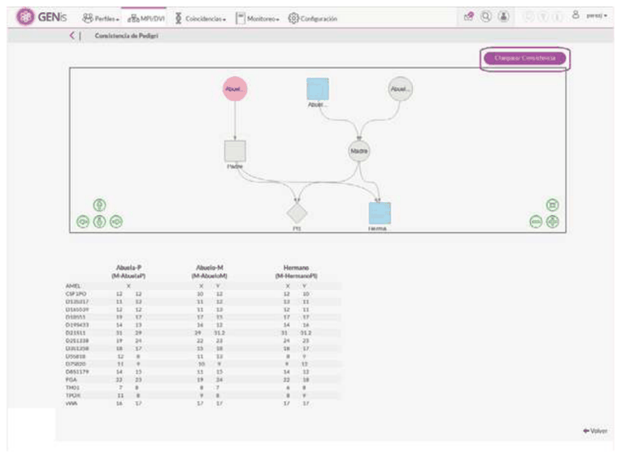

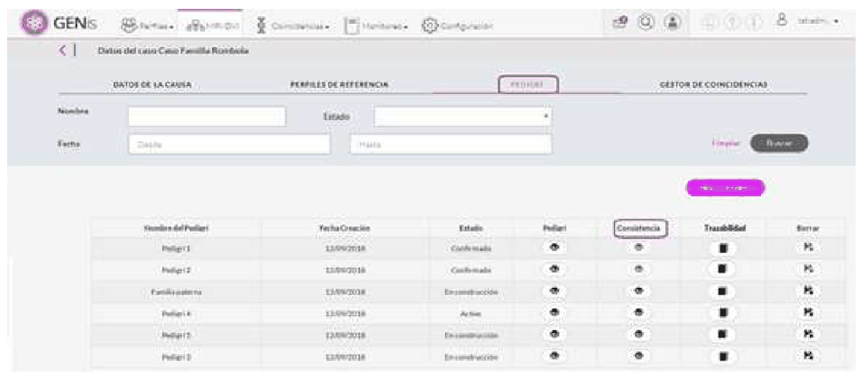

En la pantalla de **Consistencia de Pedigrí** me muestra el grafo con los nodos, y debajo del detalle de los alelos de cada uno de los nodos del pedigrí.

Presionar el botón **Chequear Consistencia** y automáticamente me aparece el resultado de si el pedigrí es consistente o no:

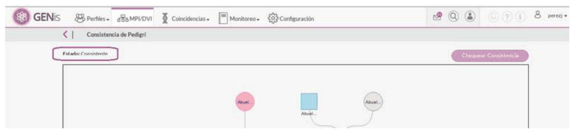

Si se realizan cambios sobre el pedigrí, el chequeo de consistencia anterior se elimina, teniendo la posibilidad de volver a realizar el chequeo de consistencias sobre el pedigrí modificado.

## BÚSQUEDA: ACTIVACIÓN DEL PEDIGRÍ

Para activar un pedigrí hacer click sobre el botón Activar dentro del pedigrí:

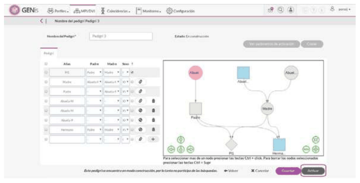

Antes de activar el pedigrí, se deben indicar los siguientes parámetros:

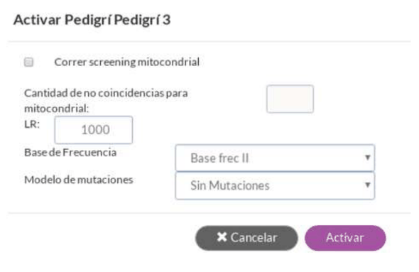

- **Correr screening mitocondrial:** permite activar la búsqueda por el análisis mitocondrial (Ver detalle en la proxima seccion 20.16 Screening Mitocondrial)

- **Cantidad de no coincidencias para mitocondrial:** esté parametro se activa cuando se chequea el campo Correr screening mitocondrial.

- **LR:** indica el umbral mínimo de LR. Durante el proceso de match, se calcula el LR del pedigrí en cuestión con todos los perfiles candidatos (perfiles de las categorías de pedigrí salvo IR). Si ese LR supera el umbral, se reporta la coincidencia.
- **Base de frecuencia:** con esta base se hace el proceso de match del pedigrí.

- **Modelo de Mutaciones:** indica si el pedigrí se va a activar sin ningún modelo o si la posibilidad de seleccionar uno de los modelos de mutaciones,
    - Sin mutaciones
    - Equal
    - Stepwise

De la misma manera funciona cuando se da de alta un perfil en una categoría de pedigrí, se intenta matchear contra todos los pedigrís que estén en estados Activo (no importa si se cree que ya se encontró a la persona, se sigue comparando ese pedigrí por las dudas)

Aclaración sobre la continuidad de las búsquedas

Mientras un pedigrí se encuentre en estado **Activo**, GENis lo utiliza como consulta para la búsqueda de coincidencias, tanto al momento de su activación como cada vez que se incorporan nuevos perfiles pertenecientes a categorías de búsqueda de MPI.

Este comportamiento permite que un pedigrí continúe siendo comparado en el tiempo, aun cuando ya se haya validado un escenario, en aquellos casos en que el usuario decida mantener activa la búsqueda. La finalización de las comparaciones automáticas ocurre únicamente cuando el pedigrí pasa a un estado final (Confirmado o Cerrado).

Los parámetros definidos al momento de activar un pedigrí determinan el comportamiento de las búsquedas de coincidencias en el módulo MPI y deben ser seleccionados de acuerdo con el tipo de caso y los objetivos de la búsqueda.

El *screening mitocondrial* actúa como un filtro inicial de compatibilidad y no constituye por sí mismo una confirmación de parentesco. La *cantidad de no coincidencias permitidas* establece el grado de tolerancia en dicha comparación preliminar.

El *umbral de LR* define el criterio mínimo para reportar coincidencias y cumple una función operativa de priorización, no de interpretación pericial definitiva.

La selección de un *modelo mutacional* permite considerar la posibilidad de mutaciones en el análisis de parentesco, lo cual puede modificar la sensibilidad de la búsqueda y los valores de LR obtenidos.

El detalle conceptual y operativo de cada uno de estos parámetros se desarrolla en las secciones específicas correspondientes.

Para poder activar un pedigrí, primero se debe **Guardar** para que se active la opción **Activar**. Se lanza un *match de compatibilidad*. Se calcula un LR con todos los perfiles candidatos, y se reportan aquellos que tengan un LR mayor al umbral como una coincidencia en la agrupación de *Compatibilidad*.

Al activar el pedigrí, se puede observar que se activa el proceso de búsqueda de personas   y una vez finalizada la busqueda aparece el siguiente cartel:

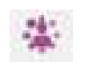

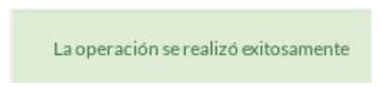

Una vez activado el pedigrí, se tiene el botón **Ver parámetros de activación**, que me permite ver los parámetros que se definieron al activar el pedigrí:

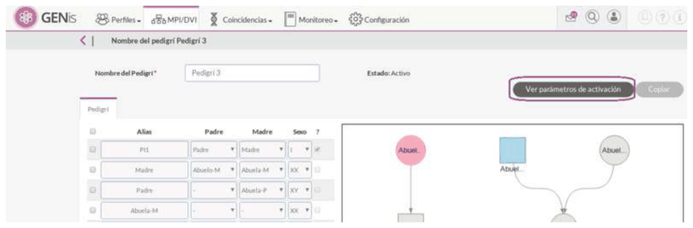

Estos parametros son de solo consulta, están grisados sin posibilidad de modificación.

## SCREENING MITOCONDRIAL

Dentro de un pedigrí perteneciente a un caso, al activar el mismo, se tiene un casillero para chequear si se quiere correr el screening mitocondrial, como se vio en la sección anterior.

En el caso de que se chequee esta opción, se procede de la siguiente manera:

- Dentro del pedigrí, se busca el perfil que tenga cargado el análisis mitocondrial (siempre sobre la rama materna), el mismo será utilizado como base de la búsqueda (se toma el primero cargado)
- Con el análisis del primer paso se compara contra todos los perfiles de las categorías de la búsqueda de MPI que tengan cargado un análisis mitocondrial.
- Para los casos que dieron match mitocondrial o que no tienen cargado un análisis mitocondrial, se realiza la búsqueda autosomal.
- Solo se guardan los matches de mitocondrial que además dieron match por autosomal, los otros se descartan.

Dentro del detalle del match se tiene una columna de **Análisis Mitocondrial**, donde haciendo click sobre el ícono del ojo, me aparece el detalle de los rangos y variaciones de cada perfil, marcando en verde las coincidencias.

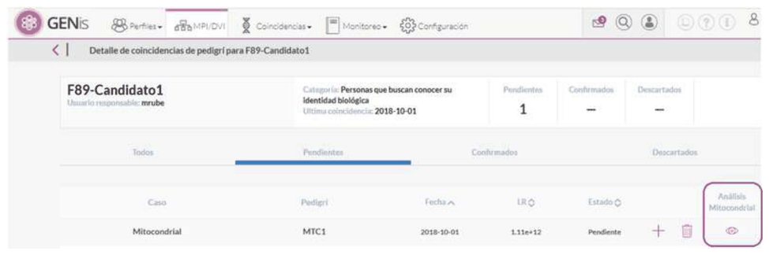

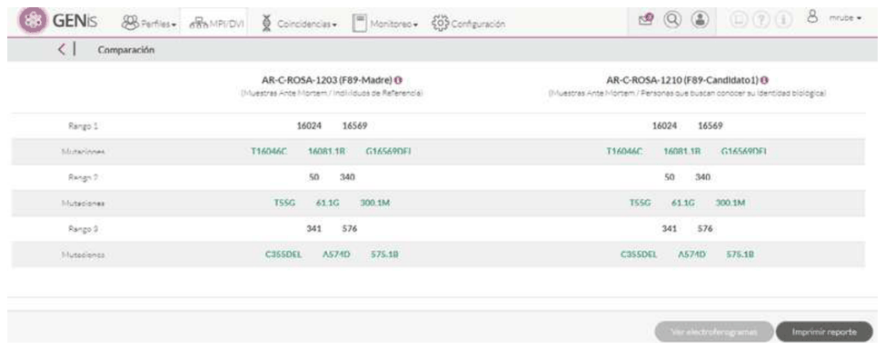

### Validaciones

- En el caso de que no se seleccione el screening mitocondrial, la búsqueda se realiza solamente por autosomal.
- Cuando se carga un nuevo perfil de alguna categoría de búsqueda de MPI, se compara contra todos los pedigrís activos, pero para los que tienen seleccionado el screening de mitocondrial, se hace la comparación de mitocondrial como primer filtro (siempre y cuando el nuevo perfil tenga cargado un análisis mitocondrial).
- Para los casos de DVI el casillero de **Correr screening mitocondrial y Cantidad de no coincidencias para mitocondrial**, esta siempre grisado, es decir, para los casos de DVI no se utiliza el Screening Mitocondrial. Esta decisión responde a la naturaleza del proceso de identificación en desastres, donde el universo de perfiles es cerrado y donde el uso del análisis mitocondrial como filtro excluyente podría conducir a la pérdida de asociaciones válidas, especialmente en contextos de perfiles incompletos, degradados o parciales.
- En DVI, el análisis mitocondrial puede estar disponible como información complementaria, pero la identificación se basa principalmente en el análisis autosomal, la agrupación de restos y la evaluación integral de la evidencia genética dentro del caso.

## MUTACIONES

Cuando el pedigrí tiene un modelo mutacional asociado, lo que se tiene en cuenta es si alguno de los alelos de la persona de interes es distinto a los que podria tomar, en base a los alelos de la familia, porque se considera la posibilidad de que hayan mutado.

Esto hace que se pueda modificar el LR y generen matches, que al no tener un modelo asociado, nunca se hubieran generado.

Los tipos de modelo disponibles son: **Equal** y **Stepwise**. Ambos permiten parametrizar la **Tasa de Mutación**, mientras que el modelo Stepwise además tiene un **Rango de Mutación**. Todos los parámetros tienen valores por defecto.

Para poder utilizar esta funcionalidad, primero chequear la configuración de los **Modelos Mutacionales**. Para esto ir al menú **Configuración/Modelos Mutacionales**:

Para ingresar un nuevo modelo mutacional, presionar el botón **Nuevo** :

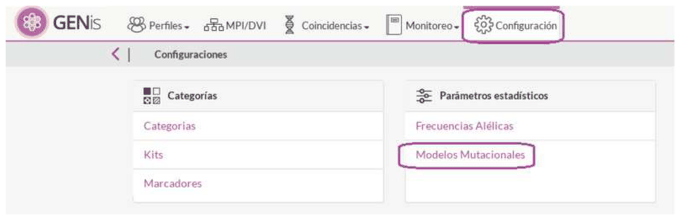

Completar los datos para poder generar el nuevo modelo:

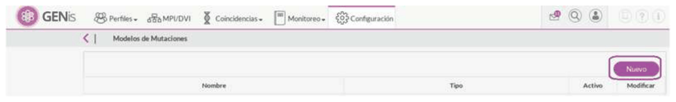

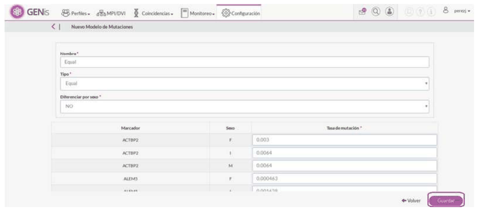

El campo **Diferenciar por sexo**, me permite que el modelo distinga disntintas tasas de mutacion de acuerdo a si es hombre o mujer, y esto puede cambia el LR.

Al momento de activar un pedigrí se selecciona si se le quiere asociar un modelo mutacional o que se active sin modelo.

Para modificar un modelo mutacional, hacer click en el ícono 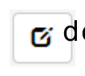 de la columna **Modificar**, que me permite acceder a los parámetros configurados:

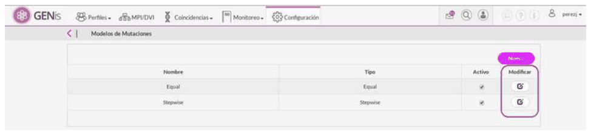

## GESTOR DE COINCIDENCIAS (MATCHES)

Al igual que Forense, se tiene el **Gestor de Coincidencias** para el caso de MPI/DVI.

Dentro de cada caso se tiene la solapa **Gestor de Coincidencias** con el detalle de las coincidencias encontradas:

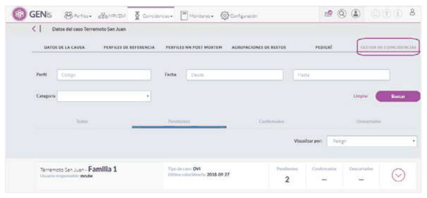

Cuando hay un match automáticamente se envia una nueva notificación indicando que se encontraron coincidencias. En la notificación se indica si la coincidencia es de un caso de MPI o de DVI:

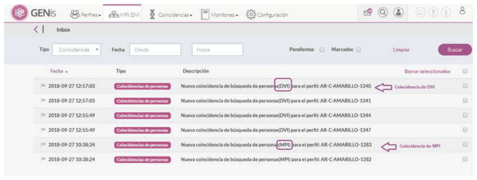

### Coincidencias para MPI

Para los casos de MPI se tienen tres maneras de acceder a las coincidencias:

- Dentro del inbox, haciendo click sobre la notificación.
- Dentro del caso, en la solapa Gestor de Coincidencias
- Desde el menú Coindidencias/MPI

Desde el menú de coincidencias, aparece el listado de los pedigris de todos los casos en los que se encontró una coicidencia.

Se puede visualizar por perfil o por pedigrí:

### Vista por pedigrí - perfil

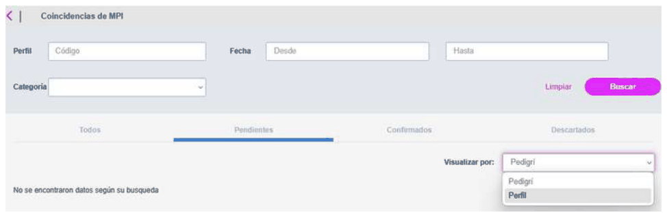

**Nota:** Para el Gestor de Coincidencias dentro de un caso, las coincidencias solo se ven por pedigrí.

Al igual que el Gestor de Coincidencias de Forense, haciendo click sobre la flecha de la derecha, 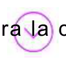 se muestra la coincidencia con mayor LR:

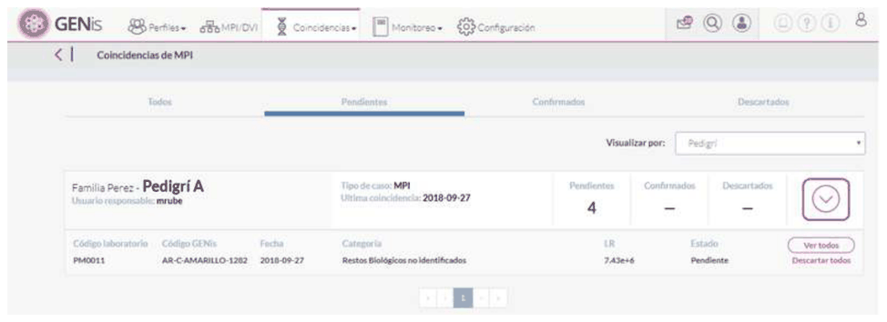

Haciendo click en el botón **Ver todos** me trae el detalle de los perfiles encontrados:

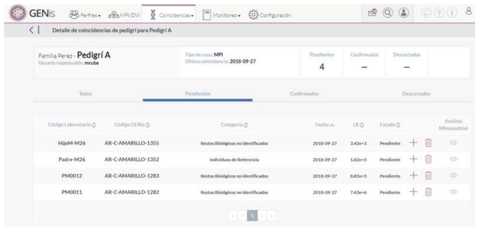

Desde el caso, en la solapa de Gestor de Coincidencias, muestra solamente las coincidencias pertenecientes al caso:

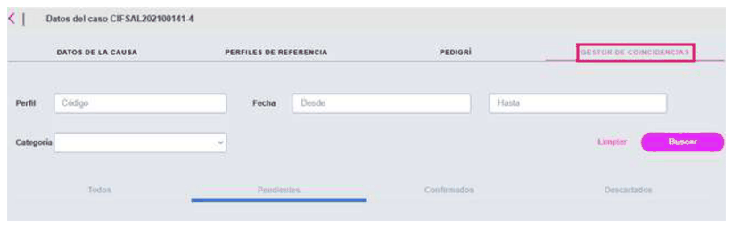

Los matches de pedigrí no tienen hit, solo tienen descarte. Esto es porque la validación en los pedigrís se hace a nivel de escenario.

A partir de cada match permite crear un escenario (Ver detalle de cómo crear un escenario en la sección siguiente).

### Coincidencias para DVI

Para los casos de DVI, tener en cuenta que cuando se ingresan perfiles nuevos a la base, no se busca coincidencias con los Pedigrís activos (como ocurre para MPI), es decir, cuando se activa un pedigrí de DVI, la búsqueda se realiza sobre los perfiles activos, dentro del caso de DVI al cual pertenece el pedigrí.

## ESCENARIOS

Los escenarios permiten evaluar la probabilidad del pedigrí o de un subconjunto del mismo. Existen dos tipos de escenarios:

- Escenarios generados desde el pedigrí
- Escenario para validar el pedigrí (cuando se produce un match)

### Escenarios generados desde el pedigrí

Cuando un pedigrí se encuentra en el estado Activo, se pueden generar N escenarios, realizando todas las pruebas que se consideren necesarias.

Para generar un nuevo escenario, seleccionar desde el menú de la izquierda los nodos de los cuales se quieren generar el escenario o desde el gráfico de nodos de la derecha, presionando las teclas ctrl+click, seleccionando mas de un nodo:

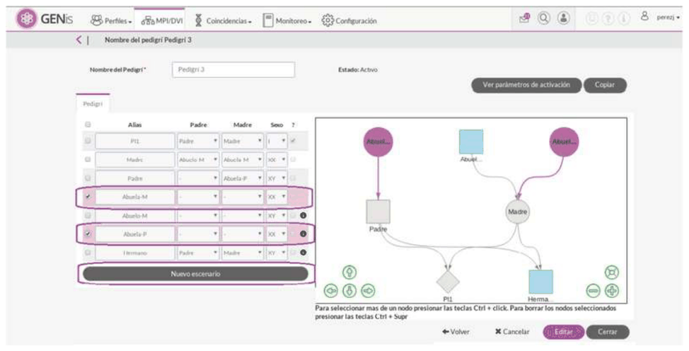

Una vez seleccionados los nodos, se activa (deja de estar grisado) el botón **Nuevo escenario**, completar el nombre corto y descripción y luego presionar el botón **Aceptar**:

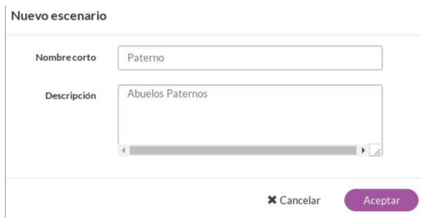

Una vez que se presciona el botón **Aceptar**, se agrega una nueva solapa al lado del pedigrí original:

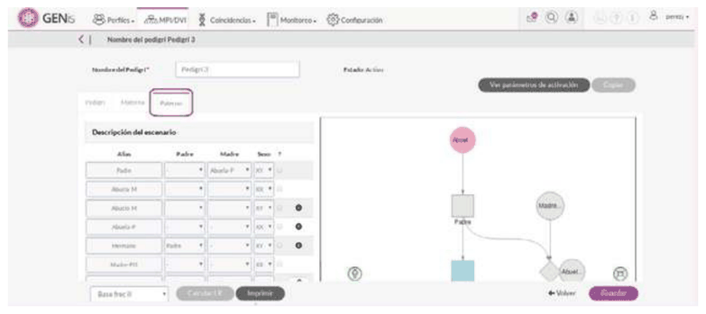

Los nodos PI1, Madre y Padre, se copian automáticamente independientemente de si fueron seleccionados o no.

Asocia un perfil a la persona de interes (PI1), y presionar el botón **Guardar**.

Una vez asociado un perfil, se tiene la posibilidad de cambiar la base de frecuencia y calcular el LR:

El botón Imprimir me muestra un informe con los alelos de los perfiles con la posibilidad de imprimirlo o bajar un archivo a la PC.

Ejemplo:

Se tiene tambien la opción de eliminar el escenario, presionando sobre el botón **Borrar**. Tener en cuenta que se pueden asociar los siguientes perfiles a un escenario:

- Para DVI:
    - Me permite asociar a la incógnita solamente los perfiles de la solapa Perfiles NN Post Mortem dentro del caso.
    - Se pueden asociar tanto perfiles en estado Activo como en estado Agrupado (Ver detalle en la sección 20.22 Agrupaciones de Restos)
- Para MPI
    - Me permite asociar a la incognita cualquier perfil de las categorías de MPI, menos la categoría IR.

### Escenario para validar el match

Un pedigrí solo puede tener un **escenario validado**, el cual se genera desde la pantalla de coincidencias. Para agregar un escenario, dentro del menu de **Coincidencias/MPI**, o dentro del **Gestor de Coincidencias** de cada caso, ubicarse dentro de la tarjeta del perfil que dio match y hacer click en el ícono +:

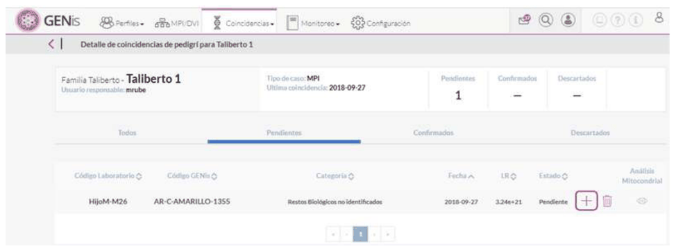

Agregar un nombre y una descripción:

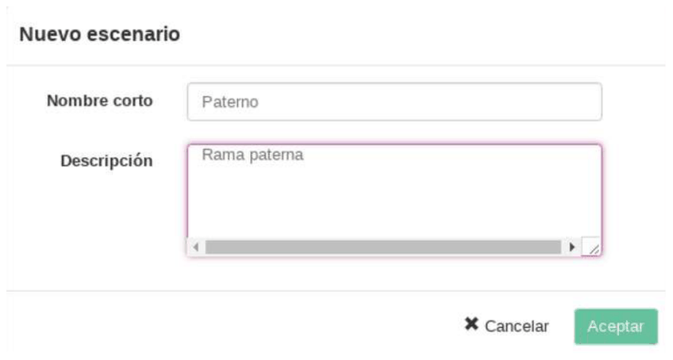

Automáticamente se agrega una nueva solapa, que me permite modificar la base de frecuencia, calcular el LR, e imprimir el detalle de comparación de perfiles:

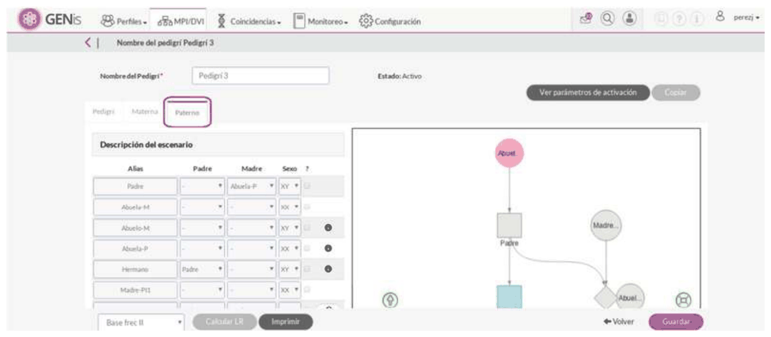

Tener en cuenta que para este tipo de escenario, la persona de interés tiene asociado el perfil coincidente, el cual no se puede modificar.

Para validar el escenario, hacer click sobre el botón **Validar**. Me

aparece el siguiente mensaje de advertencia:

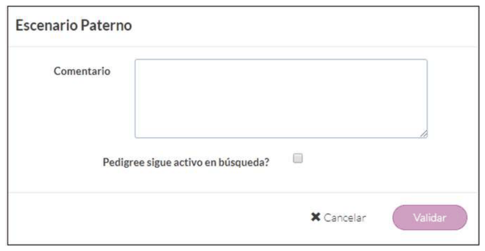

**Activo** con el nombre **Copia "nombre del pedigrí original"**.

Si no se chequea esa opción, el pedigrí solamente pasa al estado **Confirmado**.

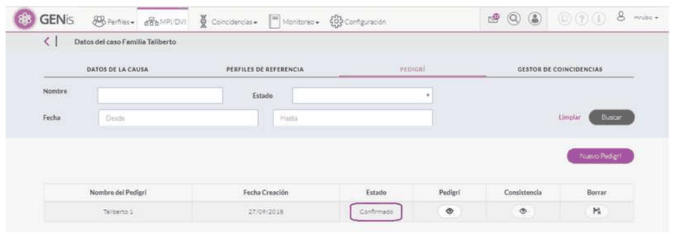

## COPIA DEL PEDIGRÍ

Dentro de cada pedigrí se tiene la opción de poder realizar una copia del mismo.

Para poder realizar la copia de un pedigrí, seleccionar primero los nodos que se quieren copiar.

Para seleccionarlos se puede hacer desde el menú de la izquierda y chequear los casilleros que se quieren copiar, o seleccionar los nodos del grafo haciendo ctrl + clik:

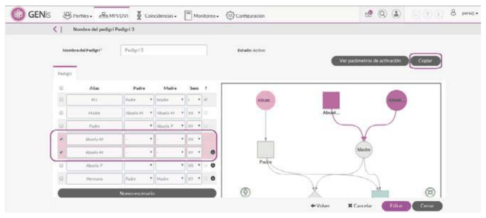

Una vez seleccionado los nodos, se habilita el botón **Copiar**. Si no se tiene nada seleccionado, el botón permanecerá grisado y estará disponible al seleccionar al **menos un nodo**.

La persona de interes, madre y padre **se copian siempre** al nuevo pedigrí aunque no se hayan seleccionado.

Una vez que se presiona el botón **Copiar**, se abre una nueva pantalla con los nodos seleccionados. Para poder guardar el nuevo pedigrí se debe completar el campo mandatorio **Nombre del pedigrí**, caso contrario el botón **Guardar** me aparece grisado. El botón **Cancelar**, cancela la copia del pedigrí y vuelve a la pantalla anterior del pedigrí original:

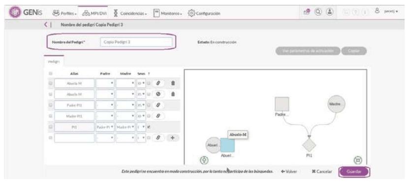

Al guardarlo queda automáticamente cargado en la lista de pedigrís pertenecientes al caso:

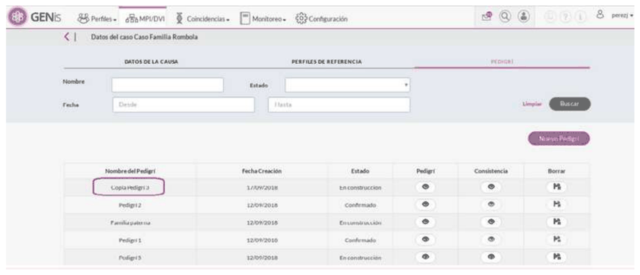

El nuevo pedigrí se crea en el primer estado que es el estado **En construcción**.

Se puede realizar una copia de pedigrí en cualquier estado menos en el estado **Borrado**, dado que no se tiene acceso al Pedigrí.

Tener en cuenta de que si se está modificando el pedigrí original, se seleccionan los nodos a copiar y se hace click en el botón **Copiar** antes de salvar los cambios del pedigrí original, estos cambios se perderán y aparecerá una pantalla de advertencia de que si se quiere avanzar con la copia se perderán los últimos cambios:

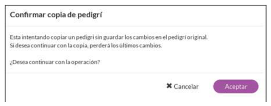

El botón **Cancelar** vuelve a la pantalla anterior de edición del pedigrí original y el botón Aceptar abre la pantalla de copia de pedigrí.

## TRAZABILIDAD DE UN PEDIGRÍ

La trazabilidad del pedigrí permite guardar determinadas acciones asociados al mismo. Las acciones queden registradas son las siguientes:

- Cambios de estados
- Generación de match
- Descartes/Confirmacion de matches
- Edición del pedigri
- Generación de escenarios
- Copia de pedigrí

Para ver la trazabilidad de un **Pedigrí**, ubicarse en la solapa Pedrigrí y presionar el ícono de trazabilidad:

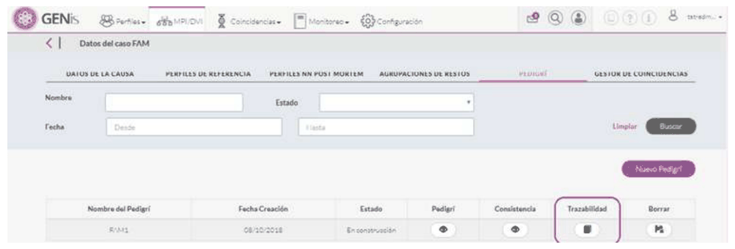

## AGRUPACIONES DE RESTOS (COLLAPSING)

Para los tipos de casos de DVI, se tiene la solapa **Agrupaciones de Restos**, el cual me permite realizar el collapsing.

El **Collapsing** consiste en agrupar varios perfiles, dejando uno solo en representación de todos, tomando como **perfil agrupador** el más completo, y dejando el resto de los perfiles asociados al perfil principal, en un estado inactivo.

La *Agrupación de Restos* (*Collapsing*) cumple entonces una función esencial:

1. **Consolidación operativa del caso**

GENis permite *consolidar* varios perfiles (ENN, RNN, INN, PFNI) que corresponden a **un mismo individuo**, de modo que el sistema trate a ese conjunto como **una sola entidad genética primaria** dentro del caso. Esto evita que cada fragmento del mismo individuo compita o se compare repetidamente en el Gestor de Coincidencias.

2. **Ordenamiento y reducción de ruido en la búsqueda**

Sin collapsing, el motor de búsqueda compararía cada perfil fragmentado como si fuera un individuo distinto.

La agrupación evita:

- Multiplicación de coincidencias irrelevantes
- Falsos candidatos generados por perfiles parciales
- Saturación de la búsqueda de compatibilidades autosomales

3. **Selección del perfil más informativo**

El perfil agrupador actúa como **representante único**, permitiendo:

- Comparaciones más robustas
- Uso de la mayor cantidad de alelos disponibles
- Descartar automáticamente perfiles redundantes sin eliminarlos

4. **Conservación de la trazabilidad**

Todos los perfiles hijos quedan asociados al padre, conservando su información original. Esto permite:

- Auditoría completa
- Revisión posterior por peritos
- Mantenimiento del vínculo con el lugar/condición de hallazgo

5. **Integración con pedigríes y escenarios**

Solo los perfiles **activos** pueden participar en pedigríes y escenarios. Al colapsar, GENis garantiza que:

- Solo un perfil del mismo individuo ingrese al proceso inferencial,
- Evitando inconsistencias de parentesco generadas por restos múltiples.

Este perfil agrupador **no es un ensamble** de partes de perfiles incompletos, ni una combinación genética generada por el sistema. GENis no fusiona alelos ni construye perfiles "compuestos".

**Criterios utilizados para elegir el perfil agrupador**

El sistema aplica un criterio **estructural**, no estadístico, basado exclusivamente en la completitud del perfil:

1. **Cantidad de marcadores autosómicos presentes.**

El perfil con mayor número de marcadores informativos se selecciona como agrupador.

2. **Cantidad total de alelos observados.**

A igual número de marcadores, se elige el que presenta más alelos cargados.

3. **Criterio de desempate interno.**

Si dos o más perfiles tienen exactamente la misma completitud, GENis emplea un ordenamiento interno (ID de carga / orden de registro) para elegir un único perfil padre.

**Nota técnica:**

- GENis **no utiliza frecuencias alélicas**, probabilidades ni cálculos de LR para seleccionar el perfil agrupador.
- El proceso es **administrativo y de gestión de base de datos**, no una evaluación genética.
- Los perfiles hijos permanecen almacenados y asociados, sin perder información ni alelos.
- El perfil agrupador es simplemente el **más completo**, no el "más probable".

Se pueden realizar dos tipos de agrupaciones: Agrupación Automática y Agrupación Manual.

La **Agrupación automática**, se realiza sobre todos los perfiles cargados en la solapa Perfiles NN Post Mortem.

Internamente el collapsing es un proceso de match en alta.

Para lanzar la agrupación automática, dentro del caso, ir a la solapa **Agrupaciones de Restos**, y hacer click sobre el botón **Agrupación Automática**:

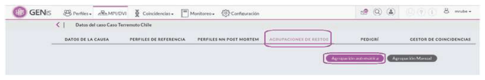

Aparecerá el siguiente cartel de que esta corriendo el proceso:

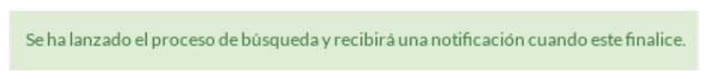

El finalizar el proceso, se recibe una notificación en el Inbox con el resultado de la corrida. Se tiene dos opciones:

- No se encontraron resultados,
- Se encontraron resultados, y los mismos se encontrarán en la solapa **Agrupación de Restos**.

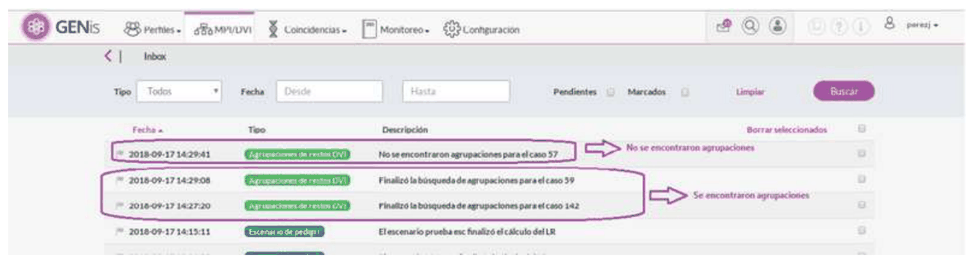

Para el caso de que se hayan encontrado agrupaciones, se puede acceder a las mismas haciendo click sobre la notificación o entrando en la solapa **Agrupaciones de Restos** dentro del caso:

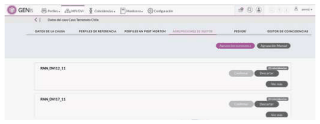

Presionando el botón **Ver más** me permite acceder al detalle de cada agrupación:

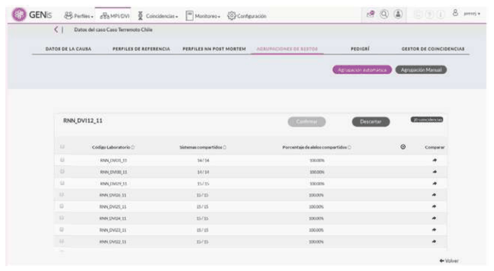

La flecha de la columna **Comparar** me permite el detalle de la comparación entre los dos perfiles:

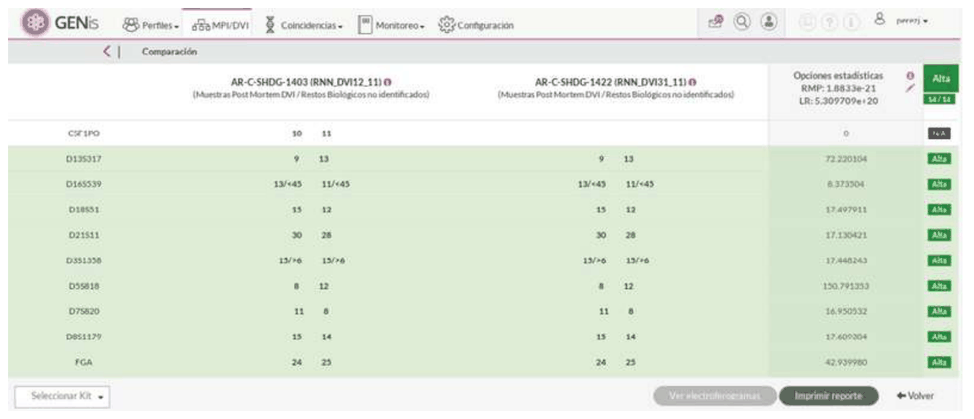

La agrupación de perfiles funciona como un match, es decir, se agrupa por perfiles las coincidencias que tiene cada uno representado por una tarjeta.

Para confirmar una agrupación, seleccionar primero con que perfiles se quiere realizar la agrupación. Para eso, hacer click en los casilleros seleccionando los perfiles correspondientes:

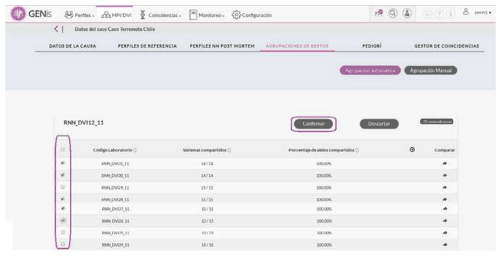

El botón **Confirmar** estará grisado hasta que se chequee al menos un perfil.

Una vez confirmada la agrupación, el perfil sobre el que se realizó la confirmación, pasa a ser un perfil padre o agrupador que es el quedará activo en la solapa **Perfiles NN post mortem**. El resto de los perfiles quedarán asociados al perfil agrupador en un estado Agrupado:

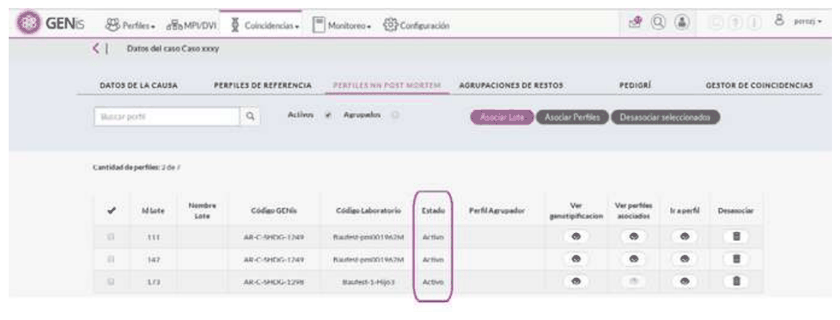

Tener en cuenta las siguientes premisas al confirmar/descartar un collapsing:

- Se elimina la agrupación de perfiles sobre la que se confirmó el collapsing y las agrupaciones donde los perfiles hijos están propuestos como perfiles agrupados (padre).
- Se eliminan los hijos de todas las agrupaciones donde están como hijos (un hijo solo puede tener un padre)
- Al descartar una agrupación solamente elimina ese grupo, sin modificar a otro (es decir, se eliminaría el match del lado de un perfil pero no de los otros).

De esta manera un perfil pasa a tener dos estados posibles:

- **Activo:** estado que tienen los perfiles que son agrupadores/padres (tiene perfiles hijos asociados) o perfiles que no tienen perfiles asociados.
- **Agrupado:** estado que tienen los perfiles hijos que fueron agrupados (colapasados), es decir, tienen un perfil padre. Un perfil agrupado se comporta como un perfil que está inhabilitado como si estuviera dado de baja. Aparecerá grisado y no se puede realizar ninguna acción sobre ellos, a excepción de pasarlo al estado Activo (Ver seccion 20.22.3 Desagrupar perfiles) y asociarlo a un escenario.

Precionando sobre el ícono del ojo dentro de la columna **Ver perfiles asociados**, me aparecen los perfiles asociados al perfil agrupador:

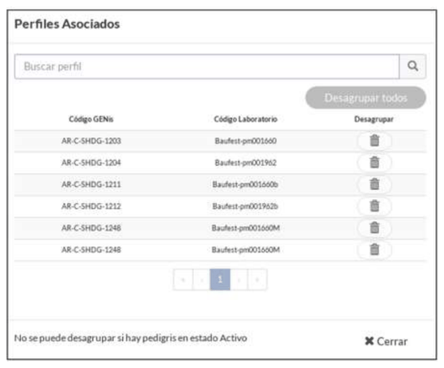

## AGRUPACIÓN MANUAL

Dentro de la solapa **Agrupación de Restos**, hacer click sobre el botón de **Agrupación Manual**, me aparece la siguiente pantalla:

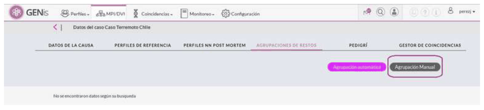

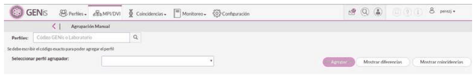

Para poder realizar la agrupación manual, escribir el código del perfil y hacer click sobre la lupa para agregar el perfil. Tener en cuenta que para poder agregar el perfil, el código GENis o de laboratorio **deben estar completos** sino no me lo va a dejar agregar.

A medida que voy agregando los perfiles me va apareciendo el código de laboratorio y debajo el detalle de los alelos de cada perfil.

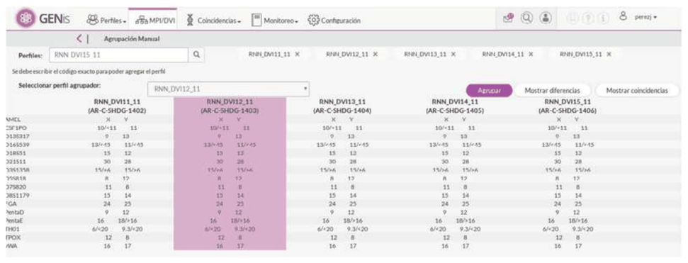

Se tienen los botones **Mostrar diferencias** y **Mostrar coincidencias** que me indican en un color (rojo y verde respectivamente) los alelos en los que tienen diferencias los compartidos.

Para poder realizar la agrupación manual, seleccionar el perfil agrupador entre los perfiles ingresados dentro del combo **Seleccionar perfil agrupador**.

Tener en cuenta las siguientes premisas:

- Se pueden agregar hasta 5 perfiles.
- Si agrego un perfil que ya es agrupador (padre), lo propondrá automáticamente como agrupador y el combo Seleccionar perfil agrupador permanecerá grisado.
- Si se agrega otro perfil que también es padre, este ultimo perfil pasa a ser padre (siempre el último padre agregado es el padre), me permite agregar al listado y ver las diferencias/coincidencias, pero al momento de hacer click en el botón Agrupar me saldrá el siguiente cartel:

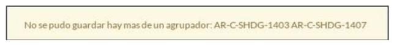

Eliminar el resto de los perfiles padres, haciendo click en la cruz "X". En el caso de que se quiera cambiar el padre, eliminar el que esta como agrupador y y agregar el nuevo perfil agrupador.

- Si ninguno de los perfiles agregados son agrupadores, seleccionar el perfil agrupador desde el menú Seleccionar perfil agrupador. Este menú contiene el listado de todos los perfiles agregados. El botón **Agrupar**, permanece grisado si no tiene un perfil agrupador o esta que se agregue al menos dos perfiles.
- El perfil agrupador se distingue del resto con un recuadro de color violeta

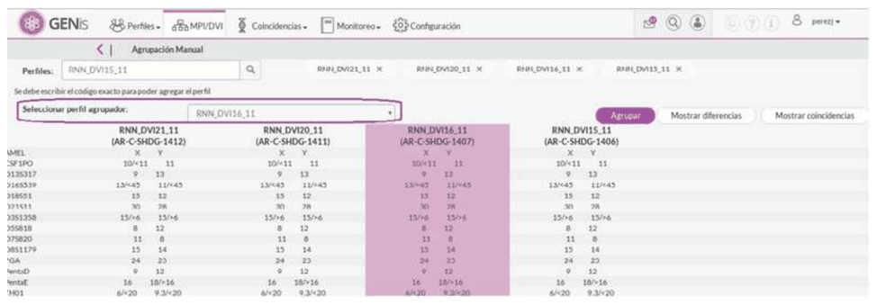

- Al hacer click en el botón **Agrupar**, me sale un cartel que confirma que se realizó la agrupación:

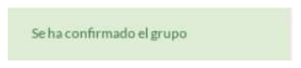

- El botón Volver, regresar a la solapa Agrupaciones de Restos.

**Validaciones**

- Al confirmar una agrupación (tanto manual como automático), los perfiles hijos no deben estar asociados a un pedigrí activo o en construcción, es decir, no puedo inactivar un perfil que esta asociado a un pedigrí.
- No se puede realizar una agrupación con un perfil que tiene coincidencia pendiente.
- Al desagrupar un perfil de un grupo (Ver seccion siguiente), o agregar un nuevo perfil de resto, el perfil no podrá estar en ningún pedigrí activo.

## DESAGRUPAR PERFILES

Dentro de la solapa **Perfiles NN Post Mortem** se visualizan los perfiles **Activos** por defecto. Se puede ver los perfiles **Agrupados** chequeado el casillero:

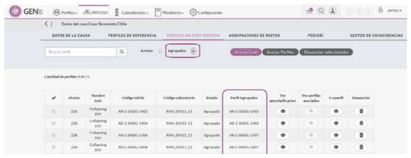

Para el caso de los perfiles agrupados, se tiene la columna del Perfil Agrupador indicando cual es el perfil agrupador asociado (Perfil padre).

En el listado de perfiles **Activos**, en la columna **Ver perfiles asociados**, el ícono del ojo permite ver la información de los perfiles agrupados (hijos) relacionados para el caso de los perfiles **Activos** que contienen hijos. En el caso de que un perfil Activo no tenga perfiles asociados hijos, el ícono permanecerá grisado:

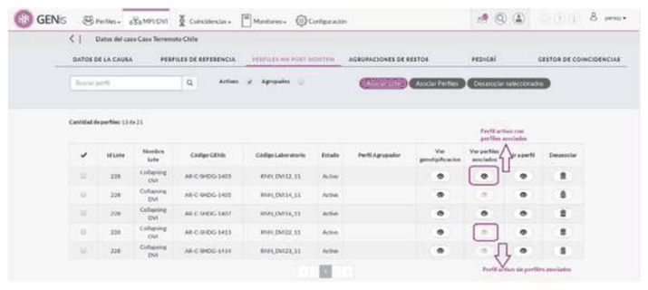

Para desagrupar los perfiles, hacer click sobre el ícono del ojo, y aparece una nueva pantalla con los perfiles asociados:

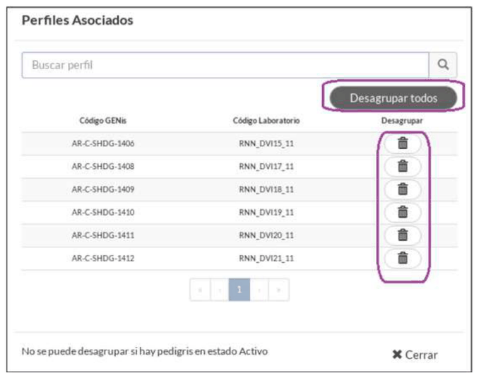

Esta pantalla permite Desagrupar los perfiles de a uno, haciendo click sobre el ícono de la papelera o la opción de **Desagrupar todos** (que permite desagrupar todos los perfiles hijos de la solapa). Al realizar esta acción, los perfiles desagrupados pasan a ser perfiles activos.

**Validaciones**

- No se puede desasociar un perfil que está asociado a un pedigrí.
- Si se vuelve a hacer una nueva agrupación (collapsing) se realizará solamente sobre perfiles Activos, es decir, que se podrán sumar nuevos hijos a los padres ya existentes.
- No se puede cambiar el padre. En caso se querer cambiarlo, hay que desasociar el perfil del caso y asociar los hijos al nuevo padre.
