# Instance interconnection

Instance interconnection is one of the central pillars of the GENis ecosystem, since it allows different nodes —for example, provincial laboratories, a national node, or judicial nodes— to cooperate in the search for genetic matches without directly sharing their complete databases. This is a federated architecture: each institution retains ownership and administration of its profiles, but GENis enables a standardized mechanism to send, receive, and process genetic information in a secure, traceable, and scientifically consistent manner.

This scheme replicates, on a national scale, the principles of international networks such as **Prüm** in the European Union, **NDIS/CODIS** in the US, and the guidelines of **ISFG** and **ENFSI** for cross-institutional exchange. As in those systems, interconnection in GENis requires a minimum level of harmonization between instances so that profiles can be correctly interpreted and matches make scientific sense.

## General operation of the exchange

When a laboratory needs to share a genetic profile with another instance —for example, sending a provincial profile to the national instance— GENis generates a package that contains:

- the autosomal analysis,
- the mitochondrial analysis, if available,
- the profile's category (Evidence, Victim, IR, etc.),
- the authorized metadata,
- and information about the party responsible for the profile.

That package travels from the sending instance to the receiving instance, where it first enters a review queue. There it is validated:

- that the profile is complete,
- that its category exists in the higher-level instance,
- that the kit name matches exactly,
- that the kit's markers are defined,
- and that the allele structure is compatible.

Once approved, the profile is integrated into the higher-level instance's database and automatically becomes part of the matching processes defined per category.

When a match occurs, the higher-level instance notifies the lower-level instance, which can view it, dismiss it, or proceed according to its legal protocols.

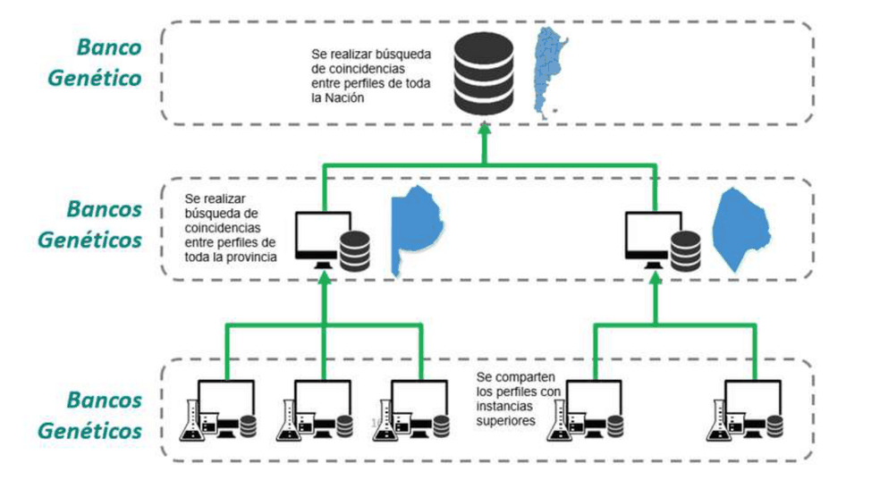

## Necessary conditions for interconnection to work

For two instances to interoperate without errors, it is essential that they share a minimum set of fundamental configurations. GENis does not attempt to resolve semantic differences between laboratories: it requires that both speak exactly the same "operational language." This is consistent with what is established by ISFG (2023) and ENFSI-QCLD (2022) for federated forensic networks.

The harmonization conditions include:

- **Identical categories:** the name must match literally; even a minimal difference ("Victim" vs. "victim") invalidates the profile.
- **Uniformly defined markers:** GENis does not interpret equivalences (Penta E ≠ PentaE).
- **Matching kit aliases:** if one laboratory uses "GF6C" and the other "GlobalFiler6C," the profile will be rejected.
- **Equivalent matching rules:** the stringency levels (high, medium, low) must be defined symmetrically.
- **Compatible population frequency databases:** this point has direct implications for LR calculations (see the next section).

These conditions do not stem from a whim of the system, but from the need to preserve scientific consistency. Otherwise, the higher-level instance could interpret the same profile differently from the lower-level instance, generating false dismissals or false hits.

### Note: Implications of frequency databases and the international recommendation

GENis can identify matches without requiring all instances to use exactly the same population database —because the matching engine works mainly with allelic compatibility, categorical rules, and internal thresholds. However, **the LR calculation shown by the higher-level instance does depend on the frequency database it has configured.**

This creates an important phenomenon:

- The lower-level instance will see the LR,
- but will not be able to reproduce it if its population database is different,
- and the LR will also not be comparable with the lower-level instance's own internal LRs.

International regulation is clear on this point. According to:

- **ISFG 2023 – Recommendations on Statistical Genetics for Forensic Databases,**
- **ENFSI-QCLD 2022 – Best Practices for DNA Database Management,**
- **EU Prüm 2018 Technical Annex,**
- **NDIS (US) 2023 Operational Procedures Manual,**

all agree that:

**"For any profile-exchange network, connected laboratories must use harmonized frequency databases, centrally managed and updated uniformly, in order to guarantee statistical reproducibility and consistency between nodes."**

Therefore, although GENis operates with different databases for the operational matching part, **in order to comply with international regulations and ensure scientific consistency**, it is strongly recommended to:

1. use the same national population database for all provinces.
2. distribute updates from a unified repository,
3. ensure that inter-instance LRs can be reproduced at any node.

## Notification of matches between instances

When the higher-level instance finds a match with a profile coming from a lower-level instance, the process is automatic:

1. a match is generated,
2. a notification is sent to the lower-level instance,
3. the lower-level laboratory views the match card,
4. it can dismiss it or confirm it,
5. confirmation (hit) synchronizes the status between both instances,
6. everything is recorded in the audit log of both nodes.

This flow is equivalent to the procedure set out by Prüm: the country receiving the match responds with a "confirmed positive match" or "no match."

## Management of imported profiles and quality control

When profiles arrive from lower-level instances, the higher-level instance does not incorporate them automatically: it reviews them first. If it detects errors —invalid headers, inconsistent markers, non-existent kits, unknown categories— it must reject the profile.

The decision is deliberate: the national instance must act as a **quality filter**, preventing a poor local configuration from contaminating the entire ecosystem.

This control policy is consistent with the practices of:

- **CODIS/NDIS**, which requires mandatory human review for every profile coming from state laboratories.
- **Prüm**, which requires manual verification of each exchange before incorporating it into the national system.

GENis follows the same philosophy.

Communication between the nodes of the GENis network is strictly vertical. This means that **Laboratory** nodes communicate only with the registry they depend on. **Provincial Registries** communicate with the **National Registry** and with the **Laboratories** that depend on it. The **National Registry** communicates with the **Provincial Registries** and with the **Laboratories** that depend directly on it (in case any exist).

## Instance interconnection

Within a lower-level instance, in order to configure a higher-level instance, go to the menu **Settings/Instance Interconnection/Higher-Level Instance:**

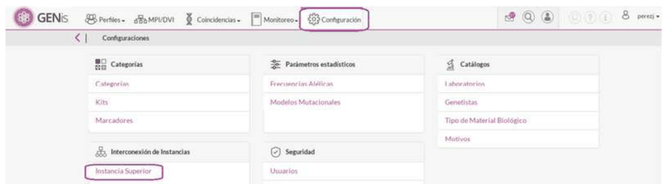

There are two tabs:

**Connectivity:** in this tab you must enter the IP address of the higher-level instance. There is a button to check the connection:

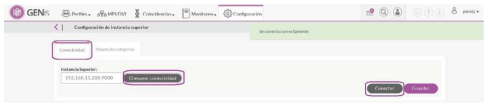

**Category Mapping:** allows configuring the categories that the profiles exported to the higher-level instance will have. The Auto-configure button lets the system automatically select the matching option in the combo box if it finds the same categories in both instances:

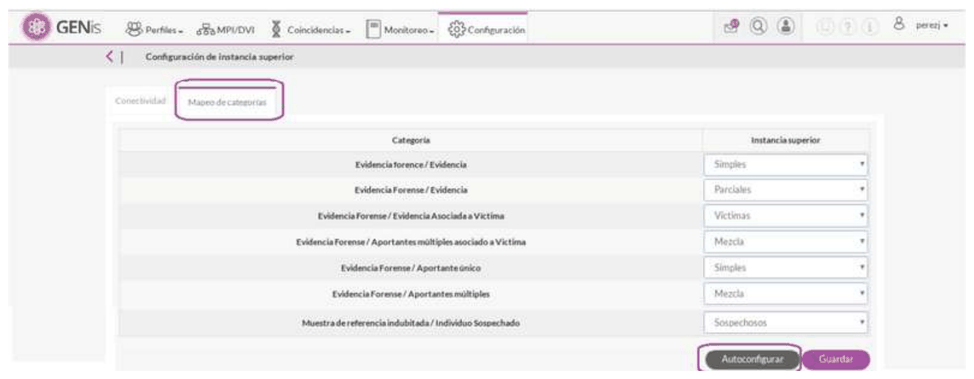

The **Higher-Level Instance** receives a notification that the **Lower-Level Instance** is pending approval. By clicking on the notification, or from the **Monitoring/Lower-Level Instances** menu, the Lower-Level Instance can be approved:

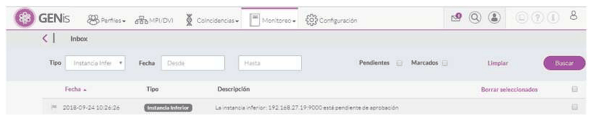

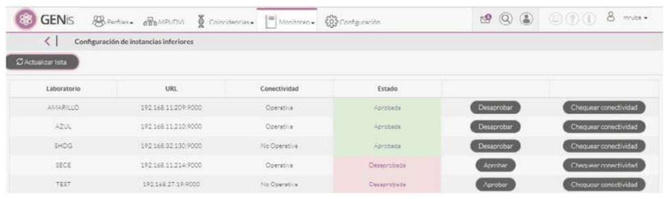

## Replicating profiles

In order to perform interconnection between instances, the category to which the profile belongs must have the **Replicate to higher-level instances** checkbox checked; otherwise the profile cannot be interconnected with any laboratory:

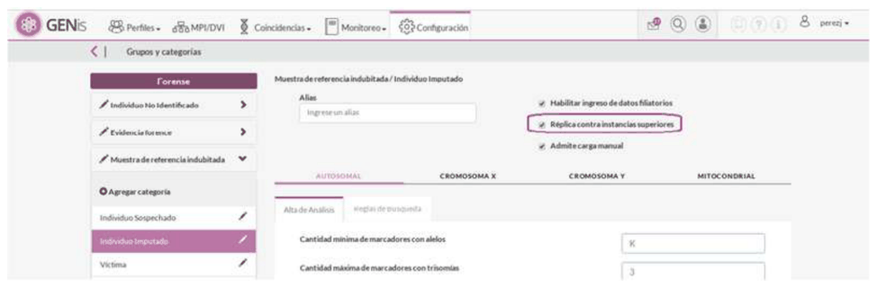

If this option is enabled, the option to replicate to a higher-level instance will be available both in bulk upload and in manual upload; otherwise this option will be grayed out:

**Bulk upload:**

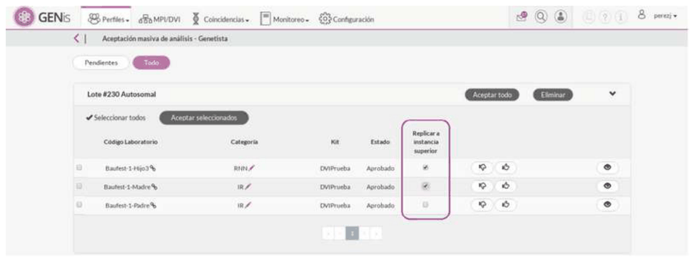

**Manual upload:**

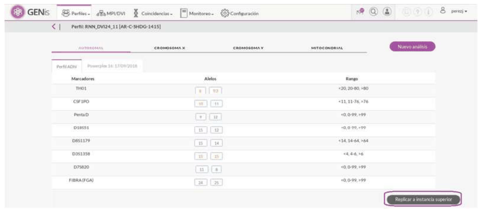

Each laboratory must upload its profiles to its own instance, which will automatically be replicated to the higher-level instance.

Depending on the subcategory to which the profile belongs, it will be sent to the higher-level instance together with the following associated data:

- Profile system code.
- Category/subcategory.
- Type of analysis included in the profile.
- Date the profile was registered in the system.

When an electropherogram or a file associated with a profile is loaded and that profile is replicated between instances, the electropherogram and/or attachment is also replicated and can be viewed.

## Approval/rejection of profiles at the higher-level instance

Suppose, for example, that **Laboratory 1** performs a bulk upload of a mixture, which is replicated to the higher-level instance:

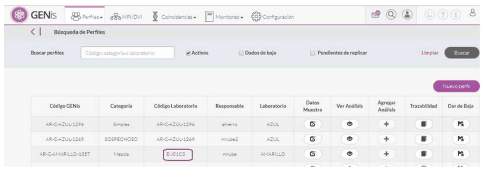

At **Laboratory 2**, a bulk upload of a suspect profile is performed, which is replicated to the higher-level instance:

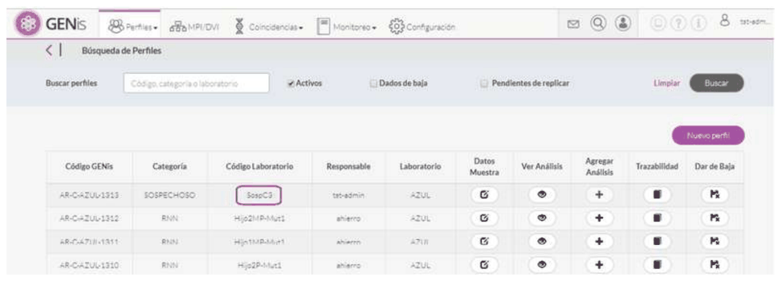

The higher-level instance receives the profiles uploaded from the lower-level instances. To approve or reject them, go to the menu **Profiles/Approval of Profiles from Lower-Level Instance**.

The eye icon  allows viewing the detail of the profile's alleles.

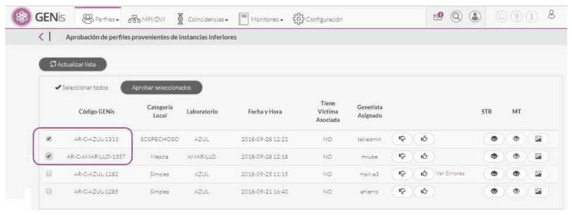

When an electropherogram or a file associated with a profile is loaded and that profile is replicated between instances, the electropherogram and/or attachment is also sent and can be viewed.

Approve profiles by clicking the approve icon, or by selecting the desired profiles and pressing the **Approve Selected** button. A message appears confirming that the profiles were approved:

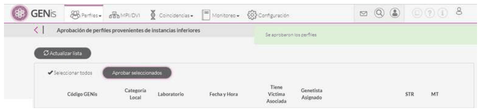

Once the profiles are approved, they become part of the higher-level instance, and the matching process runs automatically:

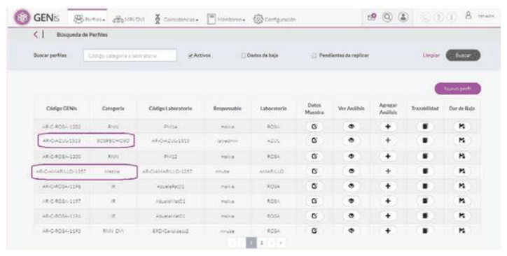

The GENis Code tells me which laboratory the profile belongs to.

The higher-level instance and the laboratories receive the notification that a match was generated (see the details of Instance Interconnection notifications in section 18. Notifications):

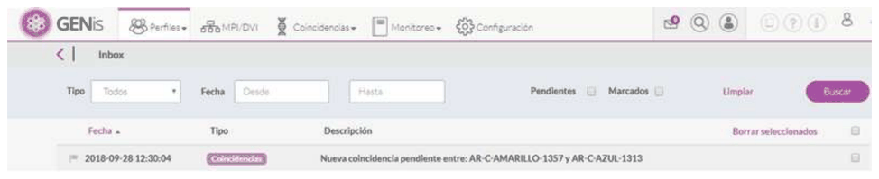

Note: keep in mind that for the match notification to reach the profile at the higher-level instance, the Instance Interconnection Notifications checkbox must be checked within the **Settings/Roles** menu:

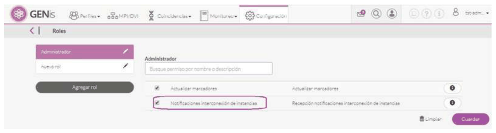

Note: Although it is possible to replicate profiles that do not have the same search-rule configuration, it is possible that the same results will not be obtained at the higher-level and lower-level instances.

## Replicating associated profiles

The following field is shown on the higher-level instance's profile approval screen:

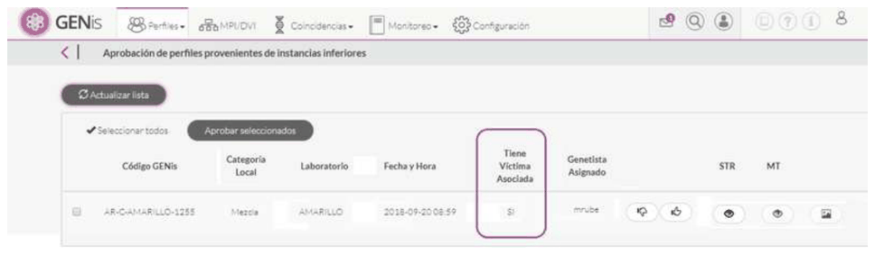

When an evidence profile has an associated victim, both profiles are replicated together to the higher-level instance. The evidence is replicated in active status, while the victim's profile is replicated in disabled status. This means that the victim does not participate in any search or matching process, and is kept only as administrative information from the original case.

During the matching process, both at the local instance and at the higher-level instance, GENis's search engine exclusively uses the evidence's genetic profile to compare against candidate profiles. The victim does not take part in the matching algorithm, since GENis does not implement a deconvolution model or a known-contributor assignment model: the evidence is evaluated as a single composite profile.

Consequently, matches between a mixed piece of evidence and a candidate profile (for example, a convicted person) are determined solely on the basis of allele-by-allele compatibility between those profiles, applying the configured discrepancy, drop-out, and drop-in parameters for the corresponding category. The presence of the victim does not modify the match result or the compatibility calculation, and its profile remains excluded from the search process at any instance.

## Profile modification

When a profile is replicated to a higher-level instance, no modification can be made to it; this means the buttons for adding further information will be disabled.

If there is additional information associated with the profile, the only way to add it is to deactivate the profile and reload it, adding the new information.

Profiles belonging to other laboratories cannot be edited; this means it will not be possible to: add analyses, replicate to other instances, attach files, or view the sample's internal code.

## Propagating hits and dismissals between instances

When a match is turned into a hit or a dismissal, the event is replicated to the instances involved. This will be reported in the inbox of the responsible geneticists and of users with permissions to receive interconnection notifications. The status of the partial hit/dismissal and of the complete hit/dismissal is recorded (see the notification details in section 18. Notifications).

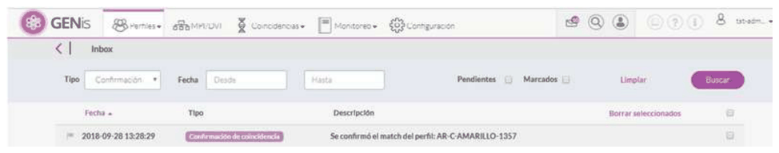

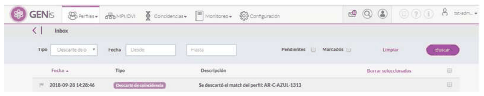

## Profile deactivation

Profile deactivation works independently at each instance, that is, when a profile is deactivated at one instance, this is not replicated to the other instances. Therefore, it should be kept in mind that if a profile's deactivation is due to a loading error or an incorrect allele assignment, it must be communicated to the higher-level instance so that it also proceeds with the deactivation.

## Filters

Within the profile list, in the **Profiles** tab, there is a **Pending Replication** checkbox, which shows the profiles that were not replicated to a higher-level instance:

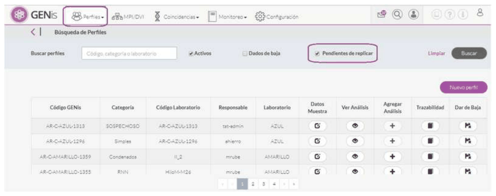

Keep in mind that the **Active** and/or **Deactivated** checkboxes must also be checked, otherwise the search will return no results.
