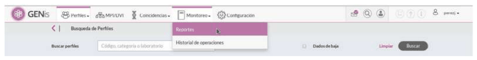

# Reports

GENis makes it possible to generate reports based on the information you want to access.

To view the reports, go to the **Monitoring/Reports** menu:

**Note:** keep in mind that for the user to be able to see the **Reports** menu, the role must have the permissions configured to view reports (see section 3.2 Role Configuration)
