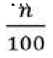

# 23. Annex I - STR match search algorithm

## Annex I – STR match search algorithm

GENis integrates **two conceptually distinct search engines**, designed to address different forensic problems:

- The **Forensic engine (STR)** is oriented toward the **detection of operational matches** between profiles (references and evidence), using per-locus comparison rules and search criteria inspired by international standards (e.g., ENFSI).

- The **MPI engine (Missing Persons Search)** is oriented toward **kinship-based identification** and searching large databases of people/families, using a formal probabilistic approach based on **Bayesian Networks**, which makes it possible to obtain and validate **Likelihood Ratios (LR)** in complex pedigrees.

## Forensic engine (STR): search algorithms and "stringency"

In the forensic module, GENis implements match searches for STR profiles using **per-marker comparison rules and stringency levels**. These rules are consistent with the international concept of "search stringencies" (high / moderate / low) used in DNA database systems and described by ENFSI for database management.

Conceptually:

- **High stringency:** requires that all alleles present in one profile be present in the other profile in a compatible way at each locus compared. This is the strictest mode and is used when an essentially complete match is expected. ENFSI
- **Moderate stringency:** allows locus-by-locus matches, considering the locus with the fewer number of alleles as the "minimum set" that must be contained in the other. This is the typical mode for comparing single-source profiles with mixtures, or for accommodating situations compatible with apparent drop-out. ENFSI
- **Low stringency:** requires at least one shared allele per locus compared. ENFSI describes this mode as useful for simple kinship-type searches (e.g., parent-child) in some systems; in GENis it can be used as a broad criterion for exploration/screening depending on local configuration.

### "Mixture–Mixture" algorithm

In addition to the traditional stringency modes, GENis incorporates an algorithm called **Mixture–Mixture**, whose operational goal is to detect whether two pieces of evidence compatible with a mixture might share the same contributor (e.g., "the same genetic profile would be present in two pieces of evidence from two contributors"). This functionality is useful as a prioritization and investigative-linking tool between evidence from different incidents.

**Technical note:** the mixture–mixture algorithm is not equivalent to probabilistic genotyping (PG) mixture interpretation software. It does not perform deconvolution, does not assign contributors, and does not replace expert tools such as LRmix / EuroForMix / STRmix. Its function is **operational within the matching engine**.

## MPI engine (Missing Persons Search): Bayesian networks and LR by pedigree

The MPI module works with a different problem: the central evidence is not "profile vs. profile" but rather **"family/pedigree vs. candidates"**.

GENis models each family as a **Bayesian Network** that integrates:

- the pedigree structure,
- the observed genotypes,
- and parameters such as the mutation model (when activated).

Based on this, GENis calculates probability distributions for the genotype of the sought individual and makes it possible to estimate **Likelihood Ratios** for large volumes of candidates, with validation against recognized tools (e.g., Familias and forrel), demonstrating good performance.

- -ENFSI, Guideline for DNA Database Management – Review and Recommendations (approved 05.10.2023). ENFSI
- -Chernomoretz et al., GENis, an open-source multi-tier forensic DNA information system (Forensic Science International: Reports, 2020). CONICET Repository
- -Chernomoretz et al., Bayesian networks for DNA-based kinship analysis: Functionality and validation of the GENis missing person identification module (FSI: Genetics Supplement Series, 2022).

## Locus or marker

A locus is a position within the genome. In the context of this document, Locus and Marker mean the same thing. Example: possible Locus values are D3S1358, TPOX, TH01.

## Allele

An allele is a value of one of the following forms:

- a number x ≥ 1 with two decimal places (that is, a number of the form with n

N)
- [x] where x is a number as in the previous item, mandatory for matching

## Genotype

A Genotype is a pair Locus → (Allele, Allele,…). For example, a Genotype is D3S1358 → (28.5, 22).

## Genotyping

A genotyping is a list of genotypes in which the locus of each element is not repeated.

## Genetic profile

A genetic profile is a structure composed of:

- A unique identifier id
- A genotyping

## Allele equality

Given two alleles x and y, we define the function **equalₐ: Allele×Allele→Bool** as follows:

- **equalₐ (x; y) = x == y**
- **equalₐ ([x]; y) = x == y**
- **equalₐ (x; [y]) = x == y**
- **equalₐ ([x]; [y]) = x == y**
- **otherwise = false**

## Match under high stringency for genotypes

Given two Genotypes **X=M₁ → ( x₁,x₂,…,xₙ)** and **Y= M₂ →( y₁,y₂,…,yₘ)**, we define **X =ₘ Y** if and only if the following conditions are satisfied:

- **M₁= M₂**
- **n = m**
- **∃ a permutation x₁',x₂',…,xₙ' of x₁,x₂,…,xₙ such that ∀ i:1,…,n:equalₐ (xᵢ',yᵢ)**

## Match under medium or moderate stringency for genotypes

Given two Genotypes **X=M₁ → ( x₁,x₂,…,xₙ)** and **Y= M₂ →( y₁,y₂,…,yₘ)**, we define **X⊂ₘY** if and only if the following conditions are satisfied.

- **M₁= M₂**
- **n = m**
- **∃ a permutation x₁',x₂',…,xₙ' of the collection formed by x₁,x₂,…,xₙ followed by m — n alleles such that ∀ i:1,…,n:equalₐ (xᵢ',yᵢ)**

## Match under low stringency for loci

Given two loci **X=(M₁,x₁,x₂)** and **Y=(M₂,y₁,y₂)**, we define **X≈ₘY** if and only if the following conditions are satisfied

- **M₁= M₂**
- **x₁=x₂ V x₁=y₂ V y₁=x₂ V x₂=y₂**
