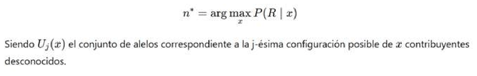
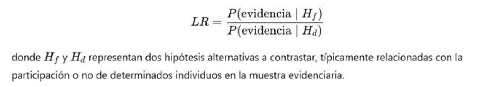
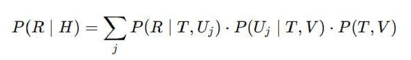
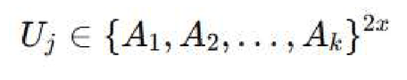
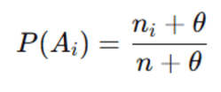
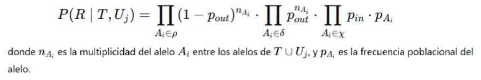
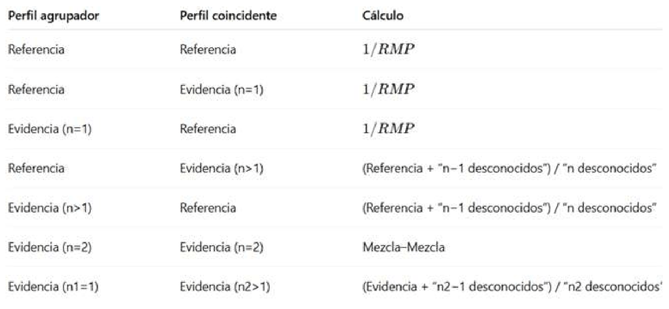
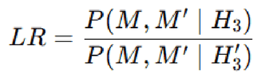

# 25. ANEXO II - GESTOR DE COINCIDENCIAS Y CÁLCULOS ESTADÍSTICOS POR DEFAULT

## ANEXO II – GESTOR DE COINCIDENCIAS Y CÁLCULOS ESTADÍSTICOS POR DEFAULT

### Introducción

GENis permite el ingreso y la gestión de perfiles genéticos provenientes tanto de referencias como de evidencias forenses, incluyendo evidencias en las que no es posible determinar a priori el número de individuos que contribuyeron al material genético analizado. Esta situación es habitual en el trabajo pericial, particularmente en muestras complejas o de baja calidad, donde el genetista no puede establecer con certeza el número de aportantes únicamente a partir del electroferograma.

Sin embargo, para poder ejecutar los procesos automáticos de comparación, organización de coincidencias y estimación estadística, el sistema debe formalizar ciertos supuestos mínimos. En este contexto, GENis implementa procedimientos matemáticos y estadísticos que permiten inferir parámetros operativos, tales como el número más probable de aportantes, y calcular valores estadísticos orientativos (LR por default), que facilitan la priorización y navegación de las coincidencias encontradas.

Este anexo describe el fundamento lógico, matemático y estadístico de dichos procedimientos, con el objetivo de transparentar el funcionamiento interno del sistema. Los cálculos aquí presentados **no sustituyen el análisis pericial formal**, sino que constituyen herramientas automáticas de apoyo a la gestión de grandes volúmenes de información genética.

## INFERENCIA DEL NÚMERO DE APORTANTES A UNA EVIDENCIA

GENis es capaz de proveer una estimación del número más probable de aportantes, denotado como ***n\****, para un perfil genético evidenciario ***R***. Esta estimación se obtiene maximizando, en función del número de aportantes, la probabilidad de que la evidencia provenga de un conjunto de ***x*** contribuyentes desconocidos:

*Siendo **Uⱼ(x)** el conjunto de alelos correspondiente a la j-ésima configuración posible de **x** contribuyentes desconocidos.*

Este procedimiento evalúa, para distintos valores de ***x***, la capacidad explicativa de cada hipótesis en relación con los alelos observados en la evidencia. El objetivo no es establecer una conclusión definitiva sobre el número real de aportantes, sino seleccionar el valor más coherente con la evidencia disponible para permitir el correcto funcionamiento de los algoritmos de coincidencia y de los cálculos estadísticos automáticos.

La inferencia del número de aportantes cumple, en particular, tres funciones operativas dentro del sistema:

1. Permite agrupar las coincidencias de manera consistente en el gestor, diferenciando perfiles agrupadores de tipo referencia o evidencia.
2. Habilita el cálculo automático de valores de LR por default bajo hipótesis simplificadas.
3. Determina cuándo puede ejecutarse el algoritmo específico de comparación Mezcla–Mezcla, el cual solo se aplica cuando ambas evidencias tienen inferidos dos aportantes.

## CÁLCULO DE LR POR DEFAULT

Con el objetivo de brindar al analista una valoración inicial del posible peso estadístico de una coincidencia, GENis realiza cálculos automáticos de cocientes de verosimilitud (LR) bajo supuestos predefinidos. Estos cálculos permiten jerarquizar coincidencias dentro del gestor y orientar el análisis posterior.

El cociente de verosimilitud se define de la siguiente manera:

*donde **Hf** y **Hd** representan dos hipótesis alternativas a contrastar, típicamente relacionadas con la participación o no de determinados individuos en la muestra evidenciaria.*

En un caso general, las hipótesis consideran la posible contribución a la muestra ***M*** de individuos con perfiles conocidos ***S₁,S₂,…,Sₙ*** y de aportantes desconocidos ***D₁,D₂,…,Dₘ***. Este enfoque permite tratar de manera unificada tanto problemas de fuente única como análisis de mezclas con múltiples contribuyentes.

## DEFINICIÓN DE CONJUNTOS Y FORMULACIÓN DEL PROBLEMA

Para estimar la probabilidad ***P(evidencia|H)***, se adopta la nomenclatura introducida por *Curran* y colaboradores. Se definen los siguientes conjuntos:

- ***R***: conjunto de alelos observados en la muestra evidenciaria.
- ***T***: conjunto de alelos correspondientes a personas que, según la hipótesis ***H***, contribuyeron a la muestra.
- ***V***: conjunto de alelos correspondientes a personas con perfil conocido que, según ***H***, no son contribuyentes.
- ***Uⱼ***: conjunto de alelos correspondiente al ***j-ésimo*** grupo posible de contribuyentes desconocidos bajo la hipótesis ***H***.
- ***x***: número de contribuyentes desconocidos estipulado por la hipótesis.

El objetivo es computar:

donde el índice ***j*** recorre los distintos conjuntos posibles de contribuyentes desconocidos que podrían explicar la evidencia.

Siguiendo el desarrollo propuesto en *Curran* (2005), esta expresión permite integrar, de manera formal, todas las configuraciones genéticas compatibles con la hipótesis planteada.

## IMPLEMENTACIÓN DEL CÁLCULO EN GENIS

GENis considera como ensamble de conjuntos ***{Uj}*** a todas las posibles permutaciones de ***2 x*** alelos tomados con repetición de los ***k*** valores alélicos observados en el sistema analizado:

Para estimar las probabilidades ***P(Uj│T,V)*** y ***P(T,V)***, se utiliza la expresión que permite calcular la probabilidad de observar un alelo ***Ai***, sabiendo que dicho alelo ha aparecido ***ni*** veces en un grupo de ***n*** alelos provenientes de la misma población, considerando la posible estructura subpoblacional:

Cuando ***θ=0***, los resultados convergen a los esperados bajo la hipótesis de Hardy–Weinberg.

## INCORPORACIÓN DE DROP-OUT, DROP-IN Y ESTRUCTURA POBLACIONAL

La estimación de la probabilidad ***P(R│T,Uj)*** de observar la réplica ***R***, dados los contribuyentes conocidos y desconocidos que propone la hipótesis ***H***, tiene en cuenta:

- la posible estructura subpoblacional, caracterizada por el parámetro ***θ***
- la probabilidad de drop-out
- la probabilidad de drop-in

Se definen los siguientes conjuntos:

- ***δ***: conjunto de alelos aportados por los contribuyentes ***T ∪ Uⱼ*** que no se observan en la muestra ***R*** (alelos con drop-out).
- ***χ***: conjunto de alelos observados en ***R*** que no pertenecen a los contribuyentes (alelos con drop-in).
- ***ρ***: conjunto de alelos que no sufrieron eventos de drop-out ni drop-in.

La probabilidad buscada resulta:

*donde **nAi** es la multiplicidad del alelo **Ai** entre los alelos de **T ∪ Uj**, y **pAi** es la frecuencia poblacional del alelo.*

## CÁLCULOS AUTOMÁTICOS SEGÚN TIPO DE COINCIDENCIA

En función del tipo de perfil agrupador, del tipo de perfil coincidente y del número de aportantes inferidos, GENis aplica distintos esquemas de cálculo estadístico por default, resumidos en la siguiente tabla:

Estos cálculos tienen un carácter orientativo y operativo, y no deben interpretarse como sustitutos de un análisis pericial exhaustivo mediante software especializado.

## VALORACIÓN ESTADÍSTICA DE ASOCIACIONES ENTRE MEZCLAS EVIDENCIARIAS

Cuando se comparan dos mezclas evidenciarias ***M*** y ***M´*** GENis permite evaluar la probabilidad de que ambas puedan explicarse bajo la hipótesis de un contribuyente común ***Cs*** junto con contribuyentes adicionales distintos en cada muestra.

Se contrasta dicha hipótesis frente a una hipótesis alternativa en la cual diferentes pares de contribuyentes explicarían las mezclas. El cociente de verosimilitud se define como:

Este enfoque permite valorar estadísticamente asociaciones entre evidencias, facilitando la identificación de posibles vínculos entre escenas o eventos distintos.

## ALCANCE Y LIMITACIONES

Los cálculos y deducciones presentados en este anexo constituyen la base formal del funcionamiento estadístico del gestor de coincidencias de GENis. Su objetivo es brindar soporte automático y consistente a la gestión de coincidencias en bases de datos genéticas de gran escala.

No obstante, los valores obtenidos deben interpretarse siempre como **indicadores orientativos**, y no como conclusiones periciales definitivas. Para la interpretación forense formal de evidencias complejas, GENis debe ser utilizado de manera complementaria a software especializados de análisis probabilístico continuo.
