# 26. ANEXO III - INTERPRETACIÓN DE ESTADÍSTICAS DE EVIDENCIAS

## ANEXO III – INTERPRETACIÓN DE ESTADÍSTICAS DE EVIDENCIAS

El presente anexo describe el marco **estadístico y probabilístico** utilizado por GENis para la valoración cuantitativa de evidencias genéticas, particularmente en contextos que involucran **mezclas de ADN y múltiples hipótesis de contribución**. Su objetivo es brindar al usuario una comprensión conceptual de los cálculos realizados por el sistema, sin pretender sustituir la formación estadística especializada ni la interpretación pericial formal.

GENis implementa un enfoque basado en el **cociente de verosimilitudes (Likelihood Ratio, LR)**, ampliamente aceptado en genética forense, el cual permite comparar la plausibilidad relativa de dos hipótesis alternativas frente a una misma evidencia genética.

En términos generales, el LR se define como:

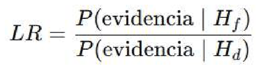

donde ***Hf y Hd*** representan dos hipótesis en competencia, típicamente asociadas a la **participación o no de determinados individuos en la muestra evidenciaria**. Un valor de LR mayor que 1 indica que la evidencia es más probable bajo la hipótesis del numerador que bajo la del denominador, mientras que valores menores que 1 indican lo contrario

## MARCO GENERAL DE HIPÓTESIS Y CONTRIBUYENTES

En un caso general, las hipótesis consideradas por GENis contemplan la posible contribución genética a una muestra evidenciaria ***M*** por parte de:

- individuos con perfiles conocidos ***S1,S2,…,Sn***.
- y un conjunto de aportantes desconocidos ***D1,D2,…,Dm***.

Este planteo permite tratar de manera unificada tanto **problemas de fuente única** (identificación) como **análisis de mezclas con múltiples contribuyentes**, sin requerir que el número exacto de aportantes sea conocido a priori.

Para formalizar este enfoque, se utilizan los siguientes conjuntos:

- ***R***: conjunto de alelos observados en la evidencia.
- ***T***: conjunto de alelos aportados por los individuos que, según la hipótesis evaluada, contribuyeron a la muestra.
- ***V***: conjunto de alelos pertenecientes a individuos conocidos que, según la hipótesis, no contribuyeron a la muestra.
- ***Uj***: conjunto de alelos correspondiente al j-ésimo escenario posible de aportantes desconocidos.

La probabilidad de la evidencia bajo una hipótesis determinada se expresa entonces como:

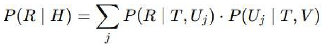

donde la suma recorre todos los escenarios compatibles de contribuyentes desconocidos.

## CONSIDERACIÓN DE FRECUENCIAS ALÉLICAS Y SUBESTRUCTURA POBLACIONAL

Para estimar las probabilidades asociadas a los distintos escenarios, GENis utiliza las **frecuencias alélicas poblacionales** correspondientes a la base seleccionada por el usuario. Asimismo, se contempla la posible **estructura subpoblacional** mediante el parámetro θ, de acuerdo con los modelos clásicos de Balding–Nichols.

La probabilidad de observar un determinado conjunto de alelos se calcula considerando la multiplicidad de cada alelo y su frecuencia poblacional, permitiendo incorporar correcciones por endogamia o estructura genética cuando corresponde.

## MODELADO DE DROP-OUT Y DROP-IN

GENis incorpora explícitamente los fenómenos de **drop-out** y **drop-in**, fundamentales en el análisis de mezclas:

- Se denomina *drop-out* a la ausencia en el perfil observado de un alelo que sí fue aportado por un contribuyente real.
- Se denomina *drop-in* a la aparición de un alelo en la evidencia que no proviene de ninguno de los contribuyentes considerados, típicamente atribuible a contaminación.

Sean:

- δ el conjunto de alelos aportados pero no observados (drop-out),
- χ el conjunto de alelos observados pero no explicados (drop-in),
- ρ el conjunto de alelos correctamente observados.

La probabilidad de observar la evidencia ***R*** dado un conjunto de contribuyentes se modela entonces como una combinación de estos eventos, ponderados por las probabilidades ***Pout*** y ***Pin***, configuradas para el laboratorio correspondiente.

Este enfoque permite que GENis evalúe escenarios complejos de mezcla de forma probabilística, aun cuando el usuario no haya definido explícitamente el número de aportantes ni la composición exacta de la mezcla.

## VALORACIÓN ESTADÍSTICA DE ASOCIACIONES ENTRE MEZCLAS DE EVIDENCIAS

El anexo también describe el caso particular de **asociación entre dos mezclas evidenciarias**, donde se evalúa la hipótesis de que ambas compartan uno o más contribuyentes comunes. Este tipo de análisis es utilizado, por ejemplo, en el algoritmo **Mezcla–Mezcla**, aplicable cuando ambas evidencias tienen dos aportantes inferidos.

En este contexto, se comparan hipótesis del tipo:

- H1: ambas mezclas comparten al menos un contribuyente común,
- H2: las mezclas provienen de conjuntos completamente independientes de contribuyentes.

La valoración se realiza mediante un LR construido a partir de los escenarios compatibles con cada hipótesis, siguiendo el mismo marco probabilístico general.

## ALCANCE E INTERPRETACIÓN DE LOS RESULTADOS

Es importante destacar que los valores estadísticos generados por GENis, incluidos los LR calculados en este marco, deben interpretarse como **herramientas de apoyo para la evaluación y priorización de coincidencias**, y no como sustitutos del análisis pericial completo.

GENis no implementa modelos semicontinuos ni continuos de intensidad de picos, ni optimiza parámetros de drop-out a partir de los datos de cada caso, como lo hacen software periciales especializados (por ejemplo LRmix, EuroForMix o STRmix). En consecuencia, los resultados obtenidos deben ser comprendidos dentro del alcance y las limitaciones del sistema.

## IMPLEMENTACIÓN DEL CÁLCULO

GENiS considera como ensamble de conjuntos ***{Uj}*** de alelos correspondientes a los ***x*** contribuyentes desconocidos que propone la hipótesis ***H***, a todas las posibles permutaciones de ***2x*** alelos tomados con repetición de los ***k*** valores alélicos del sistema analizado.

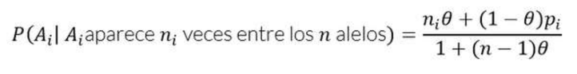

Para estimar las probabilidades ***P(Uj |T,V)y P(T,V)*** de [4] utilizaremos que

Esta expresión permite estimar la probabilidad de observar un alelo

**Ai, sabiendo que dicho alelo ha aparecido ni veces en un grupo de n alelos proveniente de la misma población**, en el caso general de que asumiéramos estructura subpoblacional (Notar que cuando θ=0 los resultados convergen a los esperados según la hipótesis de Hardy-Weinberg).

La estimación de la probabilidad ***P(R│T,Uj)*** de observar la réplica ***R*** dados los contribuyentes conocidos y desconocidos que propone la hipótesis ***H*** se obtiene teniendo en cuenta la posible estructura subpoblacional, caracterizada por el parámetro **Θ**, y probabilidades ***Pout*** y ***Pin*** de drop-out y drop-in respectivamente.

Sea ***δ*** el conjunto de alelos que se encuentran entre los aportados por los contribuyentes ***T*** y ***Uj*** pero que no se encuentran en la muestra ***R*** (i.e. alelos que sufrieron eventos de drop-out),

1. Se denomina dropout a la eventualidad de que un pico dado del electroferograma desaparezca por completo del perfil de manera artifactual. Esto puede suceder como un caso extremo de desbalance heterocigoto aunque otros investigadores sugieren que también puede originarse por otro tipo de problemas técnicos del proceso de amplificación.
2. Ocurre en relación a posibles eventos de contaminación de la muestra al momento de prepararla para su amplificación PCR.
3. χ el conjunto de alelos que están en la muestra pero no en los contribuyentes (i.e. agrupa alelos drop-in) y sea ρ el conjunto de alelos que no sufrieron drop-out ni surgieron de contaminaciones.

La probabilidad buscada resulta

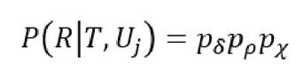

Con

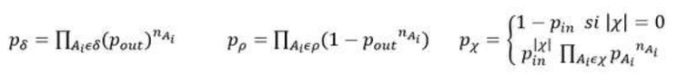

Donde ***nAi*** es la multiplicidad del alelo ***Ai*** entre los alelos ***{T,Uj}*** y ***pAi*** la frecuencia de aparición de dicho alelo en la población de interés.

## VALORACIÓN ESTADÍSTICA DE ASOCIACIONES ENTRE MEZCLAS EVIDENCIARIAS

Supongamos que dentro de un sistema de almacenamiento de muestras evidenciarias se dispone de un procedimiento para asociar dos mezclas, ***M*** y ***M´***, basado por ejemplo en criterios de similitud de composición (i.e. matching).

En lo que sigue, asumiremos que fueron dos los contribuyentes que han dejado trazas genéticas en cada una de dichas muestras y buscaremos estimar la probabilidad de que ambas muestras puedan explicarse en concordancia con la hipótesis, ***H3***, que contempla que un mismo contribuyente, ***Cs***, ha contribuido a ambos perfiles junto a sendos contribuyentes adicionales, ***C*** y ***C´***, con participaciones en las mezclas ***M*** y ***M´*** respectivamente.

Será de interés estimar así mismo la probabilidad de que ambas muestras puedan explicarse en concordancia con una hipótesis alternativa, ***H3***, según la cual diferentes pares de contribuyentes explicarían las muestras ***M*** y ***M´*** de interés. De esta manera

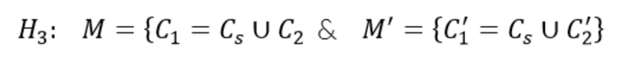

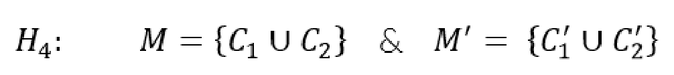

Para valorar estadísticamente el vínculo entre ***M*** y ***M´*** consideraremos el cociente

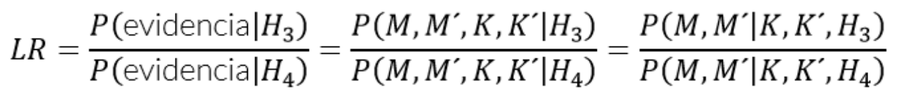

Donde ***K*** y ***K´*** denotan perfiles genotipados relacionados con las muestras ***M*** y ***M´***. Específicamente consideraremos que eventualmente se pueden llegar a conocer a-priori los genotipos ***C2*** y/o ***C´2*** asociados con ***M*** y/o ***M´*** respectivamente. Finalmente resulta

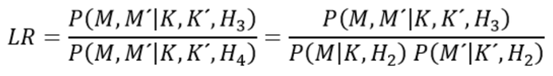

En general, dada la evidencia disponible y una hipótesis de trabajo es posible construir diferentes escenarios compatibles. Por ejemplo, sea ***M= {A1, A2, A3}***, ***M´={A1, A3, A4, A6}***, ***K={}*** y ***K´={}***. La siguiente tabla ilustra los escenarios que es posible plantear bajo la hipótesis ***H3***, de tres contribuyentes.

| Contribuyentes escenario | C1 | C2 | C´1 | C´2 |
| --- | --- | --- | --- | --- |
| 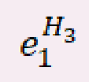 | A1,A3 | A2,A1 | A1,A3 | A4,A6 |
| 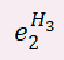 | A1,A3 | A2,A3 | A1,A3 | A4,A6 |
| 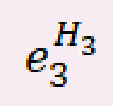 | A1,A3 | A3,A4 | A1,A3 | A4,A6 |

Así mismo las siguientes tablas reportan los escenarios compatibles con dos contribuyentes para las muestras ***M*** y ***M´*** respectivamente.

| Contribuyentes escenario | C1 | C2 |
| --- | --- | --- |
| 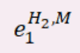 | A1,A1 | A2,A3 |
| 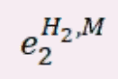 | A1,A2 | A1,A3 |
|  | A1,A2 | A2,A3 |
| 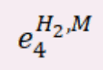 | A1,A2 | A3,A3 |
| 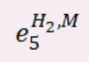 | A1,A3 | A2,A2 |
| 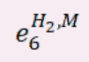 | A1,A3 | A2,A3 |

| Contribuyentes escenario | C´1 | C´2 |
| --- | --- | --- |
| 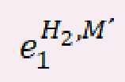 | A1,A3 | A4,A6 |
| 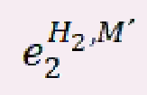 | A1,A4 | A3,A6 |
| 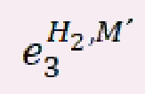 | A1,A6 | A3,A4 |

Finalmente la cantidad buscada resulta

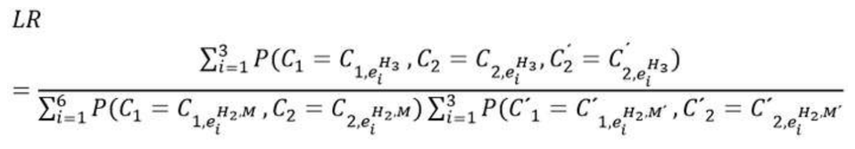
