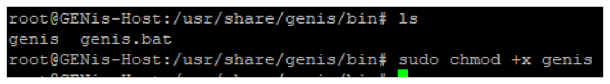
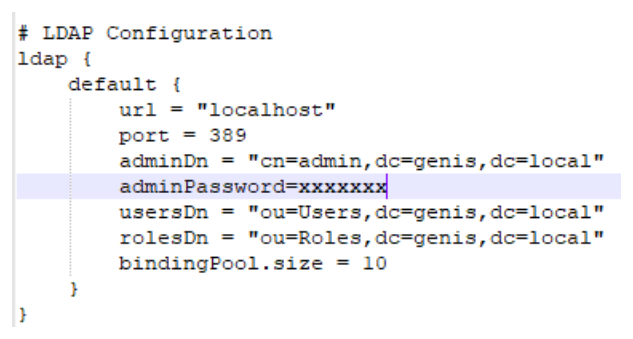
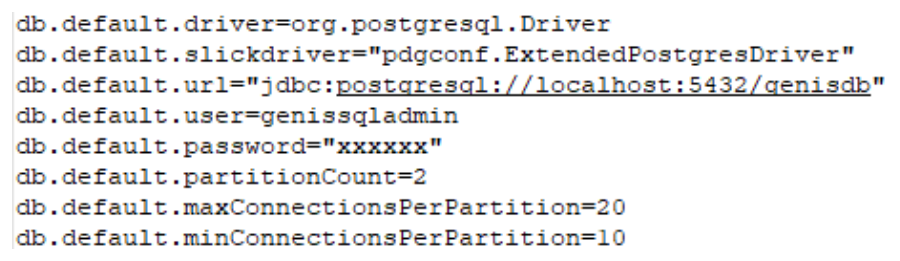
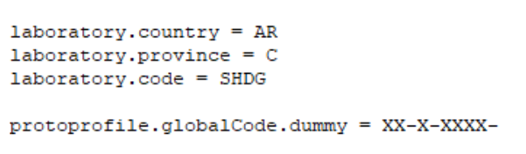
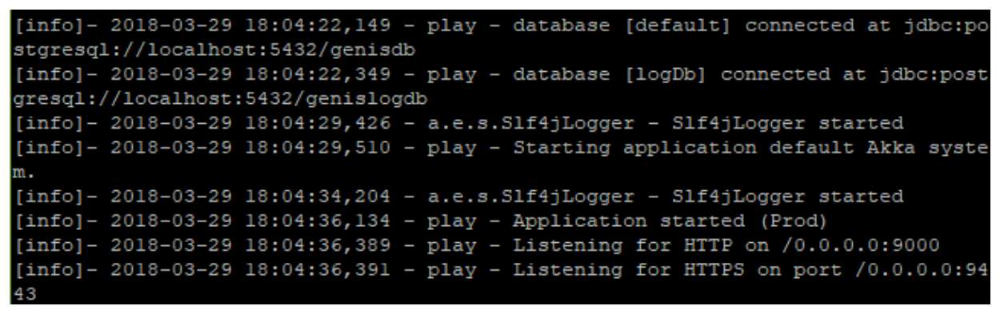

# Instalación de GENis

1.- Se debe copiar la carpeta que contiene la aplicación al Servidor donde se ejecutara GENis, la ruta por defecto es **/usr/share/genis**

Nota: la aplicación es proporcionada por el equipo de desarrollo y su version puede variar, al momento de confección de este documento la version actual es la 3.3.1

2.- Se debe otorgar permisos de ejecución al archivo **genis** ubicado en la ruta **/usr/share/genis/bin**, esto se realiza con el siguiente comando:

```
sudo chmod +x genis
```



3.- Se debe verificar el archivo de configuración de la aplicación ubicado en la ruta **/usr/share/genis/conf/**, este archivo contiene la información para conectarse a OpenLDAP, PostgreSQL y MongoDB, a continuación, se indican las líneas que se deben tener en cuenta:

- **Línea 37**: Password para conectarse a la instancia de OpenLDAP



- **Líneas 53 y 70**: Password para conectarse a la instancia de PostgreSQL



- **Líneas 153 y 154**: Información de provincia y laboratorio a la que pertenece la instancia



4.- Con las configuraciones realizadas en los pasos anteriores la aplicación está en condiciones de ejecutarse, para esto diríjase a la ruta **/usr/share/genis** y ejecute los siguientes comandos:

Ejecución en primer plano:

```
sudo ./bin/genis -v -DapplyEvolutions.default=true -DapplyDownEvolutions.default=true                 -
DapplyEvolutions.logDb=true        -DapplyDownEvolutions.logDb=true   -Dhttp.port=9000                -
Dhttps.port=9443 -Dconfig.file=/usr/share/genis/conf/application.conf
```



Ejecución en Segundo plano:

```
sudo ./bin/genis -v -DapplyEvolutions.default=true -DapplyDownEvolutions.default=true                 -
DapplyEvolutions.logDb=true        -DapplyDownEvolutions.logDb=true     -Dhttp.port=9000              -
Dhttps.port=9443 -Dconfig.file=/usr/share/genis/conf/application.conf &
```


5.- En ambos casos la aplicación iniciará correctamente y será accedida por la IP que tiene asignada el equipo mediante el puerto 9000
