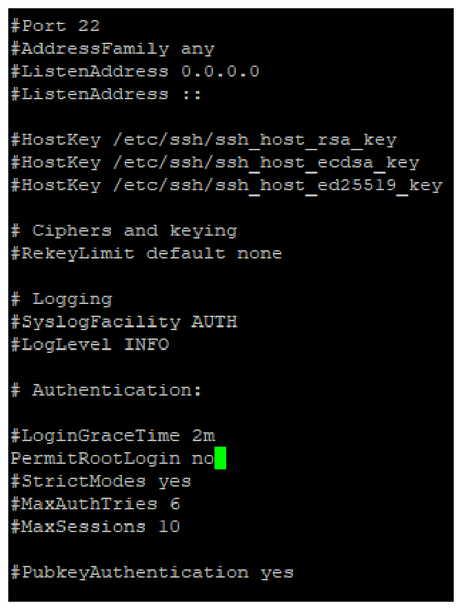
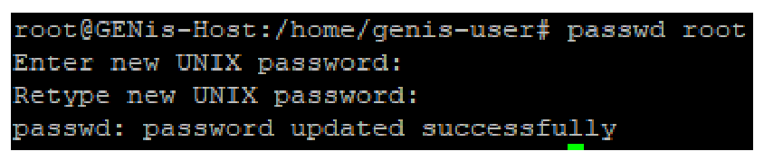
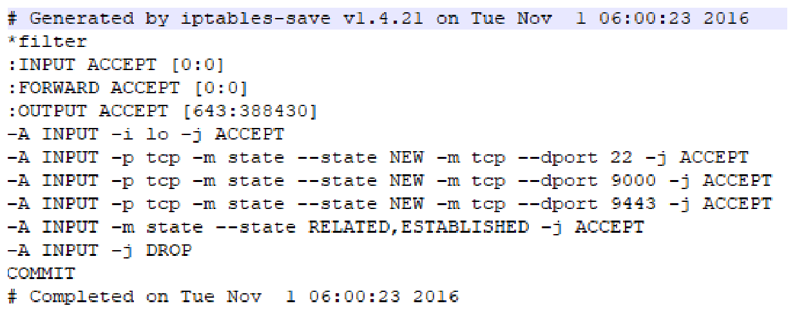
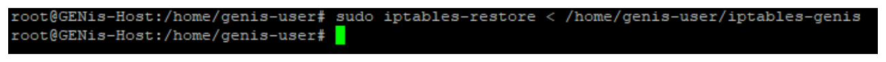
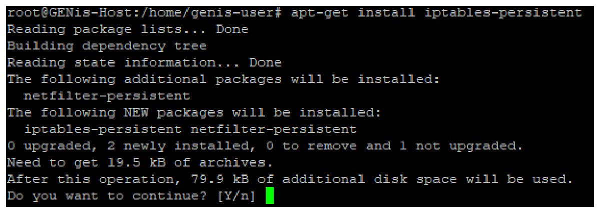
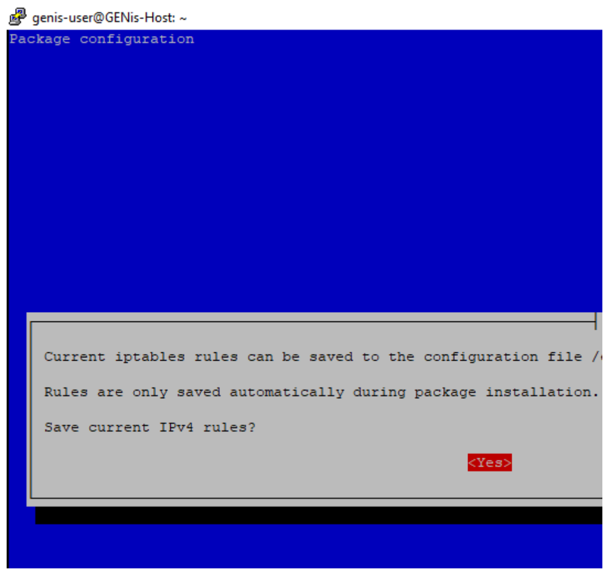

# Security hardening

### Disabling root user access via SSH

It is highly recommended to disable privileged user access via SSH; to do this, the configuration file located at **/etc/ssh/sshd.conf** must be edited and the following value changed:

```
#PermitRootLogin no
```



For the changes to take effect, the following command must be entered:

```
sudo service ssh restart
```

### Setting a "strong" password for the root user

It is recommended to set a non-trivial, sufficiently strong password for the root user; to do this, sudo permissions are required from the user performing this configuration, and this is the command:

```
sudo passwd root
```



Note: the system requires the password to be confirmed twice for the change to be applied

### Configuring Firewall options on the Server (IPTABLES)

IPTABLES is a powerful Firewall built into the Linux Kernel; the goal of configuring it in the GENis application environment is only to allow the ports it uses. Depending on the network topology of the laboratory where it is installed, it is also possible to disable SSH to block any access attempt via this protocol.

An IPTABLES configuration can be predefined and applied uniformly to all Servers where it is deployed; the structure of the file is shown below:



Note: This file is provided as part of the installation scripts

To install these rules, the file must first be copied via SFTP to the Server where GENis is located, and then imported with the following command:

```
sudo iptables-restore < /home/genis-user/iptables-genis
```



Unfortunately IPTABLES does not save these rules persistently, which means they are lost when the machine is restarted. To make these changes persistent, the iptables-persistent package must be installed with the following command:

```
sudo apt-get install iptables-persistent
```



During the installation of the packages, the wizard asks whether we want to save the current rules so they are preserved after a restart



With this, the IPTABLES rules are now persistent; if changes are made to the rules in the future, they can be saved permanently with the following command:

```
sudo iptables-save > /etc/iptables/rules.v4
```
