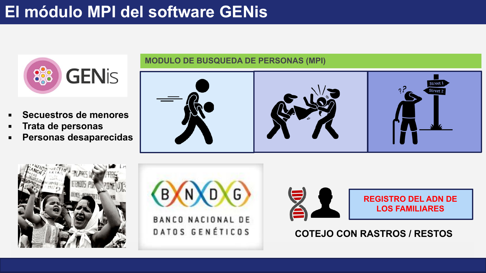

# Búsqueda de personas (MPI)

La búsqueda de personas (MPI, *Missing Person Identification*) está destinada a la identificación de personas cuyo paradero o identidad se desconoce. Se aplica principalmente en tres situaciones:

- Secuestros de menores.
- Trata de personas.
- Personas desaparecidas.

## Cómo funciona

MPI se basa en el **parentesco genético**. En lugar de comparar el perfil de la persona buscada, que habitualmente no está disponible, se trabaja con el de sus familiares:

1. **Registro del ADN de los familiares.** Se cargan los perfiles de familiares biológicos de la persona buscada, que actúan como referencia, y se organizan en un árbol familiar (pedigrí) dentro de un caso.
2. **Cotejo con rastros y restos.** Al activar el pedigrí, GENis lo compara con los perfiles de rastros, restos u otras muestras de personas aún no identificadas. La búsqueda es **abierta**: cada perfil nuevo que ingresa a la base en una categoría de MPI se compara contra todos los pedigríes activos.

Cuando el cotejo detecta compatibilidad de parentesco, se genera una coincidencia que debe ser revisada y validada mediante un escenario para orientar la identificación. Como filtro previo opcional, la búsqueda puede usar el ADN mitocondrial de la línea materna (*screening* mitocondrial).

## Registros de ADN de familiares

Un ejemplo de registro de ADN de familiares es el **Banco Nacional de Datos Genéticos (BNDG)**, institución argentina que resguarda las muestras de grupos familiares que buscan a personas desaparecidas o a niños apropiados. El fundamento del motor de parentesco de GENis fue validado con pedigríes reales de ese banco (ver [Fundamentos de genética forense](../genis/genetica_forense.md#comparacion-por-parentesco-redes-bayesianas)).

## Profundización

- Operación de casos, pedigríes, coincidencias y escenarios: [Búsqueda de personas](../busqueda_de_perfiles/busqueda_de_personas.md).
- Categorías fijas de MPI (Ante Mortem y Post Mortem): [Categorías](../administracion/categorias.md#definicion-de-categorias).
- Motor de parentesco por redes bayesianas: [Fundamentos de genética forense](../genis/genetica_forense.md#comparacion-por-parentesco-redes-bayesianas).
- Diferencias con la identificación de víctimas de desastres: [DVI](identificacion_de_victimas_dvi.md#diferencias-con-mpi).
