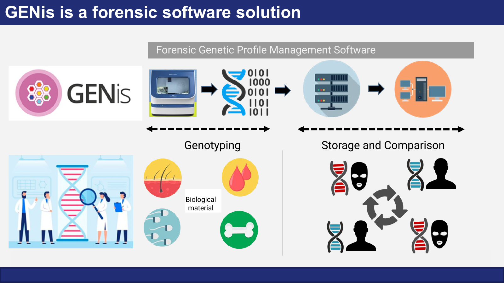

# Forensic uses

GENis is a forensic software solution: a **forensic genetic profile management** system that covers the path genetic information follows from the moment it is obtained in the laboratory until it is used in an investigation. This ability to compare profiles from different events, places and times is the foundation of judicial cooperation between institutions and between countries.

## From biological material to comparison

The workflow is organized in two complementary stages:

| Stage | What happens | Where |
|---|---|---|
| **Genotyping** | From biological material (hair, blood, fluids, bone tissue, among others) the laboratory obtains the genetic profile and translates it into digital data. | Laboratory, outside GENis |
| **Storage and comparison** | The profile is loaded onto a server, stored and automatically compared against the rest of the profiles in the database. | GENis |

GENis does not interpret laboratory signals or analyze the samples: it receives already determined profiles, manages them and matches them.

## Profiles of known and unknown origin

In every use of GENis two kinds of profiles are compared: those of **known origin** (reference samples) and those of **unknown origin** (evidence, remains or unidentified persons). Which kind a profile belongs to is determined by its [category](../genis/genetica_forense.md#profile-categories-and-classification).

## Three uses, three questions

| Use | Known origin | Unknown origin | Question it answers |
|---|---|---|---|
| [**Criminal investigation**](investigacion_criminal.md) | References from identified subjects (suspects, convicts) | Evidence found at crime scenes | Were two events committed by the same person? Is that person already known? |
| [**Missing persons search (MPI)**](busqueda_de_personas_mpi.md) | Relatives of the sought person and their personal belongings | Traces, remains, unidentified deceased persons and people seeking their biological identity | Does any of these profiles belong to the relative sought in this family tree? |
| [**Disaster victim identification (DVI)**](identificacion_de_victimas_dvi.md) | Relatives of the victims | Remains and unidentified victims of the event | Which family does each recovered remain belong to? |

The underlying difference lies in the type of comparison. In criminal investigation the comparison is **direct**: one profile against another. In MPI and DVI the sought person has no profile of their own, so the comparison is **kinship-based**: a family tree (pedigree) against the unidentified profiles. Both mechanisms are explained in [Forensic genetics foundations](../genis/genetica_forense.md).

## Exchange between instances

So that comparison goes beyond a single institution, GENis instances connect with each other through a federated architecture: each node keeps ownership and administration of its profiles and shares only what is needed to detect matches. The harmonization conditions and the submission, review and notification circuit are described in [Instance interconnection](../busqueda_de_perfiles/interconexion_de_instancias.md).
