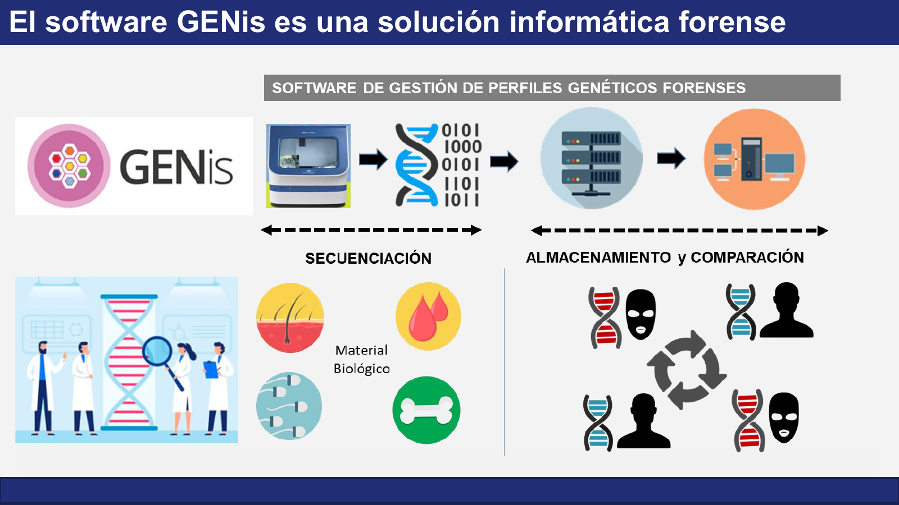

# Usos forenses

GENis es una solución informática forense: un software de **gestión de perfiles genéticos forenses** que cubre el recorrido que sigue la información genética desde que se obtiene en el laboratorio hasta que se utiliza para investigar. Esa capacidad de contrastar perfiles de distintos hechos, lugares y momentos es la base sobre la que se apoya la cooperación judicial entre instituciones y entre países.

## Del material biológico a la comparación

El flujo de trabajo se organiza en dos etapas complementarias:

| Etapa | Qué ocurre | Dónde ocurre |
|---|---|---|
| **Obtención del perfil** (en la figura, *secuenciación*) | A partir de material biológico (cabello, sangre, fluidos, tejido óseo, entre otros) el laboratorio obtiene el perfil genético y lo traduce a datos digitales. | Laboratorio, fuera de GENis |
| **Almacenamiento y comparación** | El perfil se carga en un servidor, se almacena y se compara de forma automática contra el resto de los perfiles de la base. | GENis |

GENis no interpreta señales de laboratorio ni realiza el análisis de las muestras: recibe perfiles ya determinados, los gestiona y los coteja.

## Perfiles de origen conocido y desconocido

En todos los usos de GENis se contrastan dos clases de perfiles: los de **origen conocido** (muestras de referencia, también llamadas indubitadas) y los de **origen desconocido** (evidencias, restos o personas no identificadas). A qué clase pertenece cada perfil lo determina su [categoría](../genis/genetica_forense.md#categorias-y-clasificacion-de-perfiles).

## Tres usos, tres preguntas

| Uso | Origen conocido | Origen desconocido | Pregunta que responde |
|---|---|---|---|
| [**Investigación criminal**](investigacion_criminal.md) | Referencias de sujetos identificados (sospechosos, condenados) | Evidencias halladas en escenas de crimen | ¿Dos hechos fueron cometidos por la misma persona? ¿Esa persona ya es conocida? |
| [**Búsqueda de personas (MPI)**](busqueda_de_personas_mpi.md) | Familiares de la persona buscada y sus elementos personales | Rastros, restos, personas fallecidas no identificadas y personas que buscan conocer su identidad biológica | ¿Alguno de estos perfiles corresponde al pariente buscado en este árbol familiar? |
| [**Identificación de víctimas de desastres (DVI)**](identificacion_de_victimas_dvi.md) | Familiares de las víctimas | Restos y víctimas no identificadas del evento | ¿A qué familia pertenece cada resto recuperado? |

La diferencia de fondo está en el tipo de comparación. En investigación criminal la comparación es **directa**: un perfil contra otro perfil. En MPI y DVI la persona buscada no tiene un perfil propio, por lo que la comparación es **por parentesco**: un árbol familiar (pedigrí) contra los perfiles no identificados. Ambos mecanismos se explican en [Fundamentos de genética forense](../genis/genetica_forense.md).

## Intercambio entre instancias

Para que la comparación trascienda a una única institución, las instancias de GENis se conectan entre sí mediante una arquitectura federada: cada nodo conserva la propiedad y administración de sus perfiles y comparte solo lo necesario para detectar coincidencias. Las condiciones de armonización y el circuito de envío, revisión y notificación se describen en [Interconexión de instancias](../busqueda_de_perfiles/interconexion_de_instancias.md).
