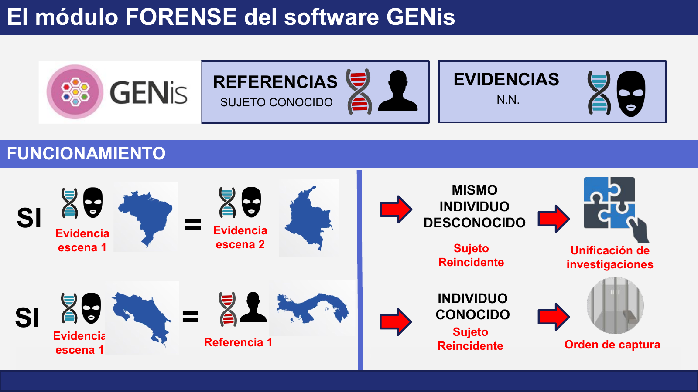

# Investigación criminal

En investigación criminal, GENis permite contrastar los perfiles genéticos cargados por distintas instituciones para responder dos preguntas investigativas: si dos hechos fueron cometidos por la misma persona y si esa persona ya es conocida.

## Tipos de perfiles

Se trabaja con **referencias**, muestras de sujetos identificados, y **evidencias**, material biológico hallado en una escena cuyo aportante es N.N. (desconocido). Ver [Perfiles de origen conocido y desconocido](index.md#perfiles-de-origen-conocido-y-desconocido).

## Funcionamiento

GENis compara cada perfil nuevo contra los ya existentes, incluso si fueron aportados por instituciones o países distintos. Según qué tipo de perfil coincide con cuál, el resultado tiene un significado investigativo diferente.

### Evidencia contra evidencia

Cuando la evidencia de la escena de un hecho coincide con la evidencia de la escena de otro hecho, se trata del **mismo individuo desconocido**, que además es un **sujeto reincidente**. La consecuencia operativa es la **unificación de investigaciones**: dos causas que corrían por separado, incluso en países distintos, pueden tratarse como una sola línea de investigación.

!!! example "Ejemplo"
    Un perfil hallado en una escena en Brasil coincide con el perfil de una evidencia de una escena en Colombia. Ambos hechos se vinculan con el mismo autor, todavía sin identificar.

### Evidencia contra referencia

Cuando la evidencia de una escena coincide con el perfil de una referencia, el aportante deja de ser desconocido: se trata de un **individuo conocido** y también un **sujeto reincidente**. La consecuencia operativa es que la autoridad competente puede disponer una **orden de captura**.

!!! example "Ejemplo"
    Un perfil hallado en una escena en Costa Rica coincide con la referencia de un sujeto cargada en Panamá. La coincidencia identifica al autor del hecho.

### Resumen

| Coincidencia | Conclusión | Resultado investigativo |
|---|---|---|
| Evidencia con evidencia | Mismo individuo desconocido, sujeto reincidente | Unificación de investigaciones |
| Evidencia con referencia | Individuo conocido, sujeto reincidente | Orden de captura |

!!! note "Alcance de la coincidencia"
    Una coincidencia en GENis es un indicio que orienta la investigación y debe ser confirmada y valorada conforme a los protocolos de cada institución. El criterio con que se comparan los perfiles y la valoración estadística asociada se explican en [Fundamentos de genética forense](../genis/genetica_forense.md#comparacion-directa-motor-de-coincidencias-str) y en [Coincidencia de perfiles](../busqueda_de_perfiles/coincidencia_de_perfiles.md).

## Referencias cruzadas

- Registro de perfiles: [Alta de perfiles](../busqueda_de_perfiles/alta_de_perfiles.md)
- Revisión de coincidencias: [Gestor de coincidencias y cálculos forense](../busqueda_de_perfiles/gestor_de_coincidencias_y_calculos_forense.md)
- Intercambio entre instituciones: [Interconexión de instancias](../busqueda_de_perfiles/interconexion_de_instancias.md)
